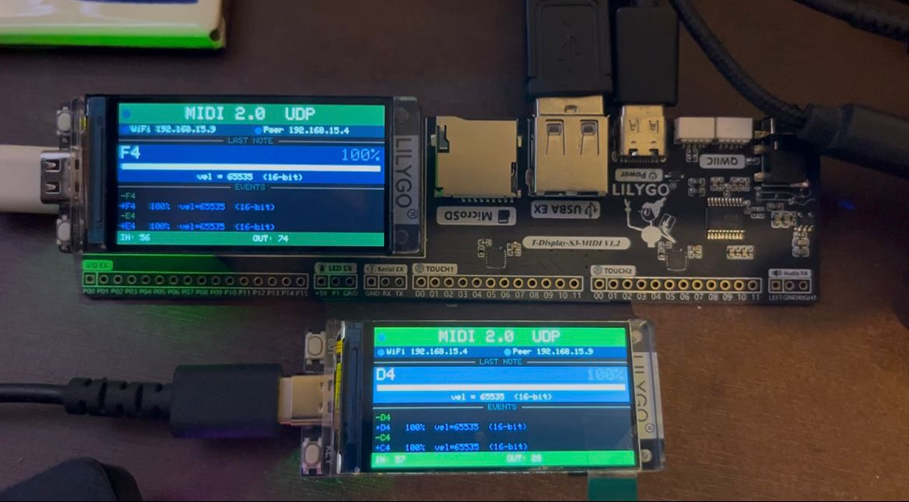

# Português (Brasil)

**O hub MIDI universal para ESP32 — 9 transportes, uma única API.**

ESP32\_Host\_MIDI transforma o seu ESP32 em um hub MIDI multi-protocolo completo. Conecte um teclado USB, receba notas de um iPhone via Bluetooth, conecte o DAW pelo WiFi com RTP-MIDI (Apple MIDI), controle o Max/MSP via OSC, alcance sintetizadores de 40 anos por um cabo DIN-5, ligue vários ESP32 sem fio via ESP-NOW e troque pacotes MIDI 2.0 com velocidade de 16 bits — **tudo ao mesmo tempo, tudo pela mesma API limpa de eventos.**

```cpp
#include <ESP32_Host_MIDI.h>

void setup() { midiHandler.begin(); }

void loop() {
    midiHandler.task();
    for (const auto& ev : midiHandler.getQueue())
        Serial.printf("%-12s %-4s ch=%d  vel=%d\n",
            ev.status.c_str(), ev.noteOctave.c_str(),
            ev.channel, ev.velocity);
}
```

---

## O que você pode construir?

> Uma lista parcial. Cada combinação de transportes abre um novo instrumento, ferramenta ou instalação.

### Interfaces MIDI sem fio

- Teclado USB → ESP32 → WiFi → macOS (Logic Pro / GarageBand) — sem drivers, sem cabos para o Mac
- App BLE no iPhone / iPad → ESP32 → USB MIDI Device → porta do DAW — apps iOS viram controladores de estúdio
- ESP32 se apresenta como interface USB MIDI Class Compliant — conecte em qualquer computador e funciona

### Hardware customizado

- **Pedalboard de efeitos** — ESP32 envia Program Change / CC para Daisy Seed ou multi-efeitos; display mostra nome do preset
- **Pad de bateria MIDI** — sensores piezo nas entradas ADC → notas MIDI com sensibilidade a velocidade → USB ou BLE
- **Sintetizador customizado** — ESP32 recebe MIDI e controla circuito analógico externo com DAC + VCO/VCA, ou dispara uma Daisy Seed com engine de síntese
- **Controlador MIDI** — encoders, faders, botões, touchpads → USB MIDI Device → qualquer DAW
- **Conversor MIDI para CV** — ESP32 + DAC externo (MCP4728, MCP4921) → CV 0–5 V / gate para Eurorack e sintetizadores analógicos
- **Pedal de expressão sem fio** — controlador de pé com ESP-NOW → hub ESP32 central → mensagens CC
- **Metrônomo / clock inteligente** — gera MIDI Clock em BPM preciso, enviado simultaneamente por USB, BLE, DIN-5 e WiFi
- **Theremin com saída MIDI** — sensores ultrassônicos ou toque capacitivo → pitch + volume → notas MIDI
- **Acordeão ou controlador de sopro MIDI** — sensores de pressão + botões → ESP32 → BLE → app instrumento no iPad

### Pontes e roteadores

- Sintetizador DIN-5 → ESP32 → USB Device → DAW moderno — adaptador sem driver
- Rig de palco sem fio: mesh ESP-NOW de performers → saída USB única para o computador da FOH
- Experimentos MIDI 2.0: dois ESP32 trocam velocidade de 16 bits via UDP

### Integração com software criativo

- Max/MSP / Pure Data / SuperCollider ↔ ESP32 via OSC — bidirecional, com endereços mapeados
- TouchOSC no tablet → ESP32 → sintetizador DIN-5 — touchscreen para hardware vintage
- Composição algorítmica no Max → OSC → ESP32 → BLE → app instrumento no iPad

### Monitoramento e educação

- Piano roll ao vivo: teclas iluminadas ao tocar, visão de 25 teclas com rolagem em display de 1,9"
- Detecção de acordes em tempo real: toque um acorde e veja o nome instantaneamente ("Cmaj7", "Dm7♭5")
- Logger de eventos MIDI com timestamps, canal, velocidade e agrupamento de acordes

---

## Matriz de Transportes

| Transporte | Protocolo | Física | Latência | Requer |
|-----------|----------|----------|---------|----------|
| USB Host | USB MIDI 1.0 | Cabo USB-OTG | < 1 ms | ESP32-S3 / S2 / P4 |
| BLE MIDI | BLE MIDI 1.0 | Bluetooth LE | 3–15 ms | Qualquer ESP32 com BT |
| USB Device | USB MIDI 1.0 | Cabo USB-OTG | < 1 ms | ESP32-S3 / S2 / P4 |
| ESP-NOW MIDI | ESP-NOW | Rádio 2,4 GHz | 1–5 ms | Qualquer ESP32 |
| RTP-MIDI (WiFi) | AppleMIDI / RFC 6295 | UDP WiFi | 5–20 ms | Qualquer ESP32 com WiFi |
| Ethernet MIDI | AppleMIDI / RFC 6295 | Cabeado (W5x00 / nativo) | 2–10 ms | W5500 SPI ou ESP32-P4 |
| OSC | Open Sound Control | UDP WiFi | 5–15 ms | Qualquer ESP32 com WiFi |
| UART / DIN-5 | Serial MIDI 1.0 | Conector DIN-5 | < 1 ms | Qualquer ESP32 |
| MIDI 2.0 / UMP | UMP via UDP | UDP WiFi | 5–20 ms | Qualquer ESP32 com WiFi |

---

## MIDI 2.0 — ESP32 × ESP32

<p align="center">
  <table bgcolor="#0d1117" cellpadding="20" align="center">
  <tr><td align="center">
  
  </td></tr>
  </table>
</p>

**ESP32\_Host\_MIDI inclui um transporte MIDI 2.0 / UMP nativo** — troca Universal MIDI Packets entre dois ESP32 via WiFi UDP com resolução total de 32 bits. Os pacotes recebidos são automaticamente escalados para MIDI 1.0 e encaminhados para todos os demais transportes ativos: BLE, USB, DIN-5, ESP-NOW — nenhum código extra de roteamento.

| Parâmetro | MIDI 1.0 | MIDI 2.0 (esta biblioteca) |
|-----------|----------|---------------------------|
| Velocity da nota | 7 bits · 128 passos | **16 bits · 65 536 passos** |
| Control Change | 7 bits · 128 passos | **32 bits · 4 294 967 295 passos** |
| Pitch Bend | 14 bits · 16 384 passos | **32 bits · 4 294 967 295 passos** |
| Protocolo | Fluxo de bytes | Universal MIDI Packet (UMP) |

```
ESP32-A  ─────  WiFi UDP ("UMP2" + Word0 + Word1)  ─────►  ESP32-B
(Teclado USB)        velocity 16-bit · CC 32-bit              │
                                                    escala → MIDI 1.0
                                                    ├─ BLE → app iOS
                                                    ├─ DIN-5 → sintetizador
                                                    ├─ USB Device → DAW
                                                    └─ ESP-NOW → palco
```

→ Detalhes: [MIDI 2.0 / UMP](docs/transportes/midi2-udp.md) · Exemplo: `T-Display-S3-MIDI2-UDP`

---

## Início Rápido

```cpp
#include <ESP32_Host_MIDI.h>

void setup() {
    Serial.begin(115200);
    midiHandler.begin();
}

void loop() {
    midiHandler.task();
    for (const auto& ev : midiHandler.getQueue())
        Serial.println(ev.noteOctave.c_str());
}
```

---

## Galeria

<p align="center">
  &nbsp;
  &nbsp;
  
</p>
<p align="center"><em>MIDI 2.0 UDP com barra de velocidade de 16 bits · RTP-MIDI / Apple MIDI conectando ao macOS</em></p>

<p align="center">
  &nbsp;
  &nbsp;
  
</p>
<p align="center"><em>Piano roll de 25 teclas rolável · Nome de acorde em tempo real (Gingoduino) · Debug da fila de eventos</em></p>

<p align="center">
  &nbsp;
  &nbsp;
  
</p>
<p align="center"><em>BLE Receiver (iPhone → ESP32) · BLE Sender · Piano debug</em></p>

> **Vídeos** — cada pasta de exemplo contém um arquivo `.mp4` em `examples/<nome>/images/`.

---

## Arquitetura

```
╔══════════════════════════════════════════════════════════════════════╗
║  ENTRADAS                        MIDIHandler              SAÍDAS    ║
║                                                                      ║
║  Teclado USB ──[USBConnection]─────►  ┌──────────────┐              ║
║  iPhone BLE  ──[BLEConnection]─────►  │              │              ║
║  macOS WiFi  ──[RTPMIDIConn.]──────►  │  Fila de     │──► getQueue()║
║  DAW USB out ──[USBDeviceConn]─────►  │  Eventos     │              ║
║  Max/MSP OSC ──[OSCConnection]─────►  │  (ring buf,  │──► Notas     ║
║  W5500 LAN   ──[EthernetMIDI]──────►  │  thread-safe)│    ativas    ║
║  Serial DIN-5──[UARTConnection]────►  │              │              ║
║  Rádio ESP32 ──[ESPNowConn.]───────►  │  Detecção de │──► Nomes de  ║
║  MIDI 2.0 UDP──[MIDI2UDPConn.]─────►  │  acordes     │    acordes   ║
║                                       └──────┬───────┘              ║
║                                              ▼                      ║
║                                     sendMidiMessage()               ║
║                                  (envia para TODOS os transportes)  ║
╚══════════════════════════════════════════════════════════════════════╝
```

**Core 0** — USB Host, pilha BLE, drivers de rádio/rede (tarefas FreeRTOS)
**Core 1** — `midiHandler.task()` + seu código em `loop()`

---

## Transportes

Todos os transportes têm a mesma estrutura:

```cpp
// Inclua apenas os transportes que você usar:
#include "src/UARTConnection.h"     // DIN-5 MIDI serial
#include "src/RTPMIDIConnection.h"  // Apple MIDI via WiFi
#include "src/OSCConnection.h"      // OSC via WiFi
#include "src/MIDI2UDPConnection.h" // MIDI 2.0 via UDP

// Registre no setup():
midiHandler.addTransport(&meuTransporte);
meuTransporte.begin(/* parâmetros */);
midiHandler.begin();
```

Para detalhes de cada transporte, exemplos de código e fotos, veja a [seção de Transportes](docs/transportes/visao-geral.md).

---

## Casos de Uso — Pontes Multi-Protocolo

Todo MIDI recebido por qualquer transporte é automaticamenteuído para todos os outros — sem código extra.

| Ponte | Diagrama |
|--------|---------|
| Teclado sem fio → DAW | iPhone BLE → ESP32 → USB Device → Logic Pro |
| Teclado USB → WiFi | Teclado USB → ESP32 → RTP-MIDI → macOS |
| Legado para moderno | Sintetizador DIN-5 → ESP32 → USB Device → qualquer DAW |
| Moderno para legado | macOS → RTP-MIDI → ESP32 → DIN-5 → caixa de ritmo dos anos 80 |
| Rig de palco sem fio | Nós ESP-NOW → hub ESP32 → USB → computador FOH |
| Software criativo | Max/MSP OSC → ESP32 → BLE → app instrumento no iPad |
| MIDI 2.0 → vintage | ESP32-A UDP/MIDI2 → ESP32-B → DIN-5 → sintetizador analógico |

---

## Ecossistema de Hardware

O ESP32\_Host\_MIDI funciona como o **cérebro MIDI e hub de protocolos**, conectando-se a um amplo ecossistema de placas e dispositivos.

### Placas que você pode conectar ao ESP32

| Placa | Conexão | Caso de uso |
|-------|-----------|-------------|
| **[Daisy Seed](https://electro-smith.com/daisy)** (Electro-Smith) | UART / DIN-5 ou USB | Engine de síntese de áudio DSP; ESP32 envia MIDI, Daisy toca as notas |
| **Teensy 4.x** (PJRC) | UART serial ou USB Host | Roteamento MIDI complexo ou síntese; excelente suporte USB MIDI nativo |
| **Arduino UNO / MEGA / Nano** | UART serial (DIN-5) | Projetos MIDI clássicos; ESP32 é o gateway sem fio |
| **Raspberry Pi** | RTP-MIDI, OSC ou USB | Host de DAW, processamento de áudio, composição generativa |
| **Eurorack / sintetizadores modulares** | DIN-5 MIDI → interface CV/gate | CV de pitch, gate, velocidade → tensão analógica via módulo conversor |
| **Sintetizadores de hardware** | DIN-5 | Qualquer teclado, sintetizador em rack ou unidade de efeitos com MIDI |
| **iPad / iPhone** | BLE MIDI | GarageBand, AUM, apps Moog, NLog, Animoog — todos compatíveis com CoreMIDI |
| **DAW no computador** | USB Device ou RTP-MIDI | Logic Pro, Ableton, Bitwig, FL Studio, Reaper, Pro Tools |

> **Daisy Seed + ESP32** é uma combinação especialmente poderosa: o ESP32 cuida de toda a conectividade MIDI (USB, BLE, WiFi, DIN-5) e a Daisy Seed processa áudio em tempo real a 48 kHz / 24 bits com seu DSP ARM Cortex-M7. Comunicam-se por um único cabo UART/DIN-5.

> **Teensy 4.1** pode executar lógica MIDI complexa, arpejadores, voicers de acordes ou sequenciadores, enquanto o ESP32 cuida do transporte sem fio — cada placa fazendo o que faz melhor.

### Projetos de hardware que você pode construir

```
┌─────────────────────────────────────────────────────────────────────┐
│  PROJETO                │  COMPONENTES                               │
├─────────────────────────────────────────────────────────────────────┤
│  Pedalboard sem fio     │  ESP32 + botões + carcaça → ESP-NOW       │
│                         │  → hub central → DIN-5 / USB para rack    │
├─────────────────────────────────────────────────────────────────────┤
│  Pad de bateria MIDI    │  ESP32 + sensores piezo + ADC → notas     │
│                         │  MIDI sensíveis à velocidade via USB/BLE   │
├─────────────────────────────────────────────────────────────────────┤
│  Sintetizador           │  ESP32 + Daisy Seed: ESP32 faz a ponte    │
│                         │  de todos os protocolos, Daisy gera áudio │
├─────────────────────────────────────────────────────────────────────┤
│  Conversor MIDI para CV │  ESP32 + DAC MCP4728 → CV 0–5 V + gate   │
│                         │  para Eurorack / sintetizadores analógicos │
├─────────────────────────────────────────────────────────────────────┤
│  Controlador MIDI       │  ESP32-S3 + encoders + faders + OLED →   │
│  customizado            │  USB MIDI Device reconhecido por qualquer  │
│                         │  DAW sem driver                            │
├─────────────────────────────────────────────────────────────────────┤
│  Auxiliar de piano /    │  ESP32 + LEDs RGB nas teclas + display    │
│  ferramenta de ensino   │  → ilumina a tecla correta para cada nota  │
├─────────────────────────────────────────────────────────────────────┤
│  Pedal de expressão     │  ESP32 + FSR / potenciômetro em carcaça   │
│  sem fio                │  de pé → mensagens CC via ESP-NOW          │
├─────────────────────────────────────────────────────────────────────┤
│  Arpejador / sequenciador│  ESP32 recebe acordes, gera padrões      │
│                         │  arpejados, envia para DIN-5               │
├─────────────────────────────────────────────────────────────────────┤
│  Theremin / sintetizador│  Sensores ultrassônicos → pitch + volume  │
│  por ar                 │  → notas MIDI via BLE ou USB               │
├─────────────────────────────────────────────────────────────────────┤
│  Instalação de arte     │  Sensores de movimento / proximidade /    │
│  interativa             │  toque → MIDI → música generativa / luz    │
└─────────────────────────────────────────────────────────────────────┘
```

---

## Gingoduino — Teoria Musical em Sistemas Embarcados

[**Gingoduino**](https://github.com/sauloverissimo/gingoduino) é uma biblioteca de teoria musical para sistemas embarcados — o mesmo motor que alimenta o exemplo `T-Display-S3-Gingoduino`. Quando integrada via `GingoAdapter.h`, ela escuta o mesmo fluxo de eventos MIDI e analisa continuamente as notas ativas para produzir:

- **Nome do acorde** — "Cmaj7", "Dm7♭5", "G7", "Am" com extensões e alterações
- **Nota raiz** — pitch raiz identificado do acorde
- **Conjunto de notas ativas** — lista estruturada das notas pressionadas no momento
- **Análise de intervalos** — intervalos entre as notas (3M, 7m, 5J, etc.)
- **Identificação de escala** — detecta a escala provável (maior, menor, modos)

Tudo roda **no dispositivo** em velocidade de interrupção — sem nuvem, sem rede, sem latência.

```cpp
#include "src/GingoAdapter.h"  // requer Gingoduino ≥ v0.2.2

void loop() {
    midiHandler.task();

    std::string chord = gingoAdapter.getChordName();  // "Cmaj7", "Dm", "G7sus4" …
    std::string root  = gingoAdapter.getRootNote();   // "C", "D", "G" …

    display.setChord(chord.c_str());
}
```

<p align="center">
  
</p>
<p align="center"><em>T-Display-S3-Gingoduino: nome do acorde, nota raiz e teclas ativas em tempo real</em></p>

**→ [github.com/sauloverissimo/gingoduino](https://github.com/sauloverissimo/gingoduino)**

---

## Gingo — Teoria Musical para Python e Desktop

[**Gingo**](https://github.com/sauloverissimo/gingo) é a versão desktop e Python do Gingoduino — os mesmos conceitos de teoria musical portados para Python, para uso em scripts, integrações com DAW, processadores MIDI, ferramentas de composição e aplicações web.

Use para:

- Analisar arquivos MIDI e extrair progressões de acordes
- Criar processadores MIDI em Python que reconhecem acordes em tempo real
- Desenvolver aplicações web com anotação de teoria musical
- Prototipar algoritmos de teoria musical antes de portá-los para o Gingoduino no ESP32
- Gerar cifras, leadsheets e exercícios educativos

```python
from gingo import Gingo

g = Gingo()
chord = g.identify([60, 64, 67, 71])   # C Mi Sol Si
print(chord.name)   # "Cmaj7"
print(chord.root)   # "C"
```

**→ [github.com/sauloverissimo/gingo](https://github.com/sauloverissimo/gingo)**
**→ [sauloverissimo.github.io/gingo](https://sauloverissimo.github.io/gingo/)**

> **Fluxo ESP32 + Gingo:** prototipe algoritmos de teoria musical em Python com o Gingo → porte a lógica para o Gingoduino no ESP32 → exiba nomes de acordes ao vivo no T-Display-S3.

---

## Compatibilidade de Hardware

### Chip → transportes disponíveis

| Chip | USB Host | BLE | USB Device | WiFi | Ethernet nativo | UART | ESP-NOW |
|------|:--------:|:---:|:----------:|:----:|:---------------:|:----:|:-------:|
| ESP32-S3 | ✅ | ✅ | ✅ | ✅ | ❌ (W5500 SPI) | ✅ | ✅ |
| ESP32-S2 | ✅ | ❌ | ✅ | ✅ | ❌ (W5500 SPI) | ✅ | ❌ |
| ESP32-P4 | ✅ | ❌ | ✅ | ❌ | ✅ | ✅ ×5 | ❌ |
| ESP32 (clássico) | ❌ | ✅ | ❌ | ✅ | ❌ (W5500 SPI) | ✅ | ✅ |
| ESP32-C3 / C6 / H2 | ❌ | ✅ | ❌ | ✅ | ❌ | ✅ | ✅ |

> **Ethernet SPI W5500** funciona em **qualquer** ESP32 via `EthernetMIDIConnection`.

### Placas recomendadas

| Caso de uso | Placa |
|-------------|-------|
| Melhor para tudo (USB Host + BLE + WiFi + display) | **LilyGO T-Display-S3** |
| USB Host + USB Device + pilha BLE completa | Qualquer ESP32-S3 DevKit |
| Mesh sem fio com latência ultra-baixa | ESP32 DevKit (ESP-NOW) |
| Rack de estúdio com Ethernet | ESP32-P4 (MAC nativo) ou qualquer ESP32 + W5500 |
| Gateway MIDI DIN-5 | Qualquer ESP32 + optoacoplador UART |
| Experimentos MIDI 2.0 | Dois ESP32-S3 na mesma rede WiFi |

---

## Instalação

**Arduino IDE:** Sketch → Incluir Biblioteca → Gerenciar Bibliotecas → pesquise **ESP32_Host_MIDI**

**PlatformIO:**

```ini
[env:esp32-s3-devkitc-1]
platform = espressif32
board    = esp32-s3-devkitc-1
framework = arduino

lib_deps =
    sauloverissimo/ESP32_Host_MIDI
    # lathoub/Arduino-AppleMIDI-Library  ; RTP-MIDI + Ethernet MIDI
    # arduino-libraries/Ethernet          ; Ethernet MIDI
    # CNMAT/OSC                           ; OSC
    # sauloverissimo/gingoduino           ; Nomes de acordes
```

**Pacote de placa:** `Boards Manager → "esp32" por Espressif → ≥ 3.0.0`

---

## Exemplos com Display (T-Display-S3)

| Exemplo | Transporte | O que o display mostra |
|---------|-----------|------------------------|
| `T-Display-S3` | USB Host | Notas ativas + log de eventos |
| `T-Display-S3-Queue` | USB Host | Fila completa em debug |
| `T-Display-S3-Piano` | USB Host | Piano roll de 25 teclas rolável |
| `T-Display-S3-Piano-Debug` | USB Host | Piano roll + debug estendido |
| `T-Display-S3-Gingoduino` | USB Host + BLE | Nomes de acordes via teoria musical |
| `T-Display-S3-BLE-Sender` | BLE | Status do modo envio + log |
| `T-Display-S3-BLE-Receiver` | BLE | Modo recepção + log de notas |
| `T-Display-S3-ESP-NOW-Jam` | ESP-NOW | Status do par + eventos de jam |
| `T-Display-S3-OSC` | OSC + WiFi | Status WiFi + log ponte OSC |
| `T-Display-S3-USB-Device` | BLE + USB Device | Status duplo + log ponte |
| `T-Display-S3-MIDI2-UDP` | MIDI 2.0 UDP | Status WiFi + par, barra vel. 16 bits |

---

## Referência da API

```cpp
midiHandler.begin();                // inicia transportes built-in
midiHandler.task();                 // chamar em cada loop()
midiHandler.addTransport(&t);       // registrar transporte externo

const auto& q = midiHandler.getQueue();
std::vector<std::string> n = midiHandler.getActiveNotesVector(); // ["C4","E4","G4"]
std::string chord = midiHandler.getChordName();                  // "Cmaj7"

midiHandler.sendNoteOn(ch, note, vel);
midiHandler.sendNoteOff(ch, note, vel);
midiHandler.sendControlChange(ch, ctrl, val);
midiHandler.sendProgramChange(ch, prog);
midiHandler.sendPitchBend(ch, val);   // 0–16383, centro = 8192
```

---

## Licença

MIT — see [LICENSE](LICENSE)

---

<p align="center">
  Construído com ❤️ para músicos, makers e pesquisadores.<br/>
  Issues e contribuições são bem-vindos:
  <a href="https://github.com/sauloverissimo/ESP32_Host_MIDI">github.com/sauloverissimo/ESP32_Host_MIDI</a>
</p>
