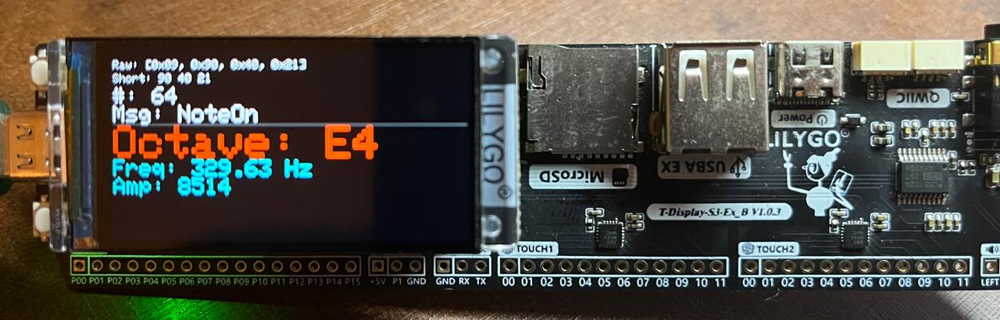
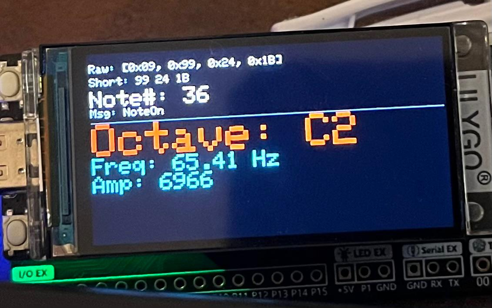

# ESP32_Host_MIDI 🎹📡

Project developed for ARDUINO IDE:

This project provides a complete solution for receiving, interpreting, and displaying MIDI messages via USB and BLE on the ESP32 (especially ESP32-S3) with the T-Display S3.

---

## English 🇺🇸 🏈

### Overview
The **ESP32_Host_MIDI** library allows the ESP32 to act as a USB host for MIDI devices, interpret incoming data (using functions from the **MIDI_Handler** module), and display this information on the T-Display S3 using **DisplayHandler**. Additionally, the library supports **BLE MIDI** communication, enabling the ESP32 to function as a **BLE MIDI server**.

The library is modular, making it easy to adapt to other hardware by adjusting the configuration files.

### File Structure
- **ESP32_Host_MIDI_Config.h**  
  Defines the pins used for USB communication and the display.  
  - *Example:* `USB_DP_PIN`, `USB_DN_PIN`, `TFT_CS_PIN`, `TFT_DC_PIN`, `TFT_RST_PIN`, `TFT_BL_PIN`.

- **ESP32_Host_MIDI.h / ESP32_Host_MIDI.cpp**  
  Manages USB MIDI communication.  
  - **Key Functions:**  
    - `begin()`: Initializes the USB Host and registers the client.  
    - `task()`: Processes USB events and submits transfers.  
    - `onMidiMessage(const uint8_t *data, size_t length)`: Virtual function called when a MIDI message is received. Should be overridden to process the message (e.g., using **MIDI_Handler**).

- **ESP32_BLE.h / ESP32_BLE.cpp**  
  Implements the **BLE MIDI server**, allowing the ESP32 to receive MIDI messages via Bluetooth Low Energy (BLE).  
  - **Key Functions:**  
    - `begin()`: Initializes the BLE server and advertises the MIDI service.  
    - `task()`: Periodically processes BLE events.  
    - `setMidiMessageCallback()`: Sets a callback to process received BLE MIDI messages.  
    - `sendMidiMessage()`: Sends MIDI messages via BLE to connected devices.  

- **MIDI_Handler.h / MIDI_Handler.cpp**  
  Provides static functions that interpret raw MIDI data (after removing the USB header) into various formats:  
  - **Raw Format:** Ex.: `[0x09, 0x90, 0x3C, 0x64]`  
  - **Short Format:** Ex.: `"90 3C 64"`  
  - **Note Number:** Ex.: `"60"`  
  - **Message Type:** Ex.: `"NoteOn"`, `"NoteOff"`, `"Control Change"`, `"Program Change"`, etc.  
  - **Status:** Ex.: `"9n"`  
  - **Note Sound with Octave:** Ex.: `"C5"`  
  - **Message Vector:** A structure that aggregates the interpreted fields.

- **displayhandler.h / displayhandler.cpp**  
  Manages the display output on the T-Display S3 using the LovyanGFX library.  
  - **Key Functions:**  
    - `init()`: Initializes the display, sets rotation (180°), dimensions (320x170), and font size.  
    - `printMidiMessage(const char* message)`: Displays the formatted message across 5 lines, with the last line ("Octave") highlighted (separator line, larger font, and different color).  
    - `clear()`: Clears the display.

- **ESP32_Host_MIDI.ino**  
  Example implementation for the T-Display S3. Integrates USB MIDI reception, BLE MIDI reception, data interpretation (via **MIDI_Handler**), and information display.  
  - Uses a derived class that overrides `onMidiMessage()` to:
    - Remove the USB header from the data.
    - Format the data into 5 lines (Raw, Short, Note#, Msg, and Octave).
    - Display the message and clear the screen after 1 second.

### Example with Lilygo T-Display S3
The project includes examples in the `examples/T-Display-S3/` folder, with code specifically for this board.

Additionally, the `examples/T-Display-S3/images/` folder contains illustrative images of the project's functionality:

### Operation

1. **MIDI USB-OTG Reception on ESP32:**  
   When a MIDI device is connected via USB, the ESP32 captures the MIDI data.  

2. **MIDI BLE Reception:**  
   The ESP32 captures MIDI data received via Bluetooth Low Energy (BLE) and processes it in the BLE MIDI server.  

3. **Interpretation:**  
   The virtual function `onMidiMessage()` is called. A derived class removes the header (first byte) and uses **MIDI_Handler** to convert the bytes into readable formats.

4. **Display Output:**  
   The **DisplayHandler** displays the formatted data across 5 lines (highlighting the last line) on the T-Display S3, which is rotated 180° for correct orientation.

---

# ESP32_Host_MIDI 🎹📡

Projeto desenvolvido para ARDUINO IDE:
Este projeto oferece uma solução completa para receber, interpretar e exibir mensagens MIDI via USB e BLE no ESP32 (especialmente ESP32-S3) com o T‑Display S3.
---

## Português 🇧🇷 ⚽

### Visão Geral
A biblioteca **ESP32_Host_MIDI** permite que o ESP32 atue como host USB para dispositivos MIDI, interprete os dados recebidos (utilizando funções do módulo **MIDI_Handler**) e exiba essas informações no T‑Display S3 através do **DisplayHandler**. Além disso, a biblioteca oferece suporte a comunicação **BLE MIDI**, permitindo que o ESP32 atue como um **servidor MIDI BLE**.

A biblioteca é modular, facilitando adaptações para outros hardwares, bastando ajustar os arquivos de configuração.

### Estrutura dos Arquivos
- **ESP32_Host_MIDI_Config.h**  
  Define os pinos usados para comunicação USB e para o display.  
  - *Exemplo:* `USB_DP_PIN`, `USB_DN_PIN`, `TFT_CS_PIN`, `TFT_DC_PIN`, `TFT_RST_PIN`, `TFT_BL_PIN`.

- **ESP32_Host_MIDI.h / ESP32_Host_MIDI.cpp**  
  Gerencia a comunicação USB MIDI.  
  - **Funções Principais:**  
    - `begin()`: Inicializa o USB Host e registra o cliente.  
    - `task()`: Processa os eventos USB e submete as transferências.  
    - `onMidiMessage(const uint8_t *data, size_t length)`: Função virtual chamada quando uma mensagem MIDI é recebida. Deve ser sobrescrita para tratar a mensagem (por exemplo, utilizando o **MIDI_Handler**).

- **ESP32_BLE.h / ESP32_BLE.cpp**  
  Implementa o **servidor MIDI BLE**, permitindo que o ESP32 receba mensagens MIDI via Bluetooth Low Energy (BLE).  
  - **Funções Principais:**  
    - `begin()`: Inicializa o servidor BLE e anuncia o serviço MIDI.  
    - `task()`: Processa eventos BLE periodicamente.  
    - `setMidiMessageCallback()`: Define um callback para tratar mensagens MIDI recebidas via BLE.  
    - `sendMidiMessage()`: Envia mensagens MIDI via BLE para dispositivos conectados.  

- **MIDI_Handler.h / MIDI_Handler.cpp**  
  Fornece funções estáticas que interpretam os dados MIDI brutos (após remover o cabeçalho USB) em diversos formatos:  
  - **Raw Format:** Ex.: `[0x09, 0x90, 0x3C, 0x64]`  
  - **Short Format:** Ex.: `"90 3C 64"`  
  - **Note Number:** Ex.: `"60"`  
  - **Tipo de Mensagem:** Ex.: `"NoteOn"`, `"NoteOff"`, `"Control Change"`, `"Program Change"`, etc.  
  - **Status:** Ex.: `"9n"`  
  - **Note Sound com Octave:** Ex.: `"C5"`  
  - **Message Vector:** Estrutura que reúne os campos interpretados.

- **displayhandler.h / displayhandler.cpp**  
  Gerencia a exibição das informações no T‑Display S3 utilizando a biblioteca LovyanGFX.  
  - **Funções Principais:**  
    - `init()`: Inicializa o display, configura a rotação (180°), dimensões (320x170) e tamanho da fonte.  
    - `printMidiMessage(const char* message)`: Exibe a mensagem formatada em 5 linhas, com a última ("Octave") destacada (linha separadora, fonte maior e cor diferenciada).  
    - `clear()`: Limpa o display.

- **ESP32_Host_MIDI.ino**  
  Exemplo de implementação no T‑Display S3. Integra a recepção USB MIDI, a recepção BLE MIDI, a interpretação dos dados (via **MIDI_Handler**) e a exibição das informações no display.  
  - Utiliza uma classe derivada que sobrescreve `onMidiMessage()` para:
    - Remover o cabeçalho USB dos dados.
    - Formatar os dados em 5 linhas (Raw, Short, Note#, Msg e Octave).
    - Exibir a mensagem e limpar o display após 1 segundo.

### Exemplo com Lilygo T-Display S3
O projeto inclui exemplos na pasta `examples/T-Display-S3/`, com código específico para essa placa.

Além disso, a pasta `examples/T-Display-S3/images/` contém imagens ilustrativas do funcionamento do projeto:

### Funcionamento

1. **Recepção MIDI USB-OTG ESP32:**  
   Ao conectar um dispositivo MIDI via USB, o ESP32 captura os dados MIDI.  

2. **Recepção MIDI BLE:**  
   O ESP32 captura os dados MIDI recebidos via Bluetooth Low Energy (BLE) e os trata no servidor MIDI BLE.  

3. **Interpretação:**  
   A função virtual `onMidiMessage()` é chamada. Uma classe derivada remove o cabeçalho (primeiro byte) e utiliza o **MIDI_Handler** para converter os bytes em formatos legíveis.

4. **Exibição:**  
   O **DisplayHandler** exibe os dados formatados em 5 linhas (com destaque na última linha) no T‑Display S3, que está rotacionado 180° para a orientação correta.

---

# ESP32_Host_MIDI 🎹📡

Proyecto desarrollado para ARDUINO IDE:

Este proyecto proporciona una solución completa para recibir, interpretar y mostrar mensajes MIDI a través de USB y BLE en el ESP32 (especialmente ESP32-S3) con el T-Display S3.

---

## Español 🇪🇸 🐂

### Descripción General
La biblioteca **ESP32_Host_MIDI** permite que el ESP32 actúe como un host USB para dispositivos MIDI, interprete los datos entrantes (utilizando funciones del módulo **MIDI_Handler**) y muestre esta información en el T-Display S3 mediante **DisplayHandler**. Además, la biblioteca es compatible con la comunicación **BLE MIDI**, permitiendo que el ESP32 funcione como un **servidor MIDI BLE**.

La biblioteca es modular, lo que facilita la adaptación a otro hardware mediante la configuración de archivos.

### Estructura de Archivos
- **ESP32_Host_MIDI_Config.h**  
  Define los pines utilizados para la comunicación USB y la pantalla.  
  - *Ejemplo:* `USB_DP_PIN`, `USB_DN_PIN`, `TFT_CS_PIN`, `TFT_DC_PIN`, `TFT_RST_PIN`, `TFT_BL_PIN`.

- **ESP32_Host_MIDI.h / ESP32_Host_MIDI.cpp**  
  Gestiona la comunicación MIDI por USB.  
  - **Funciones Clave:**  
    - `begin()`: Inicializa el host USB y registra el cliente.  
    - `task()`: Procesa eventos USB y envía transferencias.  
    - `onMidiMessage(const uint8_t *data, size_t length)`: Función virtual que se llama cuando se recibe un mensaje MIDI. Debe ser sobrescrita para procesar el mensaje (por ejemplo, utilizando **MIDI_Handler**).

- **ESP32_BLE.h / ESP32_BLE.cpp**  
  Implementa el **servidor MIDI BLE**, permitiendo que el ESP32 reciba mensajes MIDI a través de Bluetooth Low Energy (BLE).  
  - **Funciones Clave:**  
    - `begin()`: Inicializa el servidor BLE y anuncia el servicio MIDI.  
    - `task()`: Procesa eventos BLE periódicamente.  
    - `setMidiMessageCallback()`: Configura un callback para procesar mensajes MIDI recibidos por BLE.  
    - `sendMidiMessage()`: Envía mensajes MIDI por BLE a dispositivos conectados.  

- **MIDI_Handler.h / MIDI_Handler.cpp**  
  Proporciona funciones estáticas que interpretan datos MIDI sin procesar (después de eliminar el encabezado USB) en varios formatos:  
  - **Formato Raw:** Ej.: `[0x09, 0x90, 0x3C, 0x64]`  
  - **Formato Corto:** Ej.: `"90 3C 64"`  
  - **Número de Nota:** Ej.: `"60"`  
  - **Tipo de Mensaje:** Ej.: `"NoteOn"`, `"NoteOff"`, `"Control Change"`, `"Program Change"`, etc.  
  - **Estado:** Ej.: `"9n"`  
  - **Nota con Octava:** Ej.: `"C5"`  
  - **Vector de Mensaje:** Una estructura que agrega los campos interpretados.

- **displayhandler.h / displayhandler.cpp**  
  Gestiona la salida de la pantalla en el T-Display S3 utilizando la biblioteca LovyanGFX.  
  - **Funciones Clave:**  
    - `init()`: Inicializa la pantalla, establece la rotación (180°), dimensiones (320x170) y el tamaño de la fuente.  
    - `printMidiMessage(const char* message)`: Muestra el mensaje formateado en 5 líneas, con la última línea ("Octave") resaltada (línea separadora, fuente más grande y color diferente).  
    - `clear()`: Limpia la pantalla.

- **ESP32_Host_MIDI.ino**  
  Ejemplo de implementación para el T-Display S3. Integra la recepción de MIDI por USB, la recepción de MIDI BLE, la interpretación de datos (mediante **MIDI_Handler**) y la visualización de información.  
  - Utiliza una clase derivada que sobrescribe `onMidiMessage()` para:
    - Eliminar el encabezado USB de los datos.
    - Formatear los datos en 5 líneas (Raw, Short, Note#, Msg y Octave).
    - Mostrar el mensaje y limpiar la pantalla después de 1 segundo.

### Ejemplo con Lilygo T-Display S3
El proyecto incluye ejemplos en la carpeta `examples/T-Display-S3/`, con código específico para esta placa.

Además, la carpeta `examples/T-Display-S3/images/` contiene imágenes ilustrativas de la funcionalidad del proyecto:

### Funcionamiento

1. **Recepción de MIDI USB-OTG en ESP32:**  
   Cuando se conecta un dispositivo MIDI por USB, el ESP32 captura los datos MIDI.  

2. **Recepción de MIDI BLE:**  
   El ESP32 captura los datos MIDI recibidos por Bluetooth Low Energy (BLE) y los procesa en el servidor MIDI BLE.  

3. **Interpretación:**  
   Se llama a la función virtual `onMidiMessage()`. Una clase derivada elimina el encabezado (primer byte) y utiliza **MIDI_Handler** para convertir los bytes en formatos legibles.

4. **Salida en Pantalla:**  
   El **DisplayHandler** muestra los datos formateados en 5 líneas (resaltando la última línea) en el T-Display S3, que está rotado 180° para la orientación correcta.

---

# ESP32_Host_MIDI 🎹📡

Progetto sviluppato per ARDUINO IDE:

Questo progetto fornisce una soluzione completa per ricevere, interpretare e visualizzare messaggi MIDI tramite USB e BLE sull'ESP32 (soprattutto ESP32-S3) con il T-Display S3.

---

## Italiano 🇮🇹 🍕

### Panoramica
La libreria **ESP32_Host_MIDI** consente all'ESP32 di funzionare come host USB per dispositivi MIDI, interpretare i dati in ingresso (utilizzando funzioni del modulo **MIDI_Handler**) e visualizzare queste informazioni sul T-Display S3 tramite **DisplayHandler**. Inoltre, la libreria supporta la comunicazione **BLE MIDI**, permettendo all'ESP32 di funzionare come **server MIDI BLE**.

La libreria è modulare, facilitando l'adattamento ad altri hardware regolando i file di configurazione.

### Struttura dei File
- **ESP32_Host_MIDI_Config.h**  
  Definisce i pin utilizzati per la comunicazione USB e il display.  
  - *Esempio:* `USB_DP_PIN`, `USB_DN_PIN`, `TFT_CS_PIN`, `TFT_DC_PIN`, `TFT_RST_PIN`, `TFT_BL_PIN`.

- **ESP32_Host_MIDI.h / ESP32_Host_MIDI.cpp**  
  Gestisce la comunicazione MIDI via USB.  
  - **Funzioni Principali:**  
    - `begin()`: Inizializza l'host USB e registra il client.  
    - `task()`: Elabora eventi USB ed esegue le trasferenze.  
    - `onMidiMessage(const uint8_t *data, size_t length)`: Funzione virtuale chiamata quando viene ricevuto un messaggio MIDI. Deve essere sovrascritta per elaborare il messaggio (ad esempio, utilizzando **MIDI_Handler**).

- **ESP32_BLE.h / ESP32_BLE.cpp**  
  Implementa il **server MIDI BLE**, consentendo all'ESP32 di ricevere messaggi MIDI tramite Bluetooth Low Energy (BLE).  
  - **Funzioni Principali:**  
    - `begin()`: Inizializza il server BLE e pubblicizza il servizio MIDI.  
    - `task()`: Elabora periodicamente gli eventi BLE.  
    - `setMidiMessageCallback()`: Imposta una callback per elaborare i messaggi MIDI ricevuti tramite BLE.  
    - `sendMidiMessage()`: Invia messaggi MIDI tramite BLE ai dispositivi connessi.  

- **MIDI_Handler.h / MIDI_Handler.cpp**  
  Fornisce funzioni statiche che interpretano dati MIDI grezzi (dopo la rimozione dell'intestazione USB) in vari formati:  
  - **Formato Raw:** Es.: `[0x09, 0x90, 0x3C, 0x64]`  
  - **Formato Breve:** Es.: `"90 3C 64"`  
  - **Numero Nota:** Es.: `"60"`  
  - **Tipo di Messaggio:** Es.: `"NoteOn"`, `"NoteOff"`, `"Control Change"`, `"Program Change"`, ecc.  
  - **Stato:** Es.: `"9n"`  
  - **Nota con Ottava:** Es.: `"C5"`  
  - **Vettore di Messaggio:** Una struttura che aggrega i campi interpretati.

- **displayhandler.h / displayhandler.cpp**  
  Gestisce l'output del display sul T-Display S3 utilizzando la libreria LovyanGFX.  
  - **Funzioni Principali:**  
    - `init()`: Inizializza il display, imposta la rotazione (180°), le dimensioni (320x170) e la dimensione del carattere.  
    - `printMidiMessage(const char* message)`: Visualizza il messaggio formattato su 5 righe, con l'ultima riga ("Octave") evidenziata (linea separatrice, carattere più grande e colore diverso).  
    - `clear()`: Cancella il display.

- **ESP32_Host_MIDI.ino**  
  Esempio di implementazione per il T-Display S3. Integra la ricezione MIDI via USB, la ricezione MIDI BLE, l'interpretazione dei dati (tramite **MIDI_Handler**) e la visualizzazione delle informazioni.  
  - Utilizza una classe derivata che sovrascrive `onMidiMessage()` per:
    - Rimuovere l'intestazione USB dai dati.
    - Formattare i dati in 5 righe (Raw, Short, Note#, Msg e Octave).
    - Mostrare il messaggio e cancellare lo schermo dopo 1 secondo.

### Esempio con Lilygo T-Display S3
Il progetto include esempi nella cartella `examples/T-Display-S3/`, con codice specifico per questa scheda.

Inoltre, la cartella `examples/T-Display-S3/images/` contiene immagini illustrative del funzionamento del progetto:

### Funzionamento

1. **Ricezione MIDI USB-OTG su ESP32:**  
   Quando un dispositivo MIDI viene connesso tramite USB, l'ESP32 cattura i dati MIDI.  

2. **Ricezione MIDI BLE:**  
   L'ESP32 cattura i dati MIDI ricevuti tramite Bluetooth Low Energy (BLE) e li elabora nel server MIDI BLE.  

3. **Interpretazione:**  
   Viene chiamata la funzione virtuale `onMidiMessage()`. Una classe derivata rimuove l'intestazione (primo byte) e utilizza **MIDI_Handler** per convertire i byte in formati leggibili.

4. **Output su Display:**  
   Il **DisplayHandler** visualizza i dati formattati su 5 righe (evidenziando l'ultima riga) sul T-Display S3, che è ruotato di 180° per la corretta orientazione.

---