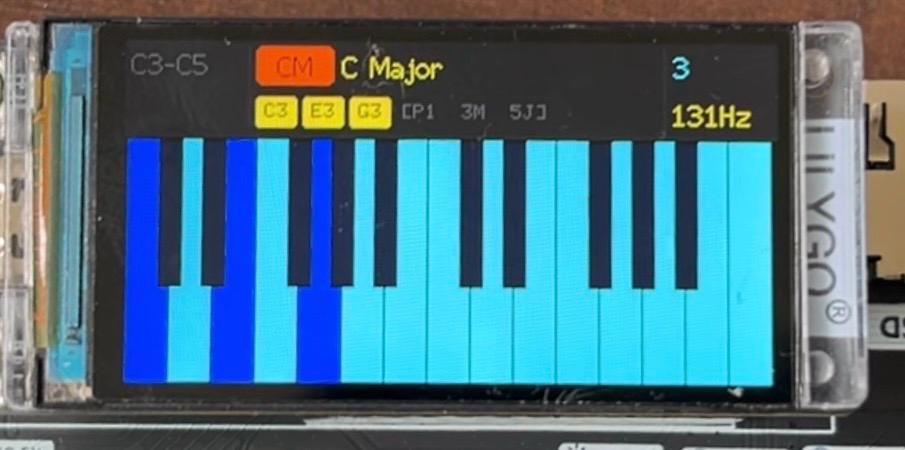
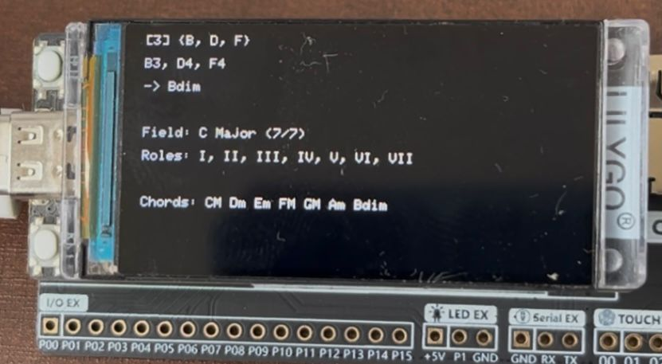
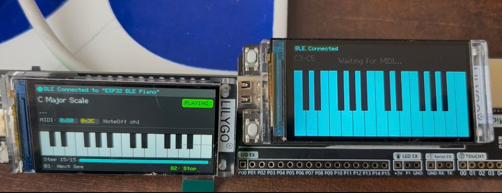
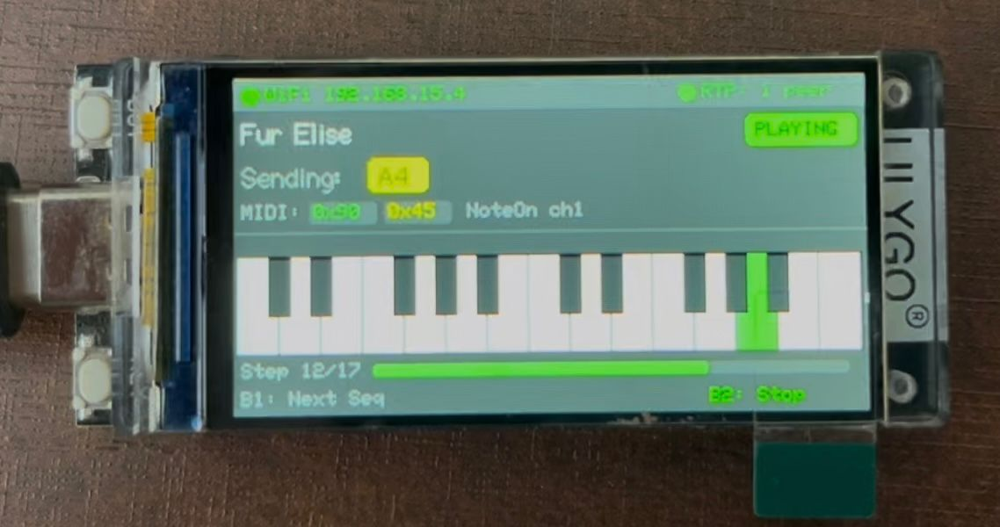
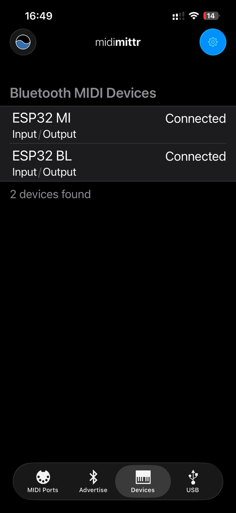
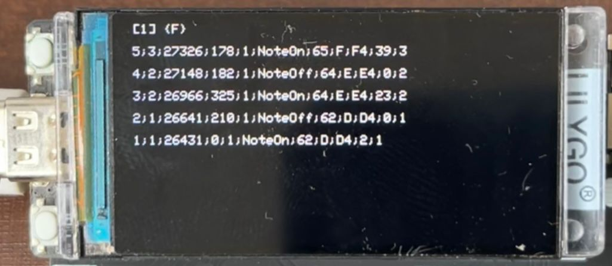
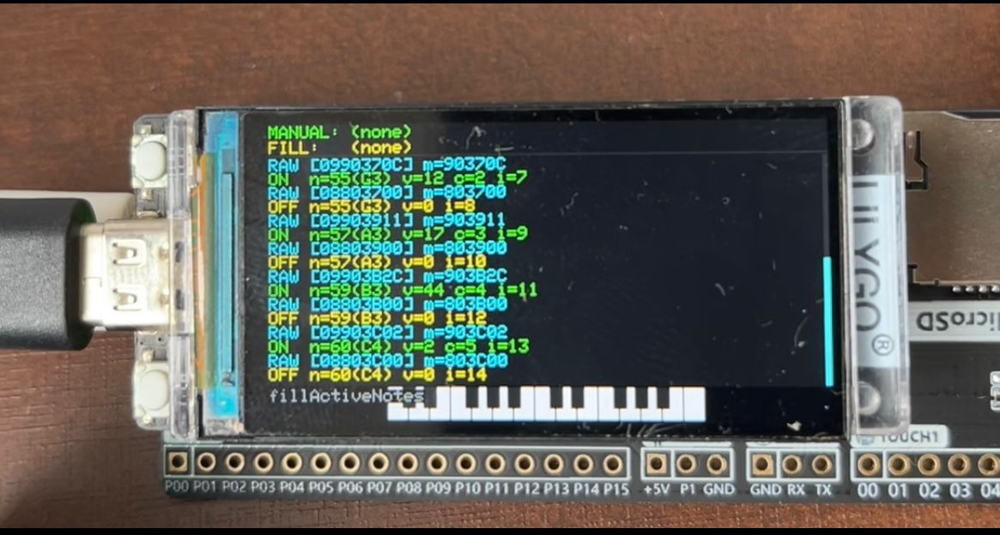

# ESP32\_Host\_MIDI

<p align="center">
  
  
  
</p>

<p align="center">
  <!-- MIDI protocols -->
  
  
  
  
  <br/>
  <!-- Platforms -->
  
  
  
  <br/>
  <!-- Ecosystem -->
  
  
  
  
  <br/>
  <!-- Meta -->
  
  
  
</p>

<p align="center">
  <a href="README-PT-BR.md">🇧🇷 Português (Brasil)</a>
</p>

---

## English

**The universal MIDI hub for ESP32 — 8 transports, one API.**

ESP32\_Host\_MIDI turns your ESP32 into a full-featured, multi-protocol MIDI hub. Connect a USB keyboard, receive notes from an iPhone via Bluetooth, bridge your DAW over WiFi with RTP-MIDI (Apple MIDI), control Max/MSP via OSC, reach 40-year-old synths through a DIN-5 serial cable, and link multiple ESP32 boards wirelessly with ESP-NOW — **all simultaneously, all through the same clean event API.**

```cpp
#include <ESP32_Host_MIDI.h>

void setup() { midiHandler.begin(); }

void loop() {
    midiHandler.task();
    for (const auto& ev : midiHandler.getQueue())
        Serial.printf("%-12s %-4s ch=%d  vel=%d\n",
            ev.status.c_str(), ev.noteOctave.c_str(),
            ev.channel, ev.velocity);
}
```

---

### What can you build?

> A partial list. Every combination of transports opens a new instrument, tool, or installation.

**Wireless MIDI interfaces**
- USB keyboard → ESP32 → WiFi → macOS (Logic Pro / GarageBand) — no drivers, no cables to the Mac
- iPhone / iPad BLE app → ESP32 → USB MIDI Device → DAW port — iOS apps become studio controllers
- ESP32 presents itself as a USB MIDI Class Compliant interface — plug into any computer, it just works

**Custom hardware instruments**
- **Effects pedal board** — ESP32 sends Program Change / CC messages to a Daisy Seed or hardware multi-effects unit; display shows preset name and bank
- **MIDI drum pad** — piezo sensors on ADC inputs → velocity-sensitive MIDI notes → USB or BLE
- **Custom synthesizer** — ESP32 receives MIDI and controls an external DAC + VCO/VCA analog circuit, or triggers a Daisy Seed running a synth engine
- **MIDI controller** — encoders, faders, buttons, touchpads → USB MIDI Device → any DAW
- **MIDI to CV converter** — ESP32 + external DAC (MCP4728, MCP4921) → 0–5 V CV / gate for Eurorack and analog synths
- **Wireless expression pedal** — foot controller with ESP-NOW → central ESP32 hub → CC messages
- **Smart metronome / clock** — generates MIDI Clock at precise BPM, sent simultaneously over USB, BLE, DIN-5, and WiFi
- **Theremin with MIDI output** — ultrasonic sensors or capacitive touch → pitch + volume → MIDI notes
- **MIDI accordion or wind controller** — pressure sensors + buttons → ESP32 → BLE → iPad instrument

**Bridges and routers**
- DIN-5 vintage synth → ESP32 → USB Device → modern DAW — zero-driver adapter
- Wireless stage rig: ESP-NOW mesh of performers → single USB output to FOH computer
**Creative software integration**
- Max/MSP / Pure Data / SuperCollider ↔ ESP32 over OSC — bidirectional, address-mapped
- TouchOSC tablet → ESP32 → DIN-5 hardware synth — touchscreen for vintage gear
- Algorithmic composition in Max → OSC → ESP32 → BLE → iOS instrument app

**Monitoring and education**
- Live piano roll: keys lit as you play, scrollable view on a 1.9" display
- Real-time chord detection: plays a chord, see its name instantly ("Cmaj7", "Dm7♭5")
- MIDI event logger with timestamps, channel, velocity, and chord grouping

---

### Transport Matrix

| Transport | Protocol | Physical | Latency | Requires |
|-----------|----------|----------|---------|----------|
| [USB Host](#usb-host-otg) | USB MIDI 1.0 | USB-OTG cable | < 1 ms | ESP32-S3 / S2 / P4 |
| [BLE MIDI](#ble-midi) | BLE MIDI 1.0 | Bluetooth LE | 3–15 ms | Any ESP32 with BT |
| [USB Device](#usb-device) | USB MIDI 1.0 | USB-OTG cable | < 1 ms | ESP32-S3 / S2 / P4 |
| [ESP-NOW MIDI](#esp-now-midi) | ESP-NOW | 2.4 GHz radio | 1–5 ms | Any ESP32 |
| [RTP-MIDI (WiFi)](#rtp-midi--apple-midi) | AppleMIDI / RFC 6295 | WiFi UDP | 5–20 ms | Any ESP32 with WiFi |
| [Ethernet MIDI](#ethernet-midi) | AppleMIDI / RFC 6295 | Wired (W5x00 / native) | 2–10 ms | W5500 SPI or ESP32-P4 |
| [OSC](#osc) | Open Sound Control | WiFi UDP | 5–15 ms | Any ESP32 with WiFi |
| [UART / DIN-5](#uart--din-5) | Serial MIDI 1.0 | DIN-5 connector | < 1 ms | Any ESP32 |

All transports share a single `MIDIHandler` event queue and the same send API. Mix and match at will.

> **MIDI 2.0** — Official MIDI 2.0 / UMP integration is under active development, following the [AM_MIDI2.0Lib](https://github.com/midi2-dev/AM_MIDI2.0Lib) standard endorsed by the MIDI Association. Stay tuned.

---

### Quick Start

```cpp
#include <ESP32_Host_MIDI.h>
// Arduino IDE: Tools > USB Mode → "USB Host"

void setup() {
    Serial.begin(115200);
    midiHandler.begin();
}

void loop() {
    midiHandler.task();
    for (const auto& ev : midiHandler.getQueue())
        Serial.println(ev.noteOctave.c_str());
}
```

Access individual fields:

```cpp
for (const auto& ev : midiHandler.getQueue()) {
    ev.status;      // "NoteOn" | "NoteOff" | "ControlChange" | "PitchBend" …
    ev.channel;     // 1–16
    ev.note;        // MIDI note number (0–127)
    ev.noteOctave;  // "C4", "D#5" …
    ev.velocity;    // 0–127
    ev.pitchBend;   // 0–16383 (center = 8192)
    ev.chordIndex;  // groups simultaneous notes
    ev.timestamp;   // millis() at arrival
}
```

---

### Gallery

<p align="center">
  &nbsp;
  &nbsp;
  
</p>
<p align="center"><em>RTP-MIDI / Apple MIDI connecting to macOS · 25-key scrolling piano roll</em></p>

<p align="center">
  &nbsp;
  
</p>
<p align="center"><em>25-key scrolling piano roll · Real-time chord name (Gingoduino) · Event queue debug</em></p>

<p align="center">
  &nbsp;
  &nbsp;
  
</p>
<p align="center"><em>BLE Receiver (iPhone → ESP32) · BLE Sender · Piano debug view</em></p>

> **Videos** — each example folder contains an `.mp4` demo inside `examples/<name>/images/`.

---

### Architecture

```
╔══════════════════════════════════════════════════════════════════════╗
║  INPUTS                          MIDIHandler             OUTPUTS    ║
║                                                                      ║
║  USB keyboard ──[USBConnection]────►  ┌──────────────┐              ║
║  iPhone BLE   ──[BLEConnection]────►  │              │              ║
║  macOS WiFi   ──[RTPMIDIConn.]─────►  │  Event Queue │──► getQueue()║
║  DAW USB out  ──[USBDeviceConn]────►  │  (ring buf,  │              ║
║  Max/MSP OSC  ──[OSCConnection]────►  │  thread-safe)│──► Active    ║
║  W5500 LAN    ──[EthernetMIDI]─────►  │              │    notes     ║
║  DIN-5 serial ──[UARTConnection]───►  │  Chord       │              ║
║  ESP32 radio  ──[ESPNowConn.]──────►  └──────┬───────┘──► Chord     ║
║                                              │            names     ║
║                                              │                      ║
║                                              ▼                      ║
║                                     sendMidiMessage()               ║
║                                  (broadcasts to ALL transports)     ║
╚══════════════════════════════════════════════════════════════════════╝
```

**Core 0** — USB Host task, BLE stack, radio / network drivers (FreeRTOS tasks)
**Core 1** — `midiHandler.task()` + your `loop()` code
**Thread safety** — ring buffers + `portMUX` spinlocks on every transport

Every transport implements the same `MIDITransport` abstract interface. Adding a new transport is one line: `midiHandler.addTransport(&myTransport)`.

---

### Transports

#### USB Host (OTG)

Connects any class-compliant USB MIDI device — keyboards, pads, interfaces, drum machines, controllers — directly to the ESP32's USB-OTG port. No hub, no driver, no OS configuration.

**Boards:** ESP32-S3, ESP32-S2, ESP32-P4 · **Arduino IDE:** `Tools > USB Mode → "USB Host"`

```cpp
#include <ESP32_Host_MIDI.h>
void setup() { midiHandler.begin(); }
```

**Examples:** `T-Display-S3`, `T-Display-S3-Queue`, `T-Display-S3-Piano`, `T-Display-S3-Gingoduino`

---

#### BLE MIDI

The ESP32 advertises as a BLE MIDI 1.0 peripheral. macOS (**Audio MIDI Setup → Bluetooth**), iOS (**GarageBand, AUM, Loopy, Moog**), and Android connect without any pairing ritual. Also supports Central (scanner) mode to connect to another BLE MIDI device.

**Boards:** Any ESP32 with Bluetooth · **Range:** ~30 m · **Latency:** 3–15 ms

```cpp
#include <ESP32_Host_MIDI.h>
void setup() { midiHandler.begin(); }  // BLE advertises automatically
```

<p align="center">
  
</p>

**Examples:** `T-Display-S3-BLE-Sender`, `T-Display-S3-BLE-Receiver`

---

#### USB Device

The ESP32-S3 presents itself as a class-compliant USB MIDI interface to the host computer. macOS, Windows, and Linux recognise it instantly — no driver. Acts as a transparent bridge: any MIDI from BLE, WiFi, UART, or ESP-NOW is forwarded to the DAW via USB, and vice versa.

**Boards:** ESP32-S3, ESP32-S2, ESP32-P4 · **Arduino IDE:** `Tools > USB Mode → "USB-OTG (TinyUSB)"`
> Cannot coexist with USB Host — both use the OTG port.

```cpp
#include "src/USBDeviceConnection.h"

USBDeviceConnection usbMIDI("ESP32 MIDI");   // name shown in DAW MIDI port list

void setup() {
    midiHandler.addTransport(&usbMIDI);
    usbMIDI.begin();
    midiHandler.begin();
}
```

**Examples:** `USB-Device-MIDI`, `T-Display-S3-USB-Device`

---

#### ESP-NOW MIDI

Ultra-low-latency (~1–5 ms) wireless MIDI between ESP32 boards via Espressif's proprietary peer-to-peer radio. No WiFi router, no handshake, no pairing. Broadcast mode (all boards receive everyone's notes) or unicast.

**Boards:** Any ESP32 · **Range:** ~200 m open air · **Infrastructure:** none

```cpp
#include "src/ESPNowConnection.h"

ESPNowConnection espNow;

void setup() {
    espNow.begin();
    midiHandler.addTransport(&espNow);
    midiHandler.begin();
}
```

**Examples:** `ESP-NOW-MIDI`, `T-Display-S3-ESP-NOW-Jam`

---

#### RTP-MIDI / Apple MIDI

Implements **Apple MIDI** (RTP-MIDI, RFC 6295) over WiFi UDP. macOS and iOS discover the ESP32 automatically via **mDNS Bonjour** — it appears in **Audio MIDI Setup → Network** with no manual configuration. Compatible with Logic Pro, GarageBand, Ableton, and any CoreMIDI app.

**Requires:** `lathoub/Arduino-AppleMIDI-Library v3.x`

```cpp
#include <WiFi.h>
#include "src/RTPMIDIConnection.h"

RTPMIDIConnection rtpMIDI;

void setup() {
    WiFi.begin("YourSSID", "YourPassword");
    while (WiFi.status() != WL_CONNECTED) delay(500);
    midiHandler.addTransport(&rtpMIDI);
    rtpMIDI.begin();
    midiHandler.begin();
}
```

<p align="center">
  &nbsp;
  
</p>

**Examples:** `RTP-MIDI-WiFi`

---

#### Ethernet MIDI

Same RTP-MIDI / AppleMIDI protocol over a wired W5x00 SPI Ethernet module or ESP32-P4 native Ethernet MAC. Lower and more consistent latency than WiFi. Ideal for studio racks and live venues with managed networks.

**Requires:** `lathoub/Arduino-AppleMIDI-Library v3.x` + `Arduino Ethernet library`

```cpp
#include <SPI.h>
#include "src/EthernetMIDIConnection.h"

EthernetMIDIConnection ethMIDI;
static const uint8_t MAC[] = { 0xDE, 0xAD, 0xBE, 0xEF, 0xFE, 0xED };

void setup() {
    midiHandler.addTransport(&ethMIDI);
    ethMIDI.begin(MAC);   // DHCP — pass a static IPAddress as second arg for fixed IP
    midiHandler.begin();
}
```

**Examples:** `Ethernet-MIDI`

---

#### OSC

Bidirectional **OSC ↔ MIDI** bridge over WiFi UDP. Receives OSC messages from Max/MSP, Pure Data, SuperCollider, and TouchOSC and converts them to MIDI events — and sends every MIDI event out as an OSC message.

**Address map:** `/midi/noteon`, `/midi/noteoff`, `/midi/cc`, `/midi/pc`, `/midi/pitchbend`, `/midi/aftertouch`

**Requires:** `CNMAT/OSC library`

```cpp
#include <WiFi.h>
#include "src/OSCConnection.h"

OSCConnection oscMIDI;

void setup() {
    WiFi.begin("YourSSID", "YourPassword");
    while (WiFi.status() != WL_CONNECTED) delay(500);
    midiHandler.addTransport(&oscMIDI);
    oscMIDI.begin(8000, IPAddress(192, 168, 1, 100), 9000);
    midiHandler.begin();
}
```

**Examples:** `OSC-MIDI-WiFi`, `T-Display-S3-OSC`

---

#### UART / DIN-5

Standard MIDI serial (31250 baud, 8N1) for connecting **vintage hardware** — synthesizers, drum machines, mixers, sequencers, anything with a DIN-5 connector. Supports running status, real-time messages (Clock, Start, Stop), and multiple simultaneous UART ports (ESP32-P4 has five hardware UARTs).

**Hardware:** TX → DIN-5 pin 5 via 220 Ω; PC-900V / 6N138 optocoupler on RX → DIN-5 pin 4

```cpp
#include "src/UARTConnection.h"

UARTConnection uartMIDI;

void setup() {
    uartMIDI.begin(Serial1, /*RX=*/16, /*TX=*/17);
    midiHandler.addTransport(&uartMIDI);
    midiHandler.begin();
}
```

**Examples:** `UART-MIDI-Basic`, `P4-Dual-UART-MIDI`

---

### Bridge Use Cases

Any MIDI arriving on any transport is automatically forwarded to all others — no extra code.

| Bridge | Diagram |
|--------|---------|
| Wireless keyboard → DAW | iPhone BLE → ESP32 → USB Device → Logic Pro |
| USB keyboard → WiFi | USB keyboard → ESP32 → RTP-MIDI → macOS |
| Legacy to modern | DIN-5 synth → ESP32 → USB Device → any DAW |
| Modern to legacy | macOS → RTP-MIDI → ESP32 → DIN-5 → 1980s drum machine |
| Wireless stage mesh | ESP-NOW nodes → ESP32 hub → USB → FOH computer |
| Creative software | Max/MSP OSC → ESP32 → BLE → iPad instrument app |

**Full hub — receive everything, send everywhere:**

```
USB keyboard ─┐
iPhone BLE   ─┤
macOS RTP   ──┼──► MIDIHandler ──► USB Device (DAW)
DIN-5 synth ─┤               ──► BLE (iOS app)
TouchOSC    ─┤               ──► DIN-5 (drum machine)
ESP-NOW     ─┘               ──► ESP-NOW (stage nodes)
```

---

### Hardware Ecosystem

ESP32\_Host\_MIDI acts as the **MIDI brain and protocol hub**. It connects and communicates with a broad ecosystem of boards and devices.

#### Boards you can connect to the ESP32

| Board | Connection | Use case |
|-------|-----------|----------|
| **[Daisy Seed](https://electro-smith.com/daisy)** (Electro-Smith) | UART / DIN-5 or USB | DSP audio synthesis engine; ESP32 sends MIDI, Daisy plays notes |
| **Teensy 4.x** (PJRC) | UART serial or USB Host | Complex MIDI routing or synthesis; excellent USB MIDI native support |
| **Arduino UNO / MEGA / Nano** | UART serial (DIN-5) | Classic MIDI projects; ESP32 is the wireless gateway |
| **Raspberry Pi** | RTP-MIDI, OSC, or USB | DAW host, audio processing, generative composition |
| **Eurorack / modular synths** | MIDI DIN-5 → CV/gate interface | Pitch CV, gate, velocity → analogue voltage via converter module |
| **Hardware synthesizers** | DIN-5 | Any keyboard, rack synth, or effects unit with MIDI In/Out/Thru |
| **iPad / iPhone** | BLE MIDI | GarageBand, AUM, Moog apps, NLog, Animoog — all CoreMIDI-compatible |
| **Computer DAW** | USB Device or RTP-MIDI | Logic Pro, Ableton, Bitwig, FL Studio, Reaper, Pro Tools |

> **Daisy Seed + ESP32** is a particularly powerful combination: the ESP32 handles all MIDI connectivity (USB, BLE, WiFi, DIN-5) and the Daisy Seed processes audio in real time at 48 kHz / 24-bit with its ARM Cortex-M7 DSP. They talk over a single UART/DIN-5 cable.

> **Teensy 4.1** can run complex MIDI logic, arpeggiators, chord voicers, or sequencers, while ESP32 handles wireless transport — each board doing what it does best.

#### Hardware projects you can build

```
┌─────────────────────────────────────────────────────────────────────┐
│  PROJECT               │  COMPONENTS                                 │
├─────────────────────────────────────────────────────────────────────┤
│  Wireless MIDI pedal   │  ESP32 + buttons + enclosure → ESP-NOW     │
│  board                 │  → central hub → DIN-5 / USB to amp rack   │
├─────────────────────────────────────────────────────────────────────┤
│  MIDI drum pad         │  ESP32 + piezo sensors + ADC → velocity-   │
│                        │  sensitive MIDI notes over USB or BLE       │
├─────────────────────────────────────────────────────────────────────┤
│  Synthesizer           │  ESP32 + Daisy Seed: ESP32 bridges all     │
│                        │  MIDI protocols, Daisy generates audio      │
├─────────────────────────────────────────────────────────────────────┤
│  MIDI to CV converter  │  ESP32 + MCP4728 DAC → 0–5 V pitch CV +   │
│                        │  gate for Eurorack / analogue synths        │
├─────────────────────────────────────────────────────────────────────┤
│  Custom MIDI           │  ESP32-S3 + encoders + faders + OLED →     │
│  controller            │  USB MIDI Device recognized by any DAW      │
├─────────────────────────────────────────────────────────────────────┤
│  Piano learning aid    │  ESP32 + RGB LEDs on piano keys + display  │
│                        │  → lights the correct key for each note     │
├─────────────────────────────────────────────────────────────────────┤
│  Wireless expression   │  ESP32 + FSR / potentiometer in foot       │
│  pedal                 │  enclosure → CC messages via ESP-NOW        │
├─────────────────────────────────────────────────────────────────────┤
│  MIDI arpeggiator /    │  ESP32 receives chords, generates          │
│  sequencer             │  arpeggiated patterns, sends to DIN-5       │
├─────────────────────────────────────────────────────────────────────┤
│  Theremin / air synth  │  Ultrasonic sensors → pitch + volume →     │
│                        │  MIDI notes via BLE or USB                  │
├─────────────────────────────────────────────────────────────────────┤
│  Interactive art       │  Motion / proximity / touch sensors →      │
│  installation          │  MIDI → generative music / light control    │
└─────────────────────────────────────────────────────────────────────┘
```

---

### Display Examples (T-Display-S3)

The LilyGO T-Display-S3 has a 1.9" 170×320 ST7789 display + ESP32-S3. These examples show a live MIDI dashboard in landscape mode (320×170 after `setRotation(2)`).

| Example | Transport | What the display shows |
|---------|-----------|------------------------|
| `T-Display-S3` | USB Host | Active notes + event log |
| `T-Display-S3-Queue` | USB Host | Full event queue debug view |
| `T-Display-S3-Piano` | USB Host | 25-key scrollable piano roll |
| `T-Display-S3-Piano-Debug` | USB Host | Piano roll + extended debug info |
| `T-Display-S3-Gingoduino` | USB Host + BLE | Chord names (music theory engine) |
| `T-Display-S3-BLE-Sender` | BLE | Send mode status + event log |
| `T-Display-S3-BLE-Receiver` | BLE | Receive mode + note log |
| `T-Display-S3-ESP-NOW-Jam` | ESP-NOW | Peer status + jam events |
| `T-Display-S3-OSC` | OSC + WiFi | WiFi status + OSC bridge log |
| `T-Display-S3-USB-Device` | BLE + USB Device | Dual status + bridge log |

---

### Gingoduino — Music Theory on Embedded Systems

[**Gingoduino**](https://github.com/sauloverissimo/gingoduino) is a music theory library for embedded systems — the same engine that powers the `T-Display-S3-Gingoduino` example. When integrated via `GingoAdapter.h`, it listens to the same MIDI event stream and continuously analyses the active notes to produce:

- **Chord name** — "Cmaj7", "Dm7♭5", "G7", "Am" with extensions and alterations
- **Root note** — identified root pitch of the chord
- **Active note set** — structured list of currently pressed notes
- **Interval analysis** — intervals between notes (M3, m7, P5, etc.)
- **Scale matching** — identifies likely scale (major, minor, modes)

Everything runs **on-device** at interrupt speed — no cloud, no network, no latency.

```cpp
#include "src/GingoAdapter.h"  // requires Gingoduino ≥ v0.2.2

void loop() {
    midiHandler.task();

    // Chord name updates automatically as notes arrive and are released:
    std::string chord = gingoAdapter.getChordName();  // "Cmaj7", "Dm", "G7sus4" …
    std::string root  = gingoAdapter.getRootNote();    // "C", "D", "G" …

    display.setChord(chord.c_str());
}
```

<p align="center">
  
</p>
<p align="center"><em>T-Display-S3-Gingoduino: chord name, root note, and active keys updated in real time</em></p>

**→ [github.com/sauloverissimo/gingoduino](https://github.com/sauloverissimo/gingoduino)**

---

### Gingo — Music Theory for Python and Desktop

[**Gingo**](https://github.com/sauloverissimo/gingo) is the desktop and Python counterpart of Gingoduino — the same music theory concepts ported to Python for use in scripts, DAW integrations, MIDI processors, composition tools, and web apps.

Use it to:
- Analyse MIDI files and extract chord progressions
- Build Python MIDI processors that recognise chords on the fly
- Create web applications with real-time music theory annotation
- Prototype music theory algorithms before porting them to Gingoduino
- Generate chord charts, lead sheets, and educational exercises

```python
from gingo import Gingo

g = Gingo()
chord = g.identify([60, 64, 67, 71])   # C E G B
print(chord.name)   # "Cmaj7"
print(chord.root)   # "C"
```

**→ [github.com/sauloverissimo/gingo](https://github.com/sauloverissimo/gingo)**
**→ [sauloverissimo.github.io/gingo](https://sauloverissimo.github.io/gingo/)**

> **ESP32 + Gingo workflow:** prototype music theory algorithms in Python with Gingo → port the logic to Gingoduino on ESP32 → display chord names live on T-Display-S3.

---

### Hardware Compatibility

#### Chip → available transports

| Chip | USB Host | BLE | USB Device | WiFi | Ethernet (native) | UART | ESP-NOW |
|------|:--------:|:---:|:----------:|:----:|:-----------------:|:----:|:-------:|
| ESP32-S3 | ✅ | ✅ | ✅ | ✅ | ❌ (W5500 SPI) | ✅ | ✅ |
| ESP32-S2 | ✅ | ❌ | ✅ | ✅ | ❌ (W5500 SPI) | ✅ | ❌ |
| ESP32-P4 | ✅ | ❌ | ✅ | ❌ | ✅ | ✅ ×5 | ❌ |
| ESP32 (classic) | ❌ | ✅ | ❌ | ✅ | ❌ (W5500 SPI) | ✅ | ✅ |
| ESP32-C3 / C6 / H2 | ❌ | ✅ | ❌ | ✅ | ❌ | ✅ | ✅ |

> W5500 SPI Ethernet works on **any** ESP32 via `EthernetMIDIConnection`.

#### Recommended boards

| Use case | Board |
|----------|-------|
| Best all-round (USB Host + BLE + WiFi + display) | **LilyGO T-Display-S3** |
| Full USB Host + USB Device + BLE | Any ESP32-S3 DevKit |
| Ultra-low-latency wireless stage mesh | ESP32 DevKit (ESP-NOW) |
| Wired studio rack | ESP32-P4 native Ethernet or any ESP32 + W5500 |
| DIN-5 MIDI gateway | Any ESP32 + UART optocoupler |

---

### Installation

**Arduino IDE:** Sketch → Include Library → Manage Libraries → search **ESP32_Host_MIDI**

**PlatformIO:**
```ini
[env:esp32-s3-devkitc-1]
platform = espressif32
board    = esp32-s3-devkitc-1
framework = arduino

lib_deps =
    sauloverissimo/ESP32_Host_MIDI
    # lathoub/Arduino-AppleMIDI-Library  ; RTP-MIDI + Ethernet MIDI
    # arduino-libraries/Ethernet          ; Ethernet MIDI
    # CNMAT/OSC                           ; OSC
    # sauloverissimo/gingoduino           ; Chord names
```

**Board package:** `Tools > Boards Manager → "esp32" by Espressif → ≥ 3.0.0`
USB Host and USB Device require **arduino-esp32 ≥ 3.0** (TinyUSB MIDI).

| Transport | Required library |
|-----------|-----------------|
| RTP-MIDI / Ethernet MIDI | `lathoub/Arduino-AppleMIDI-Library` |
| Ethernet MIDI | `arduino-libraries/Ethernet` |
| OSC | `CNMAT/OSC` |
| Chord names | `sauloverissimo/gingoduino` |
| USB Host / Device / BLE / ESP-NOW | Built into arduino-esp32 |

---

### API Reference

```cpp
// Setup
midiHandler.begin();               // start built-in transports (USB, BLE, ESP-NOW)
midiHandler.begin(cfg);            // with custom config
midiHandler.addTransport(&t);      // register external transport

// Receive
const auto& q = midiHandler.getQueue();                        // event ring buffer
std::vector<std::string> n = midiHandler.getActiveNotesVector(); // ["C4","E4","G4"]
std::string chord = midiHandler.getChordName();                 // "Cmaj7"

// Send (broadcasts to ALL transports simultaneously)
midiHandler.sendNoteOn(ch, note, vel);
midiHandler.sendNoteOff(ch, note, vel);
midiHandler.sendControlChange(ch, ctrl, val);
midiHandler.sendProgramChange(ch, prog);
midiHandler.sendPitchBend(ch, val);          // 0–16383, center = 8192
```

**MIDIHandlerConfig:**
```cpp
MIDIHandlerConfig cfg;
cfg.maxEvents      = 20;    // queue capacity
cfg.enableHistory  = true;  // keep full history
cfg.chordDetection = true;  // group simultaneous notes
```

**Custom transport interface:**
```cpp
class MyTransport : public MIDITransport {
public:
    void task() override;
    bool isConnected() const override;
    bool sendMidiMessage(const uint8_t* data, size_t len) override;
protected:
    void dispatchMidiData(const uint8_t* data, size_t len); // inject received MIDI
    void dispatchConnected();
    void dispatchDisconnected();
};
midiHandler.addTransport(&myTransport);
```

---

### File Structure

```
ESP32_Host_MIDI/
├── src/
│   ├── ESP32_Host_MIDI.h             ← main include (USB + BLE + ESP-NOW built-in)
│   ├── MIDIHandler.h / .cpp          ← event queue, chord detection, active notes
│   ├── MIDITransport.h               ← abstract transport interface
│   ├── MIDIHandlerConfig.h           ← config struct
│   ├── USBConnection.h / .cpp        ← USB Host OTG
│   ├── BLEConnection.h / .cpp        ← BLE MIDI
│   ├── ESPNowConnection.h / .cpp     ← ESP-NOW MIDI
│   ├── UARTConnection.h / .cpp       ← UART / DIN-5
│   ├── USBDeviceConnection.h         ← USB MIDI Device (header-only)
│   ├── RTPMIDIConnection.h / .cpp    ← RTP-MIDI over WiFi (header-only)
│   ├── EthernetMIDIConnection.h      ← AppleMIDI over Ethernet (header-only)
│   ├── OSCConnection.h               ← OSC ↔ MIDI bridge (header-only)
│   └── GingoAdapter.h                ← Gingoduino chord integration
└── examples/
    ├── T-Display-S3/                 T-Display-S3-Queue/
    ├── T-Display-S3-Piano/           T-Display-S3-Piano-Debug/
    ├── T-Display-S3-Gingoduino/      T-Display-S3-BLE-Sender/
    ├── T-Display-S3-BLE-Receiver/    T-Display-S3-ESP-NOW-Jam/
    ├── T-Display-S3-OSC/             T-Display-S3-USB-Device/
    ├── ESP-NOW-MIDI/                 UART-MIDI-Basic/
    ├── P4-Dual-UART-MIDI/           RTP-MIDI-WiFi/
    ├── Ethernet-MIDI/               OSC-MIDI-WiFi/
    └── USB-Device-MIDI/
```

---

### License

MIT — see [LICENSE](LICENSE)

---

<p align="center">
  Built with ❤️ for musicians, makers, and researchers.<br/>
  Issues and contributions welcome:
  <a href="https://github.com/sauloverissimo/ESP32_Host_MIDI">github.com/sauloverissimo/ESP32_Host_MIDI</a>
</p>
