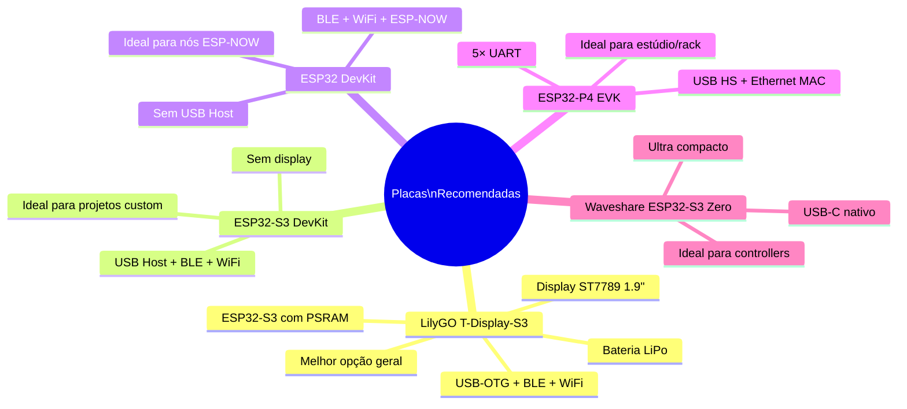

# 🔧 Hardware Suportado

Referência completa de chips ESP32, módulos e dispositivos externos compatíveis com ESP32_Host_MIDI.

---

## Chips ESP32 por Recurso

| Chip | USB Host | BLE | USB Device | WiFi | Ethernet nativo | UART | ESP-NOW |
|------|:--------:|:---:|:----------:|:----:|:---------------:|:----:|:-------:|
| **ESP32-S3** | ✅ FS | ✅ | ✅ | ✅ | ❌ | ✅ | ✅ |
| **ESP32-S2** | ✅ FS | ❌ | ✅ | ✅ | ❌ | ✅ | ❌ |
| **ESP32-P4** | ✅ **HS** | ❌ | ✅ | ❌ | ✅ | ✅ ×5 | ❌ |
| **ESP32 Classic** | ❌ | ✅ | ❌ | ✅ | ❌ | ✅ | ✅ |
| **ESP32-C3** | ❌ | ✅ | ❌ | ✅ | ❌ | ✅ | ✅ |
| **ESP32-C6** | ❌ | ✅ | ❌ | ✅ | ❌ | ✅ | ✅ |
| **ESP32-H2** | ❌ | ✅ | ❌ | ❌ | ❌ | ✅ | ✅ |

**FS** = Full-Speed (12 Mbps) · **HS** = High-Speed (480 Mbps)

!!! note "W5500 SPI Ethernet"
    O módulo Ethernet W5500 (SPI) funciona em **qualquer ESP32** via `EthernetMIDIConnection`. A coluna "Ethernet nativo" refere-se ao MAC Ethernet integrado no chip.

---

## Placas Recomendadas



---

## LilyGO T-Display-S3 (Placa Recomendada)

A melhor placa para ESP32_Host_MIDI — tudo em um:

| Especificação | Valor |
|-------------|-------|
| Chip | ESP32-S3 (dual-core 240 MHz) |
| PSRAM | 8 MB OPI PSRAM |
| Flash | 16 MB |
| Display | ST7789 1.9" 170×320 pixels |
| USB | USB-C (OTG nativo) |
| Bluetooth | BLE 5.0 |
| WiFi | 802.11 b/g/n (2,4 GHz) |
| Bateria | Carregamento LiPo integrado |
| GPIO | 16+ pinos disponíveis |
| Botões | 2× botões de usuário |

**Configuração Arduino IDE:**
```
Board: "LilyGo T-Display-S3" ou "ESP32S3 Dev Module"
PSRAM: OPI PSRAM
USB Mode: USB Host (para teclado)
Upload Mode: USB-OTG / UART
```

---

## ESP32-P4 — Alta Performance

O ESP32-P4 é o chip mais poderoso da família ESP32:

| Especificação | Valor |
|-------------|-------|
| CPU | Dual RISC-V 400 MHz |
| USB | High-Speed (480 Mbps) — hub múltiplos dispositivos |
| Ethernet | MAC nativo (requer PHY externo, ex: LAN8720) |
| UART | 5× hardware UARTs |
| PSRAM | Até 32 MB |
| Desvantagem | **Sem WiFi, sem Bluetooth** |

!!! tip "ESP32-P4 + ESP32-C6"
    Para ter WiFi + Ethernet + USB HS ao mesmo tempo, use ESP32-P4 (USB, Ethernet, UART) conectado via UART a um ESP32-C6 (WiFi/BLE) como co-processador.

---

## Dispositivos USB MIDI Compatíveis

Qualquer dispositivo **USB MIDI 1.0 Class Compliant** funciona com USB Host:

| Categoria | Exemplos |
|-----------|---------|
| Teclados controladores | Arturia KeyLab, Akai MPK, Native Instruments Komplete Kontrol |
| Pads MIDI | Akai MPD, Roland SPD, Native Instruments Maschine |
| Interfaces MIDI | iConnectMIDI, Focusrite Scarlett, Roland UM-ONE |
| Controladores DJ | Numark NS7, Pioneer DDJ |
| Sopro MIDI | Akai EWI, Yamaha WX |
| Pedaleiras | Line 6 Helix, Boss MS-3 |
| Instrumentos digitais | Roland Aerophone, Casio PX-S |

!!! tip "Como verificar"
    Se funciona em macOS sem driver → é class-compliant → funciona com ESP32_Host_MIDI.

---

## Módulos Ethernet Compatíveis

| Módulo | Chip | Interface | Alimentação |
|-------|------|----------|------------|
| W5500 Mini | W5500 | SPI | 3.3V |
| Waveshare W5500 | W5500 | SPI | 3.3V |
| ENC28J60 | ENC28J60 | SPI | 3.3V |
| USR-ES1 W5500 | W5500 | SPI | 3.3V |

!!! warning "ENC28J60"
    O `EthernetMIDIConnection` usa a biblioteca `Ethernet.h` (W5x00). Para ENC28J60, use a biblioteca `EthernetENC` — compatível com a mesma API.

---

## Pinagem SPI Sugerida por Placa

### W5500 com ESP32 Classic
```
MOSI → GPIO 23
MISO → GPIO 19
SCK  → GPIO 18
CS   → GPIO 5
```

### W5500 com ESP32-S3
```
MOSI → GPIO 11
MISO → GPIO 13
SCK  → GPIO 12
CS   → GPIO 10
```

### W5500 com ESP32-P4
```
MOSI → GPIO (SPI2_MOSI)
MISO → GPIO (SPI2_MISO)
SCK  → GPIO (SPI2_CLK)
CS   → GPIO (qualquer disponível)
```

---

## Macros de Detecção em Tempo de Compilação

```cpp
// Verificar suporte de hardware no código:

#if ESP32_HOST_MIDI_HAS_USB
    // USB Host disponível — S2, S3, P4
#endif

#if ESP32_HOST_MIDI_HAS_BLE
    // BLE disponível — ESP32, S3, C3, C6, H2
    bool connected = midiHandler.isBleConnected();
#endif

#if ESP32_HOST_MIDI_HAS_PSRAM
    // PSRAM disponível — histórico grande
    midiHandler.enableHistory(1000);
#endif

#if ESP32_HOST_MIDI_HAS_ETH_MAC
    // MAC Ethernet nativo — apenas ESP32-P4
#endif
```

---

## Próximos Passos

- [MIDI 2.0 / UMP →](midi2-ump.md) — recursos específicos do P4
- [Troubleshooting →](troubleshooting.md) — problemas comuns de hardware
- [Transportes →](../transportes/visao-geral.md) — qual transporte usar em cada chip
