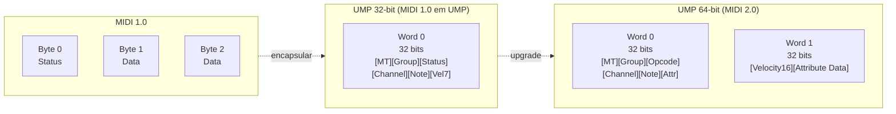
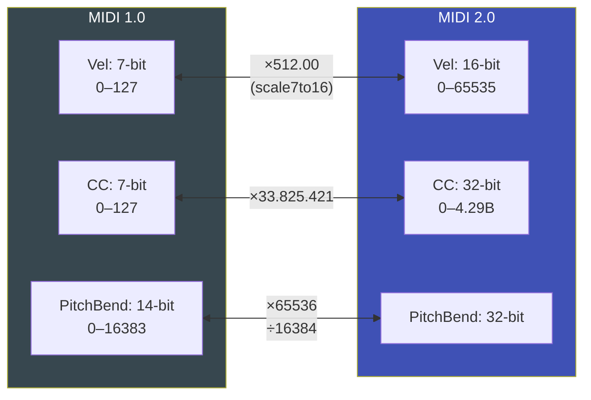

# 🚀 MIDI 2.0 / UMP — Deep Dive

Referência técnica completa sobre MIDI 2.0, Universal MIDI Packets (UMP) e a implementação em ESP32_Host_MIDI.

---

## O Que é MIDI 2.0

O MIDI 2.0 é o sucessor do MIDI 1.0 (1983), publicado pela MIDI Manufacturers Association (MMA) em 2020. Mantém **total retrocompatibilidade** com MIDI 1.0 enquanto adiciona:

- **Velocidade 16-bit** (0–65535 vs 0–127)
- **Control Change 32-bit** (0–4.294.967.295 vs 0–127)
- **Pitch Bend 32-bit** (maior precisão de afinação)
- **Pressure polirítmica 32-bit** por nota
- **Per-note controllers** (pitch bend por nota individualmente)
- **Profile Negotiation** — dispositivos negociam capacidades
- **Property Exchange** — metadados em JSON

---

## Universal MIDI Packet (UMP)

O MIDI 2.0 usa um novo formato de pacote — o **Universal MIDI Packet** — em vez dos bytes simples do MIDI 1.0:



---

## Tipos de Mensagem UMP

| Código | Tipo | Tamanho |
|--------|------|---------|
| `0x0` | Utility | 32-bit |
| `0x1` | System Real-Time / Common | 32-bit |
| `0x2` | MIDI 1.0 Channel Voice | 32-bit |
| `0x3` | Data Messages (SysEx7) | 64-bit |
| `0x4` | **MIDI 2.0 Channel Voice** | **64-bit** |
| `0x5` | Data Messages (SysEx8) | 128-bit |

---

## Opcodes MIDI 2.0 Channel Voice (MT=0x4)

| Opcode | Mensagem | Dados Word 1 |
|--------|---------|-------------|
| `0x9` | **Note On** | Velocity 16-bit |
| `0x8` | **Note Off** | Velocity 16-bit |
| `0xB` | **Control Change** | Value 32-bit |
| `0xE` | **Pitch Bend** | Value 32-bit |
| `0xC` | Program Change | — |
| `0xD` | Channel Pressure | Value 32-bit |
| `0xA` | Poly Pressure | Value 32-bit |
| `0x6` | Per-Note Pitch Bend | Value 32-bit |
| `0xF` | Per-Note Management | — |

---

## Escalamento MIDI 1.0 ↔ MIDI 2.0



### Fórmulas de Escalamento

```cpp
// MIDI 1.0 → MIDI 2.0 (upscale)
uint16_t vel16 = ((uint32_t)vel7 * 0xFFFF) / 0x7F;
uint32_t cc32  = ((uint64_t)cc7  * 0xFFFFFFFF) / 0x7F;
uint32_t pb32  = ((uint64_t)pb14 * 0xFFFFFFFF) / 0x3FFF;

// MIDI 2.0 → MIDI 1.0 (downscale)
uint8_t  vel7  = (vel16 * 0x7F + 0x8000) / 0xFFFF;
uint8_t  cc7   = (cc32  * 0x7F + 0x80000000) / 0xFFFFFFFF;
uint16_t pb14  = (pb32  * 0x3FFF + 0x80000000) / 0xFFFFFFFF;
```

---

## Implementação em ESP32_Host_MIDI

### MIDI2Support.h

```cpp
#include "src/MIDI2Support.h"

// ─── Tipos ─────────────────────────────────────────────────────────────────
struct UMPWord64 {
    uint32_t word0;
    uint32_t word1;
};

struct UMPResult {
    bool valid;
    bool isMIDI2;
    uint8_t msgType;        // Message Type (0x0–0x5)
    uint8_t channel;        // Canal (0–15)
    uint8_t note;           // Nota MIDI (0–127)
    uint16_t velocity16;    // Velocidade 16-bit (MIDI 2.0)
    uint32_t value;         // Valor 32-bit (CC, PB)
    uint8_t midi1[3];       // Equivalente MIDI 1.0 (downscaled)
};

// ─── Escalamento ───────────────────────────────────────────────────────────
class MIDI2Scaler {
public:
    static uint16_t scale7to16(uint8_t v7);
    static uint32_t scale7to32(uint8_t v7);
    static uint32_t scale14to32(uint16_t v14);
    static uint8_t  scale16to7(uint16_t v16);
    static uint8_t  scale32to7(uint32_t v32);
    static uint16_t scale32to14(uint32_t v32);
};

// ─── Builder ───────────────────────────────────────────────────────────────
class UMPBuilder {
public:
    static UMPWord64 noteOn(uint8_t group, uint8_t channel,
                             uint8_t note, uint16_t velocity16);
    static UMPWord64 noteOff(uint8_t group, uint8_t channel,
                              uint8_t note, uint16_t velocity16);
    static UMPWord64 controlChange(uint8_t group, uint8_t channel,
                                    uint8_t index, uint32_t value32);
    static UMPWord64 pitchBend(uint8_t group, uint8_t channel,
                                uint32_t value32);
};

// ─── Parser ────────────────────────────────────────────────────────────────
class UMPParser {
public:
    static UMPResult parseMIDI2(UMPWord64 pkt);
};
```

---

## Exemplo Completo — Construir e Parsear UMP

```cpp
#include "src/MIDI2Support.h"

void exemploUMP() {
    // 1. Nota com velocidade MIDI 1.0 (7-bit)
    uint8_t vel7 = 100;

    // 2. Escalar para MIDI 2.0 (16-bit)
    uint16_t vel16 = MIDI2Scaler::scale7to16(vel7);
    Serial.printf("vel7=%d → vel16=%u (%.1f%%)\n",
        vel7, vel16, vel16 / 65535.0f * 100.0f);

    // 3. Construir pacote UMP (NoteOn, grupo 0, canal 0, C4=60)
    UMPWord64 pkt = UMPBuilder::noteOn(0, 0, 60, vel16);
    Serial.printf("UMP Word0: 0x%08X\n", pkt.word0);
    Serial.printf("UMP Word1: 0x%08X\n", pkt.word1);

    // 4. Parsear de volta
    UMPResult r = UMPParser::parseMIDI2(pkt);
    Serial.printf("Parse: note=%d vel16=%u vel7=%d\n",
        r.note, r.velocity16, r.midi1[2]);
}
```

Saída:
```
vel7=100 → vel16=51380 (78.4%)
UMP Word0: 0x40093C00
UMP Word1: 0xC8B40000
Parse: note=60 vel16=51380 vel7=100
```

---

## MIDI2UDPConnection — Protocolo

Protocolo customizado ESP32→ESP32 de 12 bytes:

```
┌─────────────────────────────────────────────────────────────────┐
│ 55 4D 50 32  │  Word0 (4 bytes BE)  │  Word1 (4 bytes BE)      │
│  "UMP2"      │  Header UMP          │  Velocidade 16-bit        │
└─────────────────────────────────────────────────────────────────┘
```

Exemplo NoteOn C4, vel7=100:
```
55 4D 50 32   ← Magic "UMP2"
40 09 3C 00   ← MT=4, opcode=9 (NoteOn), ch=0, note=60
C8 B4 00 00   ← vel16 = 51380 = 0xC8B4
```

---

## Status do MIDI 2.0 na Biblioteca

| Feature | Status |
|---------|--------|
| UMP 32-bit (MIDI 1.0 in UMP) | ✅ Implementado |
| UMP 64-bit (MIDI 2.0) | ✅ NoteOn, NoteOff, CC, PB |
| Escalamento 7→16, 7→32, 14→32 | ✅ |
| MIDI2UDPConnection (ESP32↔ESP32) | ✅ |
| Profile Negotiation | 🔄 Futuro |
| Property Exchange | 🔄 Futuro |
| MIDI-CI | 🔄 Futuro |

---

## Próximos Passos

- [MIDI 2.0 UDP →](../transportes/midi2-udp.md) — usar o transporte
- [Exemplo MIDI 2.0 →](../exemplos/midi2-udp.md) — sketch com display
- [Roadmap →](../roadmap.md) — MIDI-CI e Profile Negotiation
