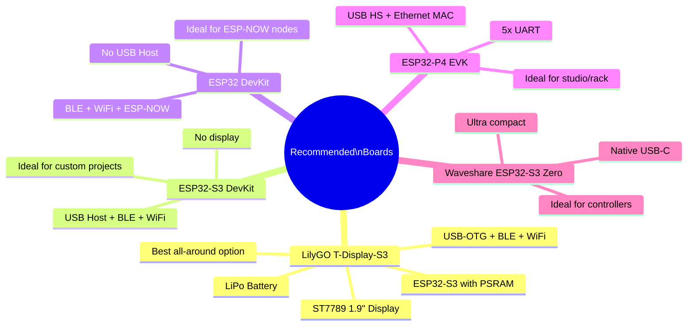

# Supported Hardware

Complete reference of ESP32 chips, modules, and external devices compatible with ESP32_Host_MIDI.

---

## ESP32 Chips by Feature

| Chip | USB Host | BLE | USB Device | WiFi | Native Ethernet | UART | ESP-NOW |
|------|:--------:|:---:|:----------:|:----:|:---------------:|:----:|:-------:|
| **ESP32-S3** | FS | | | | | | |
| **ESP32-S2** | FS | | | | | | |
| **ESP32-P4** | **HS** | | | | | x5 | |
| **ESP32 Classic** | | | | | | | |
| **ESP32-C3** | | | | | | | |
| **ESP32-C6** | | | | | | | |
| **ESP32-H2** | | | | | | | |

**FS** = Full-Speed (12 Mbps) - **HS** = High-Speed (480 Mbps)

!!! note "W5500 SPI Ethernet"
    The W5500 Ethernet module (SPI) works on **any ESP32** via `EthernetMIDIConnection`. The "Native Ethernet" column refers to the Ethernet MAC built into the chip.

---

## Recommended Boards



---

## LilyGO T-Display-S3 (Recommended Board)

The best board for ESP32_Host_MIDI -- everything in one package:

| Specification | Value |
|-------------|-------|
| Chip | ESP32-S3 (dual-core 240 MHz) |
| PSRAM | 8 MB OPI PSRAM |
| Flash | 16 MB |
| Display | ST7789 1.9" 170x320 pixels |
| USB | USB-C (native OTG) |
| Bluetooth | BLE 5.0 |
| WiFi | 802.11 b/g/n (2.4 GHz) |
| Battery | Built-in LiPo charging |
| GPIO | 16+ available pins |
| Buttons | 2x user buttons |

**Arduino IDE Configuration:**
```
Board: "LilyGo T-Display-S3" or "ESP32S3 Dev Module"
PSRAM: OPI PSRAM
USB Mode: USB Host (for keyboard)
Upload Mode: USB-OTG / UART
```

---

## ESP32-P4 -- High Performance

The ESP32-P4 is the most powerful chip in the ESP32 family:

| Specification | Value |
|-------------|-------|
| CPU | Dual RISC-V 400 MHz |
| USB | High-Speed (480 Mbps) -- hub with multiple devices |
| Ethernet | Native MAC (requires external PHY, e.g. LAN8720) |
| UART | 5x hardware UARTs |
| PSRAM | Up to 32 MB |
| Drawback | **No WiFi, no Bluetooth** |

!!! tip "ESP32-P4 + ESP32-C6"
    To get WiFi + Ethernet + USB HS all at once, use the ESP32-P4 (USB, Ethernet, UART) connected via UART to an ESP32-C6 (WiFi/BLE) as a co-processor.

---

## Compatible USB MIDI Devices

Any **USB MIDI 1.0 Class Compliant** device works with USB Host:

| Category | Examples |
|-----------|---------|
| Keyboard controllers | Arturia KeyLab, Akai MPK, Native Instruments Komplete Kontrol |
| MIDI pads | Akai MPD, Roland SPD, Native Instruments Maschine |
| MIDI interfaces | iConnectMIDI, Focusrite Scarlett, Roland UM-ONE |
| DJ controllers | Numark NS7, Pioneer DDJ |
| MIDI wind instruments | Akai EWI, Yamaha WX |
| Multi-effects pedals | Line 6 Helix, Boss MS-3 |
| Digital instruments | Roland Aerophone, Casio PX-S |

!!! tip "How to check"
    If it works on macOS without a driver, it is class-compliant and will work with ESP32_Host_MIDI.

---

## Compatible Ethernet Modules

| Module | Chip | Interface | Power |
|-------|------|----------|------------|
| W5500 Mini | W5500 | SPI | 3.3V |
| Waveshare W5500 | W5500 | SPI | 3.3V |
| ENC28J60 | ENC28J60 | SPI | 3.3V |
| USR-ES1 W5500 | W5500 | SPI | 3.3V |

!!! warning "ENC28J60"
    `EthernetMIDIConnection` uses the `Ethernet.h` library (W5x00). For ENC28J60, use the `EthernetENC` library instead -- it is compatible with the same API.

---

## Suggested SPI Pinout by Board

### W5500 with ESP32 Classic
```
MOSI -> GPIO 23
MISO -> GPIO 19
SCK  -> GPIO 18
CS   -> GPIO 5
```

### W5500 with ESP32-S3
```
MOSI -> GPIO 11
MISO -> GPIO 13
SCK  -> GPIO 12
CS   -> GPIO 10
```

### W5500 with ESP32-P4
```
MOSI -> GPIO (SPI2_MOSI)
MISO -> GPIO (SPI2_MISO)
SCK  -> GPIO (SPI2_CLK)
CS   -> GPIO (any available)
```

---

## Compile-Time Feature Detection Macros

```cpp
// Check hardware support in code:

#if ESP32_HOST_MIDI_HAS_USB
    // USB Host available -- S2, S3, P4
#endif

#if ESP32_HOST_MIDI_HAS_BLE
    // BLE available -- ESP32, S3, C3, C6, H2
    bool connected = midiHandler.isBleConnected();
#endif

#if ESP32_HOST_MIDI_HAS_PSRAM
    // PSRAM available -- large history
    midiHandler.enableHistory(1000);
#endif

#if ESP32_HOST_MIDI_HAS_ETH_MAC
    // Native Ethernet MAC -- ESP32-P4 only
#endif
```

---

## Next Steps

- [Troubleshooting ->](troubleshooting.md) -- common hardware issues
- [Transports ->](../transportes/visao-geral.md) -- which transport to use on each chip
