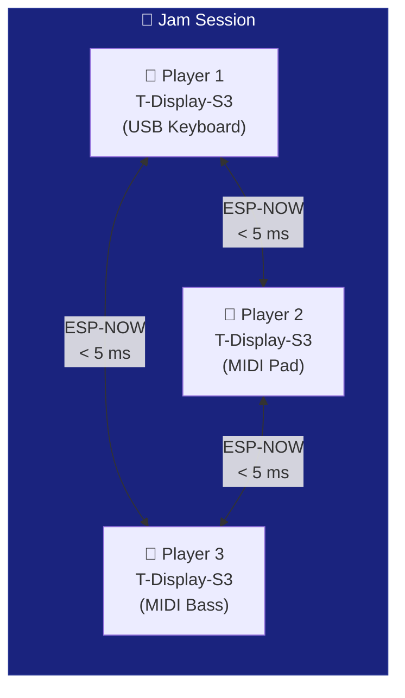

# 📡 ESP-NOW Jam

The `T-Display-S3-ESP-NOW-Jam` example creates a **wireless collaborative jam** between multiple ESP32 boards. Each musician has their own ESP32; all MIDI events are shared instantly via ESP-NOW -- no router, no WiFi latency.

---

## Concept



All ESP32 boards are on the same WiFi channel. When anyone plays a note, it is broadcast to all others and shown on each display.

---

## Required Hardware

| Per participant | Details |
|-----------------|---------|
| Board | LilyGO T-Display-S3 (or any ESP32) |
| Instrument | Any USB MIDI class-compliant device |
| Cable | USB-OTG |

---

## Code

```cpp
#include <ESP32_Host_MIDI.h>
#include "src/ESPNowConnection.h"
// Tools > USB Mode → "USB Host"

// WiFi channel -- MUST be the same on ALL ESP32 boards in the jam
const int WIFI_CHANNEL = 11;

ESPNowConnection espNow;

void setup() {
    Serial.begin(115200);

    // Start ESP-NOW on the specified channel
    espNow.begin(WIFI_CHANNEL);

    // Register and start
    midiHandler.addTransport(&espNow);

    MIDIHandlerConfig cfg;
    cfg.bleName = "Jam Node";
    midiHandler.begin(cfg);

    // Show own MAC (to add as peer on other ESP32 boards)
    Serial.printf("My MAC: %s\n", WiFi.macAddress().c_str());
    Serial.println("ESP-NOW Jam ready! Channel: " + String(WIFI_CHANNEL));
}

void loop() {
    midiHandler.task();

    for (const auto& ev : midiHandler.getQueue()) {
        // Display event (local or received via ESP-NOW from another participant)
        char noteBuf[8];
        Serial.printf("[JAM] %s %s vel=%d\n",
            MIDIHandler::statusName(ev.statusCode),
            MIDIHandler::noteWithOctave(ev.noteNumber, noteBuf, sizeof(noteBuf)),
            ev.velocity7);

        // On display: show note + who played it
    }
}
```

---

## Discovering Participant IPs/MACs

Each ESP32 prints its MAC on the Serial Monitor at startup:

```
My MAC: AA:BB:CC:DD:EE:01   ← Player 1's ESP32
My MAC: AA:BB:CC:DD:EE:02   ← Player 2's ESP32
```

In **broadcast** mode, everyone receives from everyone automatically -- no need to add MACs.

For **unicast** mode (send to a specific peer):

```cpp
uint8_t peerMAC[] = {0xAA, 0xBB, 0xCC, 0xDD, 0xEE, 0x02};
espNow.addPeer(peerMAC);
```

---

## Jam Rules

1. **Same WiFi channel** on all ESP32 boards (e.g., channel 11)
2. **No router needed** -- the ESP32 boards communicate directly
3. **Range** ~200 m line of sight
4. **Latency** 1-5 ms -- musically imperceptible

---

## Jam + USB + BLE

You can combine ESP-NOW with other transports in the same sketch:

```cpp
#include <ESP32_Host_MIDI.h>
#include "src/ESPNowConnection.h"

ESPNowConnection espNow;

void setup() {
    espNow.begin(11);
    midiHandler.addTransport(&espNow);

    MIDIHandlerConfig cfg;
    cfg.bleName = "Jam Node";
    midiHandler.begin(cfg);
    // USB keyboard + iPhone BLE + ESP-NOW -- all at the same time!
}
```

---

## Next Steps

- [ESP-NOW →](../transportes/esp-now.md) -- transport details
- [USB Host →](../transportes/usb-host.md) -- connect a keyboard to the jam
- [T-Display-S3 →](t-display-s3.md) -- add a display to the jam
