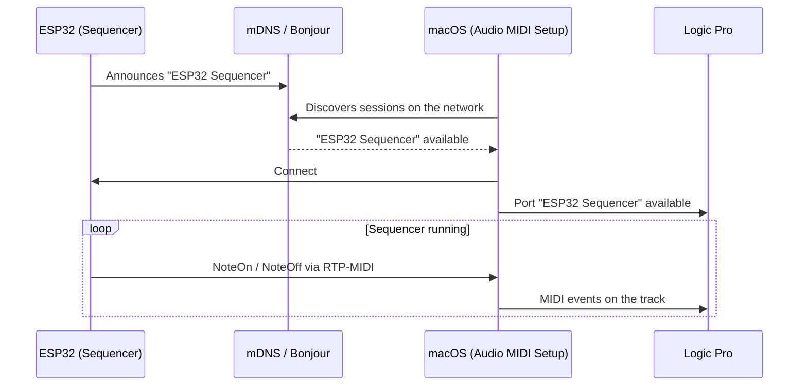

# 🌐 RTP-MIDI WiFi

The `RTP-MIDI-WiFi` example implements a step sequencer that sends notes via Apple MIDI (RTP-MIDI) to macOS -- appearing automatically in Audio MIDI Setup.

---

## Required Hardware

| Component | Details |
|-----------|---------|
| Board | LilyGO T-Display-S3 (or any ESP32 with WiFi) |
| Display | ST7789 (built into the T-Display-S3) |
| Network | WiFi 2.4 GHz or 5 GHz |

---

## Prerequisites

Install the AppleMIDI library:

```
Manage Libraries → "AppleMIDI" → Arduino-AppleMIDI-Library by lathoub (v3.x)
```

---

## Full Code

```cpp
#include <WiFi.h>
#include <ESP32_Host_MIDI.h>
#include "src/RTPMIDIConnection.h"

// ─── Configuration ──────────────────────────────────────────────────────────
const char* WIFI_SSID     = "YourSSID";
const char* WIFI_PASSWORD = "YourPassword";
const char* MIDI_NAME     = "ESP32 Sequencer";
const int   BPM           = 120;

// ─── Sequence ───────────────────────────────────────────────────────────────
const uint8_t NOTES[]    = {60, 62, 64, 67, 69, 67, 64, 62};  // C D E G A G E D
const uint8_t VELS[]     = {100, 80, 90, 110, 95, 85, 75, 100};
const int     NUM_STEPS  = 8;

RTPMIDIConnection rtpMIDI;
int step = 0;
unsigned long nextTick = 0;
const unsigned long NOTE_MS = 60000UL / BPM / 2;  // eighth note

void setup() {
    Serial.begin(115200);

    // Connect to WiFi
    Serial.printf("Connecting to %s...", WIFI_SSID);
    WiFi.begin(WIFI_SSID, WIFI_PASSWORD);
    while (WiFi.status() != WL_CONNECTED) {
        delay(500);
        Serial.print(".");
    }
    Serial.printf("\nConnected! IP: %s\n", WiFi.localIP().toString().c_str());

    // Start RTP-MIDI
    rtpMIDI.begin(MIDI_NAME);
    midiHandler.addTransport(&rtpMIDI);
    midiHandler.begin();

    Serial.printf("RTP-MIDI ready -- name: '%s'\n", MIDI_NAME);
    Serial.println("Open 'Audio MIDI Setup' on your Mac and connect to the session.");
    nextTick = millis();
}

void loop() {
    midiHandler.task();

    // Receive MIDI from macOS (bidirectional)
    for (const auto& ev : midiHandler.getQueue()) {
        char noteBuf[8];
        Serial.printf("[RTP IN] %s %s vel=%d\n",
            MIDIHandler::statusName(ev.statusCode),
            MIDIHandler::noteWithOctave(ev.noteNumber, noteBuf, sizeof(noteBuf)),
            ev.velocity7);
    }

    // Sequencer -- play next step
    unsigned long now = millis();
    if (now >= nextTick) {
        // Turn off previous note
        uint8_t prevNote = NOTES[(step + NUM_STEPS - 1) % NUM_STEPS];
        midiHandler.sendNoteOff(1, prevNote, 0);

        // Turn on next note
        midiHandler.sendNoteOn(1, NOTES[step], VELS[step]);
        Serial.printf("[SEQ] Step %d: %d (vel=%d)\n",
            step, NOTES[step], VELS[step]);

        step = (step + 1) % NUM_STEPS;
        nextTick = now + NOTE_MS;
    }
}
```

---

## macOS Setup



### Step by step

1. Open **Audio MIDI Setup** → **Window → Show MIDI Studio**
2. Click the **Network** icon (globe)
3. In the "Directory" panel, click **+** and select "ESP32 Sequencer"
4. Click **Connect**
5. Open **Logic Pro** / **GarageBand** -- the port appears automatically

---

## Gallery

<div style="display:flex; gap:12px; flex-wrap:wrap; justify-content:center; margin:20px 0">
  <figure style="margin:0; text-align:center">
    
    <figcaption><em>Audio MIDI Setup -- active session</em></figcaption>
  </figure>
  <figure style="margin:0; text-align:center">
    
    <figcaption><em>Sequencer connected to macOS</em></figcaption>
  </figure>
</div>

---

## Next Steps

- [RTP-MIDI →](../transportes/rtp-midi.md) -- transport details
- [Ethernet MIDI →](ethernet-midi.md) -- wired version with lower latency
- [OSC Bridge →](osc-bridge.md) -- alternative for Max/MSP
