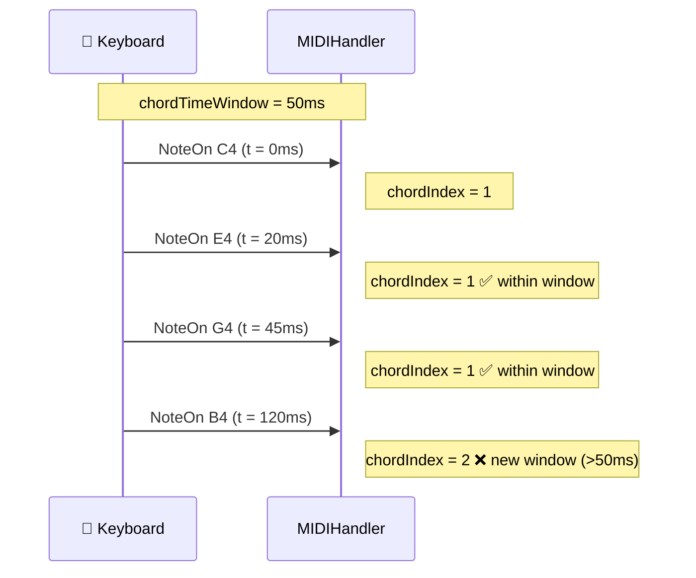

# 🎼 Chord Detection

The `MIDIHandler` automatically groups simultaneous notes using the `chordIndex` field. Notes sharing the same `chordIndex` were pressed "at the same time" (within the configured window).

---

## How It Works

Each MIDI event receives a `chordIndex`. Notes arriving close together in time share the same index:

```
Notes pressed:        C4  E4  G4  (C major chord)
chordIndex:            1   1   1   <- same index
                                   <- B4 pressed later
B4 pressed:           B4
chordIndex:            2           <- new index
```

---

## Configuration

### chordTimeWindow

Controls the time window (ms) for grouping notes:

```cpp
MIDIHandlerConfig cfg;
cfg.chordTimeWindow = 0;   // 0 ms (default): new chord only when ALL notes are released
cfg.chordTimeWindow = 50;  // 50 ms: time window (ideal for physical keyboards)
midiHandler.begin(cfg);
```



---

## Chord API

### lastChord() -- Last Chord Index

Returns the most recent `chordIndex` in the queue:

```cpp
const auto& queue = midiHandler.getQueue();
int idx = midiHandler.lastChord(queue);  // -1 if queue is empty
```

### getChord() -- Chord Notes

Returns the values of a specific field for all notes in a chord:

```cpp
const auto& queue = midiHandler.getQueue();
int idx = midiHandler.lastChord(queue);

// List of note names with octave
std::vector<std::string> notes = midiHandler.getChord(idx, queue, {"noteOctave"});
// Example: ["C4", "E4", "G4"]

// List of velocities
std::vector<std::string> vels = midiHandler.getChord(idx, queue, {"velocity"});
// Example: ["100", "95", "110"]

// Multiple fields with labels
std::vector<std::string> info = midiHandler.getChord(
    idx, queue, {"noteOctave", "velocity"}, /*includeLabels=*/true);
// Example: ["noteOctave:C4", "noteOctave:E4", "velocity:100", "velocity:95"]
```

### getAnswer() -- Quick Answer from Last Chord

Shortcut for the most recent chord, without needing to call `lastChord()`:

```cpp
// Note names from the last chord
std::vector<std::string> resp = midiHandler.getAnswer("noteName");
// Example: ["C", "E", "G"]

// Multiple fields
std::vector<std::string> multi = midiHandler.getAnswer({"noteName", "velocity"});
```

---

## Full Example

```cpp
#include <ESP32_Host_MIDI.h>
// Tools > USB Mode -> "USB Host"

void setup() {
    Serial.begin(115200);

    MIDIHandlerConfig cfg;
    cfg.chordTimeWindow = 50;  // group notes within 50ms
    midiHandler.begin(cfg);
}

void loop() {
    midiHandler.task();

    const auto& queue = midiHandler.getQueue();
    if (queue.empty()) return;

    // Check for new notes
    int lastIdx = midiHandler.lastChord(queue);
    if (lastIdx < 0) return;

    // Get notes from the most recent chord
    auto notes = midiHandler.getChord(lastIdx, queue, {"noteOctave"});

    if (!notes.empty()) {
        Serial.print("Chord [" + String(lastIdx) + "]: ");
        for (const auto& n : notes) {
            Serial.print(n.c_str());
            Serial.print(" ");
        }
        Serial.println();
    }
}
```

Typical output when playing C major (C-E-G):

```
Chord [1]: C4 E4 G4
Chord [2]: C4 F4 A4    <- F major
Chord [3]: G3 B3 D4    <- G major
```

---

## Detecting Chord Changes

```cpp
void loop() {
    midiHandler.task();

    const auto& queue = midiHandler.getQueue();
    static int lastChordIdx = -1;

    int idx = midiHandler.lastChord(queue);
    if (idx != lastChordIdx && idx >= 0) {
        lastChordIdx = idx;

        auto notes = midiHandler.getChord(idx, queue, {"noteOctave"});
        if (!notes.empty()) {
            Serial.print("New chord: ");
            for (const auto& n : notes) Serial.print(String(n.c_str()) + " ");
            Serial.println();
        }
    }
}
```

---

## Integration with Gingoduino

To identify the **name** of the chord ("Cmaj7", "Dm7b5"), use the [GingoAdapter](gingo-adapter.md):

```cpp
#include "src/GingoAdapter.h"  // requires Gingoduino >= v0.2.2

char chordName[16];
if (GingoAdapter::identifyLastChord(midiHandler, chordName, sizeof(chordName))) {
    Serial.printf("Chord: %s\n", chordName);
    // Example: "Cmaj7", "Dm", "G7sus4"
}
```

---

## chordIndex in the Event Loop

The `chordIndex` is part of each `MIDIEventData`. You can use it directly when iterating:

```cpp
for (const auto& ev : midiHandler.getQueue()) {
    if (ev.statusCode == MIDIHandler::NoteOn) {
        char noteBuf[8];
        Serial.printf("Note %s  chord #%d  vel=%d\n",
            MIDIHandler::noteWithOctave(ev.noteNumber, noteBuf, sizeof(noteBuf)),
            ev.chordIndex,
            ev.velocity7);
    }
}
```

---

## Common Pitfall: Analyzing Only One Note

!!! warning "Be careful when analyzing chords in real time"
    Analyze the chord **whenever noteCount changes**, not just on the arrival of a new event. If you only check when `chordIndex != lastIdx`, the analysis happens on the first note and the following ones are ignored.

    **Correct:**
    ```cpp
    size_t count = midiHandler.getActiveNotesCount();
    if (count != lastCount) {
        lastCount = count;
        // re-analyze chord
    }
    ```

---

## Next Steps

- [Active Notes ->](active-notes.md) -- which notes are currently pressed
- [GingoAdapter ->](gingo-adapter.md) -- identify chord name
- [Configuration ->](../guide/configuration.md) -- adjust `chordTimeWindow`
