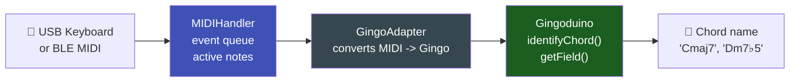

# 🎵 GingoAdapter

`GingoAdapter.h` is a bridge between `MIDIHandler` and the **[Gingoduino](https://github.com/sauloverissimo/gingoduino)** library -- the music theory library for embedded systems. With it, you can identify chord names ("Cmaj7", "Dm7b5"), harmonic fields, and progressions -- all on-device, no network required.

---

## Prerequisite

Install Gingoduino v0.2.2 or later:

```
Arduino IDE -> Manage Libraries -> "gingoduino" -> Install
```

---

## What is Gingoduino?

Gingoduino analyzes sets of MIDI notes and returns:

- **Chord name**: "Cmaj7", "Dm", "G7sus4", "F#dim7"...
- **Root note**: "C", "F#", "Bb"...
- **Harmonic field**: which key the chord fits into
- **Chord progression**: identifies patterns (II-V-I, etc.)

Everything runs **on-device**, in real time, without cloud or network.

---

## Integration Flow



---

## Basic Usage

```cpp
#include <ESP32_Host_MIDI.h>
#include "src/GingoAdapter.h"  // requires Gingoduino >= v0.2.2
// Tools > USB Mode -> "USB Host"

void setup() {
    Serial.begin(115200);
    midiHandler.begin();
}

void loop() {
    midiHandler.task();

    // Check when active notes change
    static size_t lastCount = 0;
    size_t count = midiHandler.getActiveNotesCount();

    if (count != lastCount) {
        lastCount = count;

        if (count > 0) {
            char chordName[16] = "";

            // Identify chord name
            if (GingoAdapter::identifyLastChord(midiHandler, chordName, sizeof(chordName))) {
                Serial.printf("Chord: %s  (%d notes)\n", chordName, (int)count);
            } else {
                Serial.printf("Notes: %s\n", midiHandler.getActiveNotes().c_str());
            }
        } else {
            Serial.println("[ no notes ]");
        }
    }
}
```

---

## GingoAdapter API

### identifyLastChord() -- Chord Name

```cpp
char name[16];
bool found = GingoAdapter::identifyLastChord(
    midiHandler,    // reference to MIDIHandler
    name,           // output buffer
    sizeof(name)    // buffer size
);

if (found) {
    // name = "Cmaj7", "Dm", "G7sus4", "F#dim", etc.
    Serial.printf("Chord: %s\n", name);
} else {
    // Notes do not form a recognized chord
}
```

### midiToGingoNotes() -- Convert MIDI to GingoNote

```cpp
uint8_t midiNotes[] = {60, 64, 67};  // C, E, G
GingoNote gingoNotes[7];
uint8_t count = GingoAdapter::midiToGingoNotes(
    midiNotes, 3, gingoNotes
);
// gingoNotes[0] = C, gingoNotes[1] = E, gingoNotes[2] = G
```

### deduceFieldFromQueue() -- Harmonic Field (Tier 2)

```cpp
#if defined(GINGODUINO_HAS_FIELD)
FieldMatch fields[8];
uint8_t count = GingoAdapter::deduceFieldFromQueue(
    midiHandler, fields, 8
);

for (uint8_t i = 0; i < count; i++) {
    Serial.printf("Field: %s (score: %d)\n",
        fields[i].name, fields[i].score);
}
#endif
```

### identifyProgression() -- Progression (Tier 3)

```cpp
#if defined(GINGODUINO_HAS_PROGRESSION)
const char* branches[] = {"IIm", "V7", "I"};
ProgressionMatch result;

if (GingoAdapter::identifyProgression("C", SCALE_MAJOR, branches, 3, &result)) {
    Serial.printf("Progression found: %s\n", result.name);
}
#endif
```

---

## Example with Display (T-Display-S3)

```cpp
#include <ESP32_Host_MIDI.h>
#include "src/GingoAdapter.h"

void setup() {
    midiHandler.begin();
    // initialize display here
}

void loop() {
    midiHandler.task();

    static size_t lastCount = 0;
    size_t count = midiHandler.getActiveNotesCount();

    if (count != lastCount) {
        lastCount = count;

        char chord[16] = "";
        if (count > 0) {
            GingoAdapter::identifyLastChord(midiHandler, chord, sizeof(chord));
        }

        // Show on display
        // display.showChord(chord);
        // display.showNotes(midiHandler.getActiveNotes().c_str());
    }
}
```

<div style="text-align:center; margin:20px 0">
  
  <figcaption><em>T-Display-S3-Gingoduino: chord name, root note, and active keys in real time</em></figcaption>
</div>

---

## Gingoduino Tiers

| Tier | Feature | Macro |
|------|---------|-------|
| 0 | Notes, intervals | always available |
| 1 | Chord identification | `GINGODUINO_HAS_CHORD` |
| 2 | Harmonic field | `GINGODUINO_HAS_FIELD` |
| 3 | Progressions | `GINGODUINO_HAS_PROGRESSION` |

---

## Ecosystem Links

- **[Gingoduino on GitHub](https://github.com/sauloverissimo/gingoduino)** -- music theory library for ESP32
- **[Gingo (Python)](https://sauloverissimo.github.io/gingo/)** -- desktop version of Gingoduino

---

## Next Steps

- [Chord Detection ->](chord-detection.md) -- use chordIndex without Gingoduino
- [T-Display-S3 Examples ->](../examples/t-display-s3.md) -- piano roll + chords on display
