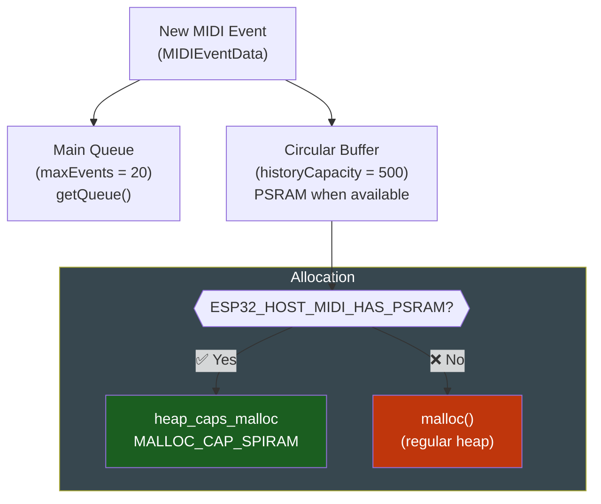

# 💾 PSRAM History

The `MIDIHandler` can maintain a circular buffer of events that persists beyond the main queue limit (`maxEvents`). When PSRAM is available, the buffer is allocated there -- allowing histories of hundreds or thousands of events without consuming heap.

---

## When to Use

- **Offline analysis**: process an improvisation session after it ends
- **History visualization**: scroll through past events on the display
- **Debug**: inspect what happened in the last N events
- **Machine learning**: collect performance data for analysis

---

## Configuration

### Via MIDIHandlerConfig

```cpp
MIDIHandlerConfig cfg;
cfg.historyCapacity = 500;  // keep the last 500 events
midiHandler.begin(cfg);
```

### Via enableHistory() -- after begin()

```cpp
midiHandler.begin();
midiHandler.enableHistory(500);  // can be called at any time
```

---

## How It Works



---

## PSRAM on the ESP32-S3

To enable PSRAM in the Arduino IDE:

```
Tools -> PSRAM -> "OPI PSRAM" (for ESP32-S3 with OPI PSRAM)
        or
Tools -> PSRAM -> "Quad PSRAM" (for ESP32-S3 with SIP PSRAM)
```

Verify it is active:

```cpp
Serial.printf("PSRAM: %u bytes\n", ESP.getPsramSize());
Serial.printf("Free PSRAM: %u bytes\n", ESP.getFreePsram());
```

!!! tip "Check availability"
    The `ESP32_HOST_MIDI_HAS_PSRAM` macro is defined automatically at compile time if the sdkconfig has `CONFIG_SPIRAM` or `CONFIG_SPIRAM_SUPPORT`.

---

## History Size

Each `MIDIEventData` occupies approximately **80-120 bytes** (depends on STL string sizes).

| Capacity | Approx. Memory | Suitable for |
|----------|---------------|--------------|
| 100 | ~10 KB | Heap (no PSRAM) |
| 500 | ~50 KB | Heap or PSRAM |
| 1000 | ~100 KB | PSRAM recommended |
| 5000 | ~500 KB | PSRAM required |

---

## Accessing the History

```cpp
// Enable history for 500 events
midiHandler.enableHistory(500);

// The main queue (getQueue()) remains limited by maxEvents
// The history is accessed internally -- there is no direct read API

// For now, use the queue + your own buffer to access the history:
std::vector<MIDIEventData> myHistory;

void loop() {
    midiHandler.task();

    for (const auto& ev : midiHandler.getQueue()) {
        myHistory.push_back(ev);

        // Limit to the desired size (manual circular buffer)
        if (myHistory.size() > 500) {
            myHistory.erase(myHistory.begin());
        }
    }
}
```

!!! note "History read API"
    The direct read API for the internal history buffer is under development. For now, the recommended pattern is to maintain your own `std::vector<MIDIEventData>` as shown above, using PSRAM via `ps_malloc()` if needed.

---

## Allocating a Vector in PSRAM

If you want to store your own history in PSRAM:

```cpp
#include <esp_heap_caps.h>

const int MAX_HISTORY = 1000;
MIDIEventData* historyBuffer = nullptr;
int historySize = 0;

void setup() {
    midiHandler.begin();

#if ESP32_HOST_MIDI_HAS_PSRAM
    historyBuffer = (MIDIEventData*)heap_caps_malloc(
        MAX_HISTORY * sizeof(MIDIEventData),
        MALLOC_CAP_SPIRAM
    );
    if (historyBuffer) {
        Serial.println("History allocated in PSRAM");
    } else {
        // Fallback to heap
        historyBuffer = (MIDIEventData*)malloc(MAX_HISTORY * sizeof(MIDIEventData));
    }
#else
    historyBuffer = (MIDIEventData*)malloc(MAX_HISTORY * sizeof(MIDIEventData));
#endif
}
```

---

## Example -- Session Analyzer

Collects an improvisation session and shows statistics at the end:

```cpp
#include <ESP32_Host_MIDI.h>

std::vector<MIDIEventData> session;
bool recording = true;

void setup() {
    Serial.begin(115200);

    MIDIHandlerConfig cfg;
    cfg.maxEvents = 20;
    cfg.historyCapacity = 500;
    midiHandler.begin(cfg);

    Serial.println("Recording session... (press button to stop)");
}

void loop() {
    midiHandler.task();

    if (recording) {
        for (const auto& ev : midiHandler.getQueue()) {
            if (ev.status == "NoteOn") {
                session.push_back(ev);
            }
        }
    }

    // Simulate end of session after 30 seconds
    if (millis() > 30000 && recording) {
        recording = false;
        analyzeSession();
    }
}

void analyzeSession() {
    Serial.printf("=== SESSION ANALYSIS ===\n");
    Serial.printf("Total notes: %d\n", (int)session.size());

    // Most played note
    int counter[128] = {0};
    for (const auto& ev : session) counter[ev.note]++;

    int mostPlayed = 0;
    for (int i = 1; i < 128; i++) {
        if (counter[i] > counter[mostPlayed]) mostPlayed = i;
    }

    Serial.printf("Most played note: %d (times: %d)\n",
        mostPlayed, counter[mostPlayed]);

    // Average velocity
    int velSum = 0;
    for (const auto& ev : session) velSum += ev.velocity;
    Serial.printf("Average velocity: %d\n",
        session.empty() ? 0 : velSum / (int)session.size());
}
```

---

## Next Steps

- [Chord Detection ->](chord-detection.md) -- analyze chords from history
- [GingoAdapter ->](gingo-adapter.md) -- music theory on the history
- [Configuration ->](../guide/configuration.md) -- `historyCapacity` and `maxEvents`
