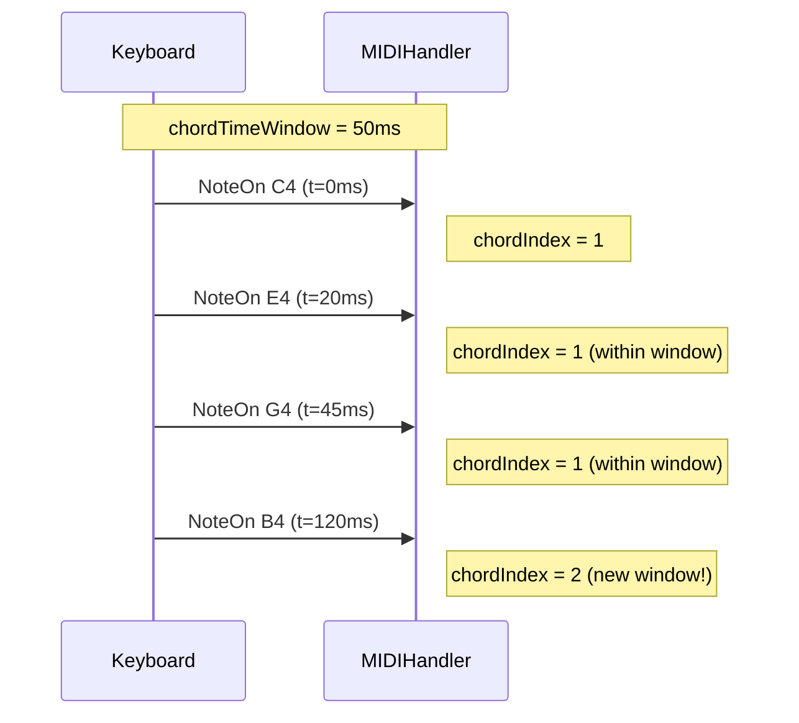

# Configuration

The `MIDIHandler` can be configured via `MIDIHandlerConfig` before calling `begin()`.

---

## MIDIHandlerConfig

```cpp
struct MIDIHandlerConfig {
    int maxEvents        = 20;    // Event queue capacity
    unsigned long chordTimeWindow = 0;  // Chord detection window (ms)
    int velocityThreshold = 0;   // Minimum velocity filter (0 = disabled)
    int historyCapacity  = 0;    // PSRAM history buffer (0 = disabled)
    const char* bleName  = "ESP32 MIDI BLE";  // BLE device name
};
```

### Basic usage

```cpp
MIDIHandlerConfig cfg;
cfg.maxEvents = 30;
cfg.bleName = "My Synth";
midiHandler.begin(cfg);
```

---

## maxEvents -- Queue Capacity

`maxEvents` defines how many MIDI events the queue holds. When the queue reaches its limit, older events are discarded (FIFO).

```cpp
// Default: 20 events
cfg.maxEvents = 20;

// For educational use (view longer history):
cfg.maxEvents = 50;

// For frequent loop() calls (more responsive):
cfg.maxEvents = 10;
```

!!! note "What is the queue?"
    The queue (`getQueue()`) contains the events **since the last `task()` call**. If your `loop()` runs fast, you will rarely have more than 5-10 events at a time.

You can also change it after `begin()`:

```cpp
midiHandler.setQueueLimit(50);
```

---

## chordTimeWindow -- Chord Detection

Controls how simultaneous notes are grouped under the same `chordIndex`.

```cpp
// 0 ms (default): new chord only when ALL notes are released
cfg.chordTimeWindow = 0;

// 30-80 ms: more responsive for physical keyboards
// (small delays between fingers when playing chords)
cfg.chordTimeWindow = 50;
```



!!! tip "When to use chordTimeWindow?"
    - **0** (default): most precise, ideal when you control the timing (sequencers)
    - **30-80 ms**: ideal for physical keyboards where fingers arrive at slightly different times

See more at [Chord Detection ->](../funcionalidades/deteccao-acordes.md)

---

## velocityThreshold -- Velocity Filter

Ignores NoteOn events with velocity below the threshold. Useful for filtering ghost notes from piezo sensors.

```cpp
// Disabled (default) -- processes all velocities
cfg.velocityThreshold = 0;

// Filter very soft notes (velocity < 10)
cfg.velocityThreshold = 10;

// Only strong notes (percussion):
cfg.velocityThreshold = 40;
```

---

## historyCapacity -- PSRAM History

Enables a circular event buffer that persists beyond the `maxEvents` limit. Uses PSRAM when available, with fallback to heap.

```cpp
// Disabled (default)
cfg.historyCapacity = 0;

// Keep the last 500 events
cfg.historyCapacity = 500;
```

Can also be enabled after `begin()`:

```cpp
midiHandler.enableHistory(500);
```

!!! warning "PSRAM required for large histories"
    Large histories (> 200 events) should use ESP32-S3 with PSRAM (4 MB+). Without PSRAM, the buffer is allocated on the heap -- limited space.

See more at [PSRAM History ->](../funcionalidades/historico-psram.md)

---

## bleName -- BLE Device Name

Sets the name that appears in iOS/macOS apps when scanning for BLE MIDI.

```cpp
cfg.bleName = "ESP32 MIDI BLE";      // default
cfg.bleName = "Piano ESP32";          // any string
cfg.bleName = "Studio Hub";           // appears in GarageBand, AUM, etc.
```

---

## Feature Detection Macros

The library automatically detects available features based on the target chip:

```cpp
// Compiled automatically -- do not define manually

// USB Host available (ESP32-S2, S3, P4)
#if ESP32_HOST_MIDI_HAS_USB
    // USB keyboard connected!
#endif

// BLE available (ESP32, S3, C3, C6 -- CONFIG_BT_ENABLED)
#if ESP32_HOST_MIDI_HAS_BLE
    bool connected = midiHandler.isBleConnected();
#endif

// PSRAM available (CONFIG_SPIRAM or CONFIG_SPIRAM_SUPPORT)
#if ESP32_HOST_MIDI_HAS_PSRAM
    midiHandler.enableHistory(1000);  // 1000 events in PSRAM
#endif

// Native Ethernet MAC (ESP32-P4 only)
#if ESP32_HOST_MIDI_HAS_ETH_MAC
    // Use EthernetMIDIConnection with external PHY (LAN8720)
#endif
```

---

## Debug Callback -- Raw MIDI

To inspect raw MIDI bytes before parsing:

```cpp
void onRawMidi(const uint8_t* raw, size_t rawLen, const uint8_t* midi3) {
    // raw     = full USB-MIDI payload (CIN + 3 bytes)
    // rawLen  = size of raw
    // midi3   = the 3 MIDI bytes (status, data1, data2)
    Serial.printf("Raw: %02X %02X %02X\n",
        midi3[0], midi3[1], midi3[2]);
}

void setup() {
    midiHandler.setRawMidiCallback(onRawMidi);
    midiHandler.begin();
}
```

---

## Clear Queue and Active Notes

```cpp
// Flush the event queue immediately
midiHandler.clearQueue();

// Reset the active notes map (useful when reconnecting)
midiHandler.clearActiveNotesNow();
```

---

## Example -- Full Configuration

```cpp
#include <ESP32_Host_MIDI.h>

void setup() {
    Serial.begin(115200);

    MIDIHandlerConfig cfg;
    cfg.maxEvents         = 30;          // larger queue
    cfg.chordTimeWindow   = 50;          // group chord notes
    cfg.velocityThreshold = 5;           // ignore ghost notes
    cfg.historyCapacity   = 500;         // store history in PSRAM
    cfg.bleName           = "My ESP32";  // BLE name

    midiHandler.begin(cfg);
}
```

---

## Next Steps

- [Transports ->](../transportes/visao-geral.md) -- add more transports
- [Chord Detection ->](../funcionalidades/deteccao-acordes.md) -- use `chordTimeWindow`
- [PSRAM History ->](../funcionalidades/historico-psram.md) -- use `historyCapacity`
