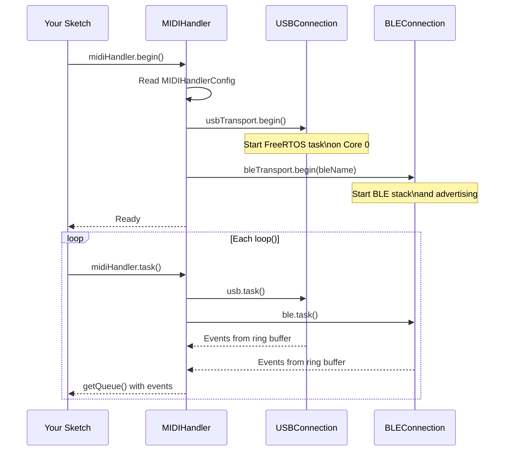

# Getting Started

In this guide you will have the ESP32 receiving and sending MIDI in less than 5 minutes.

---

## Prerequisites

- Library installed (see [Installation](installation.md))
- ESP32-S3 with USB-OTG cable **or** any ESP32 with Bluetooth

---

## Step 1 -- The Simplest Sketch

This sketch prints all MIDI events received via USB Host or BLE to the Serial Monitor:

```cpp
#include <ESP32_Host_MIDI.h>
// Arduino IDE: Tools > USB Mode > "USB Host"

void setup() {
    Serial.begin(115200);
    midiHandler.begin();  // (1)
}

void loop() {
    midiHandler.task();   // (2)

    for (const auto& ev : midiHandler.getQueue()) {  // (3)
        char noteBuf[8];
        Serial.printf("%-12s %-5s ch=%d  vel=%d\n",
            MIDIHandler::statusName(ev.statusCode),    // "NoteOn" | "NoteOff" | "ControlChange"...
            MIDIHandler::noteWithOctave(ev.noteNumber, noteBuf, sizeof(noteBuf)), // "C4", "D#5"...
            ev.channel0 + 1,
            ev.velocity7);
    }
}
```

**Notes:**

1. `begin()` automatically initializes USB Host (if the chip supports it) and BLE (if enabled)
2. `task()` must be called every `loop()` -- it drains the ring buffers from all transports
3. `getQueue()` returns the event queue since the last `task()` call

---

## Step 2 -- Access Event Fields

Each event has the following fields:

```cpp
for (const auto& ev : midiHandler.getQueue()) {
    // Identification
    ev.index;        // Global event counter (unique, increasing)
    ev.timestamp;    // millis() at arrival time
    ev.delay;        // Delta in ms since the previous event

    // Message type
    ev.statusCode;   // MIDIStatus enum: MIDI_NOTE_ON, MIDI_NOTE_OFF, MIDI_CONTROL_CHANGE...
    ev.channel0;     // MIDI channel: 0-15 (add +1 to display 1-16)

    // Note (NoteOn / NoteOff only)
    ev.noteNumber;   // MIDI number: 0-127 (60 = C4 = Middle C)
    ev.velocity7;    // 7-bit velocity: 0-127 (also: CC value, program, pressure)
    ev.velocity16;   // 16-bit velocity: 0-65535 (MIDI 2.0)

    // Static helpers (zero allocation)
    // MIDIHandler::statusName(ev.statusCode)              -> "NoteOn", "NoteOff"...
    // MIDIHandler::noteName(ev.noteNumber)                -> "C", "C#", "D"...
    // MIDIHandler::noteWithOctave(ev.noteNumber, buf, sz) -> "C4", "D#5"...

    // Chord grouping
    ev.chordIndex;   // Simultaneous notes share the same chordIndex

    // Pitch Bend (PitchBend only)
    ev.pitchBend14;  // 0-16383 (center = 8192), MIDI 1.0
    ev.pitchBend32;  // 0-4294967295 (center = 2147483648), MIDI 2.0
}
```

### Example -- NoteOn Only

```cpp
for (const auto& ev : midiHandler.getQueue()) {
    if (ev.statusCode == MIDI_NOTE_ON && ev.velocity7 > 0) {
        char noteBuf[8];
        Serial.printf("Note: %s  Velocity: %d  Channel: %d\n",
            MIDIHandler::noteWithOctave(ev.noteNumber, noteBuf, sizeof(noteBuf)),
            ev.velocity7,
            ev.channel0 + 1);
    }
}
```

### Example -- Control Change

```cpp
for (const auto& ev : midiHandler.getQueue()) {
    if (ev.statusCode == MIDI_CONTROL_CHANGE) {
        // ev.noteNumber = controller number (CC#)
        // ev.velocity7 = controller value (0-127)
        Serial.printf("CC #%d = %d  (channel %d)\n",
            ev.noteNumber, ev.velocity7, ev.channel0 + 1);
    }
}
```

---

## Step 3 -- Send MIDI Back

All send methods transmit **simultaneously** to all active transports:

```cpp
// NoteOn: channel 1, note C4 (60), velocity 100
midiHandler.sendNoteOn(1, 60, 100);

// NoteOff: channel 1, note C4 (60), velocity 0
midiHandler.sendNoteOff(1, 60, 0);

// Control Change: channel 1, CC #7 (volume) = 127
midiHandler.sendControlChange(1, 7, 127);

// Program Change: channel 1, program 0
midiHandler.sendProgramChange(1, 0);

// Pitch Bend: channel 1, value -8192 to +8191 (0 = center)
midiHandler.sendPitchBend(1, 4096);  // +0.5 semitone
```

### Example -- MIDI Echo (loopback)

Receives any NoteOn and resends to all transports:

```cpp
void loop() {
    midiHandler.task();

    for (const auto& ev : midiHandler.getQueue()) {
        if (ev.statusCode == MIDI_NOTE_ON) {
            // Resend with doubled velocity (capped at 127)
            uint8_t vel = min((int)(ev.velocity7 * 2), 127);
            midiHandler.sendNoteOn(ev.channel0 + 1, ev.noteNumber, vel);
        }
        if (ev.statusCode == MIDI_NOTE_OFF) {
            midiHandler.sendNoteOff(ev.channel0 + 1, ev.noteNumber, 0);
        }
    }
}
```

---

## Step 4 -- Check BLE Connection

```cpp
void loop() {
    midiHandler.task();

#if ESP32_HOST_MIDI_HAS_BLE
    if (midiHandler.isBleConnected()) {
        Serial.println("BLE MIDI connected!");
    }
#endif
}
```

!!! tip "Connect via iOS"
    1. Open **GarageBand** on the iPhone
    2. Tap "+" > Live Loops > Start
    3. Settings menu > Connect MIDI device via Bluetooth
    4. The ESP32 will appear as "ESP32 MIDI BLE" (or the configured name)

---

## Step 5 -- Complete Sketch with USB + BLE

```cpp
#include <ESP32_Host_MIDI.h>
// Arduino IDE: Tools > USB Mode > "USB Host"

void setup() {
    Serial.begin(115200);
    delay(1000);
    Serial.println("ESP32 Host MIDI -- Starting...");

    MIDIHandlerConfig cfg;
    cfg.maxEvents = 20;         // queue capacity
    cfg.chordTimeWindow = 50;   // ms to group chords
    midiHandler.begin(cfg);

    Serial.println("Ready! Connect a USB keyboard or use BLE.");
}

void loop() {
    midiHandler.task();

    for (const auto& ev : midiHandler.getQueue()) {
        char noteBuf[8];
        if (ev.statusCode == MIDI_NOTE_ON && ev.velocity7 > 0) {
            Serial.printf("[NoteOn]  %s  vel=%3d  ch=%d  t=%lums\n",
                MIDIHandler::noteWithOctave(ev.noteNumber, noteBuf, sizeof(noteBuf)),
                ev.velocity7,
                ev.channel0 + 1,
                ev.timestamp);
        } else if (ev.statusCode == MIDI_NOTE_OFF || ev.velocity7 == 0) {
            Serial.printf("[NoteOff] %s             ch=%d\n",
                MIDIHandler::noteWithOctave(ev.noteNumber, noteBuf, sizeof(noteBuf)),
                ev.channel0 + 1);
        } else if (ev.statusCode == MIDI_CONTROL_CHANGE) {
            Serial.printf("[CC]      #%3d = %3d    ch=%d\n",
                ev.noteNumber, ev.velocity7, ev.channel0 + 1);
        } else if (ev.statusCode == MIDI_PITCH_BEND) {
            Serial.printf("[Pitch]   %d (center=8192)  ch=%d\n",
                ev.pitchBend14, ev.channel0 + 1);
        }
    }
}
```

---

## Initialization Flow



---

## Next Steps

- [Configuration ->](configuration.md) -- adjust `MIDIHandlerConfig`, filters, and history
- [Transports ->](../transportes/visao-geral.md) -- add more transports (RTP-MIDI, UART, OSC...)
- [Features ->](../funcionalidades/deteccao-acordes.md) -- chord detection, active notes
