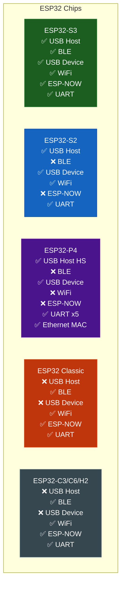

# Installation

The library supports three development environments: Arduino IDE, PlatformIO, and ESP-IDF (Arduino component).

---

## Requirements

!!! warning "Minimum ESP32 package version"
    USB Host and USB Device require **arduino-esp32 >= 3.0.0** (built-in TinyUSB MIDI).
    Check at: `Tools > Boards Manager > "esp32" by Espressif`

---

## Arduino IDE

### Step 1 -- Install the main library

```
Sketch > Include Library > Manage Libraries...
> Search: "ESP32_Host_MIDI"
> Install: ESP32_Host_MIDI by sauloverissimo
```

### Step 2 -- Install the ESP32 board package

```
Tools > Boards Manager
> Search: "esp32"
> Install: esp32 by Espressif Systems (version >= 3.0.0)
```

### Step 3 -- Install optional libraries (per transport)

Install only the ones you need:

| Transport | Library to install |
|-----------|-------------------|
| RTP-MIDI (WiFi) | `lathoub/Arduino-AppleMIDI-Library` (v3.x) |
| Ethernet MIDI | `lathoub/Arduino-AppleMIDI-Library` + `arduino-libraries/Ethernet` |
| OSC | `CNMAT/OSC` |
| Chord detection | `sauloverissimo/gingoduino` |
| USB Host / BLE / ESP-NOW | Already included in arduino-esp32 |
| USB Device | Already included in arduino-esp32 (TinyUSB) |
| UART / DIN-5 | No extra dependencies |

```
Sketch > Include Library > Manage Libraries...
> Search and install each one above
```

### Step 4 -- Set USB mode (for USB Host)

```
Tools > USB Mode > "USB Host"
```

!!! note "USB Device"
    For the USB Device transport (ESP32 presents itself as a MIDI interface), use:
    `Tools > USB Mode > "USB-OTG (TinyUSB)"`

---

## PlatformIO

Add to your `platformio.ini`:

```ini
[env:esp32-s3-devkitc-1]
platform = espressif32
board    = esp32-s3-devkitc-1
framework = arduino

lib_deps =
    sauloverissimo/ESP32_Host_MIDI
    ; Uncomment based on the transports you use:
    ; lathoub/Arduino-AppleMIDI-Library  ; RTP-MIDI + Ethernet MIDI
    ; arduino-libraries/Ethernet          ; Ethernet MIDI
    ; CNMAT/OSC                           ; OSC
    ; sauloverissimo/gingoduino           ; Chord detection

; For USB Host:
build_flags =
    -D ARDUINO_USB_MODE=0
    -D ARDUINO_USB_CDC_ON_BOOT=0
```

For USB Device:

```ini
build_flags =
    -D ARDUINO_USB_MODE=1
    -D ARDUINO_USB_CDC_ON_BOOT=1
```

---

## Manual Installation (symlink)

If you developed the library locally and want to test the examples in Arduino IDE:

```bash
# Create a symlink from your development folder to the Arduino libraries folder
ln -s /home/saulo/Libraries/ESP32_Host_MIDI /home/saulo/Arduino/libraries/ESP32_Host_MIDI
```

This lets you edit the source files directly without copying files.

---

## Verifying the Installation

After installing, open one of the examples:

```
File > Examples > ESP32_Host_MIDI > UART-MIDI-Basic
```

Compile (without uploading) to verify that all dependencies are resolved. If it compiles without errors, the installation is correct.

!!! tip "Minimal example -- no USB hardware needed"
    `UART-MIDI-Basic` is the simplest example for verifying the installation, since it does not require specific USB-OTG hardware.

---

## Chip Compatibility Table



!!! tip "Recommended board"
    **LilyGO T-Display-S3** = ESP32-S3 + ST7789 1.9" display + LiPo battery. It is the most versatile board for ESP32_Host_MIDI: USB Host, BLE, WiFi, ESP-NOW, and display all in one.

---

## Next Steps

- [Getting Started ->](getting-started.md) -- first sketch up and running
- [Configuration ->](configuration.md) -- `MIDIHandlerConfig` options
