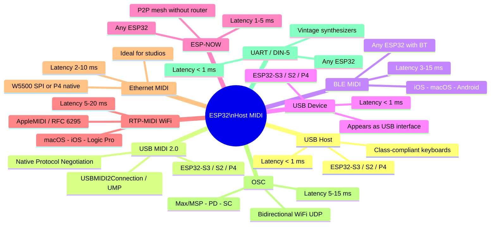
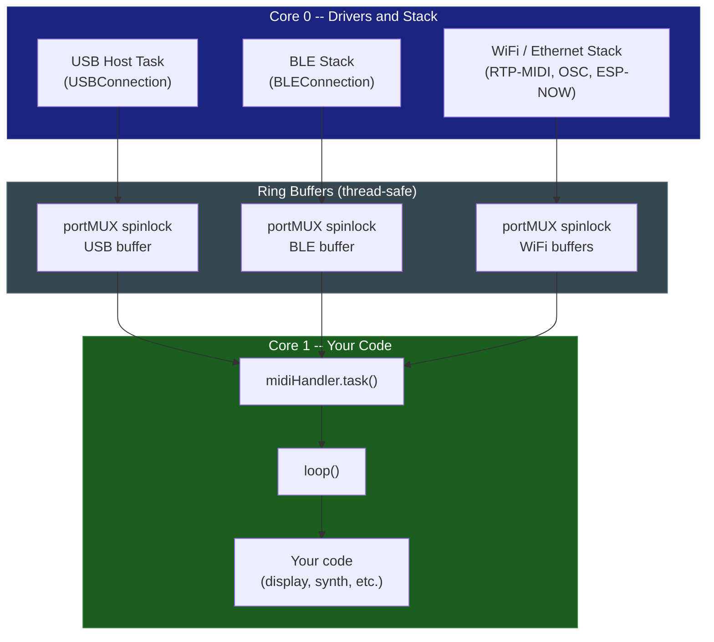
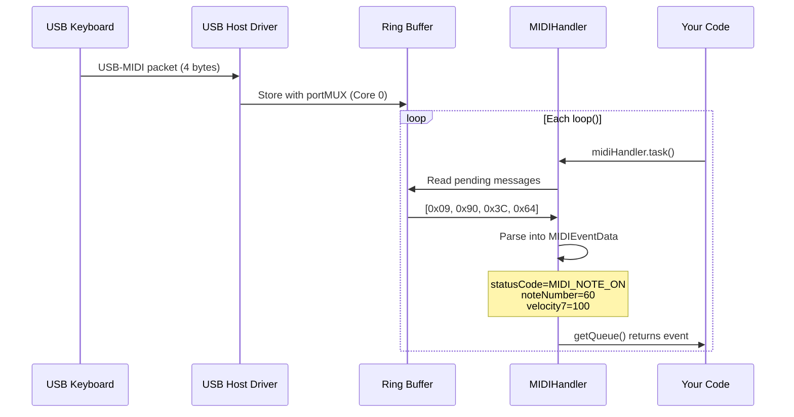

# Introduction

**ESP32_Host_MIDI** is an open-source Arduino library that turns the ESP32 into a universal MIDI hub with support for **9 simultaneous transports**, all operating through the same clean event-based API.

---

## What the Library Does

The core idea is simple: no matter where MIDI comes from -- USB, Bluetooth, WiFi, serial cable, radio -- it always arrives in the same event queue (`getQueue()`), with the same format (`MIDIEventData`), ready to process.

```cpp
for (const auto& ev : midiHandler.getQueue()) {
    ev.statusCode;  // MIDIStatus enum: MIDI_NOTE_ON, MIDI_NOTE_OFF, MIDI_CONTROL_CHANGE...
    ev.channel0;    // 0-15 (add +1 to display 1-16)
    ev.noteNumber;  // MIDI number (0-127)
    ev.velocity7;   // 0-127
    ev.velocity16;  // 0-65535 (MIDI 2.0)
    ev.pitchBend14; // 0-16383 (MIDI 1.0, center = 8192)
    ev.pitchBend32; // 0-4294967295 (MIDI 2.0)
    ev.timestamp;   // millis() on arrival
    ev.chordIndex;  // groups simultaneous notes
    // Static helpers: MIDIHandler::statusName(), noteWithOctave(), noteName()
}
```

At the same time, `midiHandler.sendNoteOn()` and other send methods transmit to **all** active transports simultaneously. An event arriving via USB can immediately go out through BLE, DIN-5, and WiFi -- with no extra code.

---

## The 9 Transports



---

## Software Architecture

### FreeRTOS Core Separation

The ESP32 has two cores. The library uses this separation to ensure low latency:



### Flow of a NoteOn Event



---

## Library Layers

| Layer | File | Responsibility |
|-------|------|---------------|
| Feature detection | `ESP32_Host_MIDI.h` | Detects USB, BLE, PSRAM by chip |
| Abstract transport | `MIDITransport.h` | Common interface for all transports |
| Central processor | `MIDIHandler.h/.cpp` | Queue, chords, active notes, sending |
| Configuration | `MIDIHandlerConfig.h` | Handler configuration struct |
| Built-in transports | `USBConnection`, `BLEConnection`, `ESPNowConnection` | Automatically registered |
| External transports | `UART`, `RTP-MIDI`, `Ethernet`, `OSC`, `USBDevice` | Manually included in sketch |
| Theory integration | `GingoAdapter.h` | Bridge with Gingoduino |

---

## Typical Use Cases

### Stage MIDI Hub

```
USB Keyboard ------------------------------------------------+
iPhone BLE --------------------------------------------------+
ESP-NOW (pedals) --------------------------------------------+---> MIDIHandler ---> USB Device -> FOH Computer
                                                              |              ---> DIN-5 -> Effects rack
                                                              |              ---> ESP-NOW -> Other performers
```

### Studio Interface

```
macOS (RTP-MIDI via WiFi) -----------------------------------+
DIN-5 Synthesizer -------------------------------------------+---> MIDIHandler ---> USB Device -> DAW
iPad (BLE MIDI) ---------------------------------------------+              ---> DIN-5 (THRU) -> Other synths
```

---

## Next Steps

- [Installation ->](installation.md) -- install via Arduino IDE or PlatformIO
- [Getting Started ->](getting-started.md) -- first sketch up and running in 5 minutes
- [Configuration ->](configuration.md) -- `MIDIHandlerConfig` and advanced options
