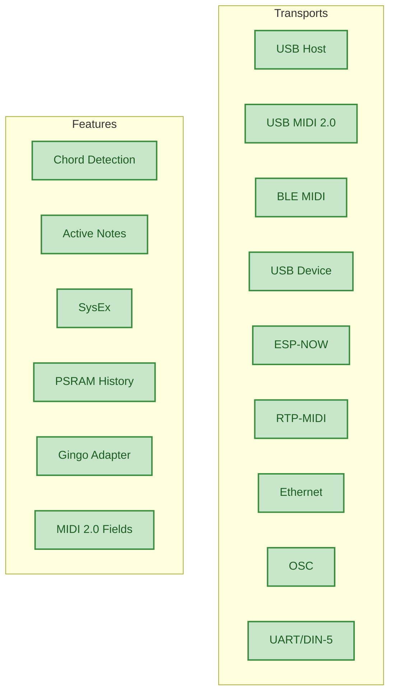

# Roadmap

Current status and future direction of the ESP32_Host_MIDI library.

---

## Current Status -- v5.2.0

Version 5.2.0 is a mature and stable library. The core -- **9 transports, one API** -- is complete and functional, with MIDI 2.0 spec-compliant fields, native USB Host MIDI 2.0, and SysEx across all transports.



---

## In Development

### BLE MIDI Central (Scanner)

**What it is:** A central mode that allows the ESP32 to scan and connect to existing BLE MIDI devices (keyboards, controllers).

**Why it matters:** Currently the ESP32 only works as a peripheral (accepts connections). Central mode allows connecting to existing BLE controllers.

**Status:** In progress.

---

## Under Consideration

| Feature | Priority | Notes |
|---------|-----------|-------|
| Multi-device USB Hub | Medium | ESP32-P4 HS already supports it -- integration pending |
| ~~SysEx handler~~ | ~~Medium~~ | Implemented in v5.1.0 |
| ~~USB MIDI 2.0 Host~~ | ~~High~~ | Implemented in v5.2.0 |
| Running Status TX | Low | DIN-5 bandwidth optimization |
| BLE MIDI Central (Scanner) | High | Connect instead of being connected |
| MIDI Clock generator | Medium | Precise BPM via FreeRTOS timer |
| Virtual MIDI ports | Low | Multiple ports on USB Device |

---

## Contributing

Contributions are welcome!

- **Issues:** [github.com/sauloverissimo/ESP32_Host_MIDI/issues](https://github.com/sauloverissimo/ESP32_Host_MIDI/issues)
- **Pull Requests:** fork + branch + PR
- **Discussions:** use Issues to propose features

### Adding a New Transport

The architecture is extensible -- any protocol can become a transport:

```cpp
class MyTransport : public MIDITransport {
public:
    void begin() { /* initialize */ }

    void task() override {
        if (hasData()) {
            uint8_t data[3];
            readData(data);
            dispatchMidiData(data, 3);  // injects into MIDIHandler
        }
    }

    bool isConnected() const override { return true; }

    bool sendMidiMessage(const uint8_t* data, size_t len) override {
        return transmitData(data, len);
    }
};
```

---

## Changelog

### v5.2.0
- MIDIStatus enum with actual MIDI status bytes (0x80-0xE0)
- New spec-compliant fields: statusCode, channel0 (0-15), noteNumber, velocity7, velocity16, pitchBend14, pitchBend32
- Deprecated fields kept for compatibility (channel, status, note, velocity, pitchBend, noteName, noteOctave)
- Static helpers: noteName(), noteOctave(), noteWithOctave(), statusName() -- zero allocation
- USBMIDI2Connection: USB Host with native MIDI 2.0/UMP (Protocol Negotiation, Function Blocks, Group Terminal Blocks)
- UMP callback path in MIDITransport (dispatchUMPData)
- 9 examples migrated to new API
- 251 native tests (MIDIHandler + MIDI2Support + USB MIDI 2.0 scan)
- Migration guide: docs/migration-v6.md

### v5.1.0
- SysEx send/receive across all transports (USB Host, USB Device, UART)
- USB MIDI packet reassembly (CIN 0x04-0x07) and UART buffer (F0-F7)
- Separate queue `getSysExQueue()` + callback `setSysExCallback()`
- `sendSysEx()` for validated sending
- Configurable buffer: `maxSysExSize`, `maxSysExEvents`
- Example: T-Display-S3-SysEx (monitor with Identity Request)
- Fix: `ESP32_HOST_MIDI_NO_USB_HOST` for USB Device mode
- Fix: EthernetMIDI session naming
- Fix: OSCConnection WiFiUdp.h case sensitivity
- Fix: UART SysEx (was discarded, now buffered)
- Docs: troubleshooting Windows CDC+MIDI

### v5.0.0
- 8 simultaneous transports (USB, BLE, USB Device, ESP-NOW, RTP-MIDI, Ethernet, OSC, UART)
- `MIDITransport` abstraction layer (unified interface)
- `addTransport()` for external transports
- `USBDeviceConnection` -- USB MIDI class-compliant (TinyUSB)
- `OSCConnection` -- bidirectional OSC-to-MIDI bridge
- `EthernetMIDIConnection` -- AppleMIDI over W5500 SPI
- `RTPMIDIConnection` -- AppleMIDI over WiFi with mDNS
- `UARTConnection` -- DIN-5 MIDI serial (31250 baud)
- `ESPNowConnection` -- P2P mesh without router
- `GingoAdapter` -- Gingoduino integration
- PSRAM history buffer (circular, falls back to heap)
- Thread-safe ring buffers with `portMUX`
- Automatic feature detection by chip (macros)

### v4.x
- USB Host + basic BLE MIDI
- Event queue with chordIndex
- Chord detection by time window
- Active notes (fillActiveNotes, getActiveNotesVector)

### v3.x and earlier
- Initial USB Host implementation
- BLE MIDI peripheral

---

## License

MIT -- use, modify, and distribute freely, for commercial or non-commercial purposes.

See [LICENSE](https://github.com/sauloverissimo/ESP32_Host_MIDI/blob/main/LICENSE) for the full text.

---

<p style="text-align:center">
Built with care for musicians, makers, and researchers.<br/>
<a href="https://github.com/sauloverissimo/ESP32_Host_MIDI">github.com/sauloverissimo/ESP32_Host_MIDI</a>
</p>
