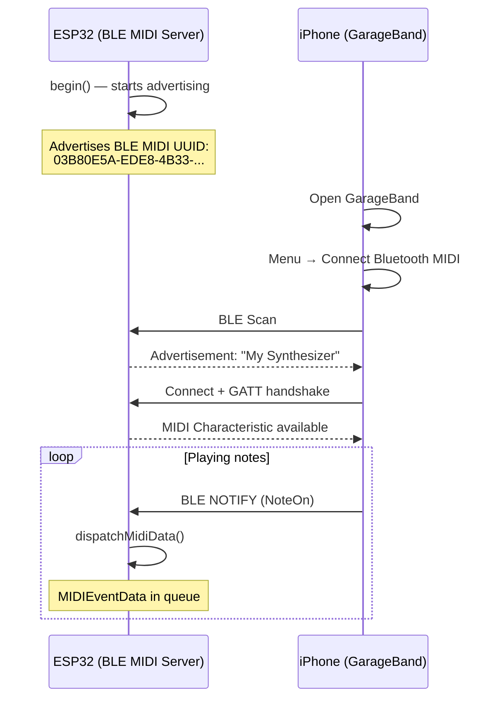

# 📱 BLE MIDI

The ESP32 advertises itself as a BLE MIDI 1.0 peripheral. iOS devices (GarageBand, AUM, Moog), macOS (Audio MIDI Setup), and Android connect without any pairing ritual.

---

## Features

| Aspect | Detail |
|--------|--------|
| Protocol | BLE MIDI 1.0 (Apple/MMA Spec) |
| Service UUID | `03B80E5A-EDE8-4B33-A751-6CE34EC4C700` |
| Range | ~30 m (line of sight) |
| Latency | 3-15 ms |
| Supported chips | ESP32, ESP32-S3, ESP32-C3, ESP32-C6, ESP32-H2 |
| Chips **without** BLE | ESP32-S2, ESP32-P4 |

---

## Code

```cpp
#include <ESP32_Host_MIDI.h>

void setup() {
    Serial.begin(115200);

    MIDIHandlerConfig cfg;
    cfg.bleName = "My Synthesizer";  // Name that appears on iOS/macOS
    midiHandler.begin(cfg);

    // BLE starts advertising automatically
    Serial.println("BLE MIDI waiting for connection...");
}

void loop() {
    midiHandler.task();

#if ESP32_HOST_MIDI_HAS_BLE
    static bool wasConnected = false;
    bool connected = midiHandler.isBleConnected();

    if (connected && !wasConnected) {
        Serial.println("✅ BLE MIDI connected!");
    } else if (!connected && wasConnected) {
        Serial.println("❌ BLE MIDI disconnected.");
    }
    wasConnected = connected;
#endif

    for (const auto& ev : midiHandler.getQueue()) {
        char noteBuf[8];
        Serial.printf("[BLE] %s %s vel=%d\n",
            MIDIHandler::statusName(ev.statusCode),
            MIDIHandler::noteWithOctave(ev.noteNumber, noteBuf, sizeof(noteBuf)),
            ev.velocity7);
    }
}
```

---

## Connecting on iOS



### Step by step on GarageBand (iOS)

1. Open GarageBand
2. Select any instrument
3. Tap the **Settings** icon (gear)
4. Tap **Bluetooth MIDI Devices**
5. The ESP32 appears with the configured name -- tap to connect

### Step by step on macOS

1. Open **Audio MIDI Setup** (`/Applications/Utilities/`)
2. Click **Window → Show MIDI Studio**
3. Click **Bluetooth** (Bluetooth icon)
4. The ESP32 appears -- click **Connect**

---

## Sending MIDI via BLE

BLE MIDI supports full send capability. When you call `sendNoteOn()`, data is sent via BLE NOTIFY to the connected device:

```cpp
// Sends to ALL transports (including BLE)
midiHandler.sendNoteOn(1, 60, 100);   // channel 1, C4, vel 100
midiHandler.sendNoteOff(1, 60, 0);    // release C4
midiHandler.sendControlChange(1, 7, 127);  // maximum volume
midiHandler.sendPitchBend(1, 0);      // center (8192 raw)

// Raw BLE send (legacy -- prefer sendRaw())
uint8_t msg[] = {0x90, 0x3C, 0x64};  // NoteOn C4 vel=100
midiHandler.sendBleRaw(msg, 3);
```

---

## Advanced Settings

### Check connection before sending

```cpp
void loop() {
    midiHandler.task();

#if ESP32_HOST_MIDI_HAS_BLE
    if (midiHandler.isBleConnected()) {
        // Only send if BLE is connected
        midiHandler.sendNoteOn(1, 60, 100);
        delay(500);
        midiHandler.sendNoteOff(1, 60, 0);
        delay(500);
    }
#endif
}
```

### Automatic reconnection

BLE restarts advertising automatically after disconnection. No extra code is needed -- when iOS/macOS disconnects, the ESP32 will resume advertising within seconds.

---

## Compatible Applications

| Platform | Application | Use |
|----------|-------------|-----|
| iOS | GarageBand | Full instrument, recording |
| iOS | AUM | Mixer and AUv3 plugin host |
| iOS | Moog apps | Minimoog, Model D, Animoog |
| iOS | NLog Synth Pro | Polyphonic synthesizer |
| iOS | Loopy Pro | Live performance looper |
| macOS | GarageBand | Instrument, recording |
| macOS | Logic Pro | Professional DAW |
| macOS | Ableton Live | With Bluetooth MIDI enabled |
| Android | MIDI+BTLE | BLE MIDI bridge for Android apps |
| Android | Caustic 3 | Synthesizer with BLE MIDI |

---

## Hardware Diagram

```
ESP32-S3 (or any ESP32 with BT)
    |
    |── Internal / external BLE antenna
    |
    ↕ Bluetooth LE 5.0
    |
    ↓
iPhone / iPad / macOS / Android
```

No additional hardware is needed -- the ESP32 already has a built-in BLE antenna.

---

## Examples with BLE MIDI

| Example | Description |
|---------|-------------|
| `T-Display-S3-BLE-Sender` | BLE sequencer -- ESP32 sends MIDI to iOS |
| `T-Display-S3-BLE-Receiver` | BLE receiver -- iOS sends to ESP32 |

<div style="display:flex; gap:12px; flex-wrap:wrap; justify-content:center; margin:20px 0">
  <figure style="margin:0; text-align:center">
    
    <figcaption><em>BLE MIDI Receiver -- iPhone → ESP32</em></figcaption>
  </figure>
  <figure style="margin:0; text-align:center">
    
    <figcaption><em>BLE MIDI Sender -- ESP32 → iOS</em></figcaption>
  </figure>
</div>

---

## Next Steps

- [USB Host →](usb-host.md) -- use USB + BLE simultaneously
- [ESP-NOW →](esp-now.md) -- wireless mesh between ESP32 units (no iOS/macOS)
- [RTP-MIDI →](rtp-midi.md) -- WiFi with auto-discovery on macOS
