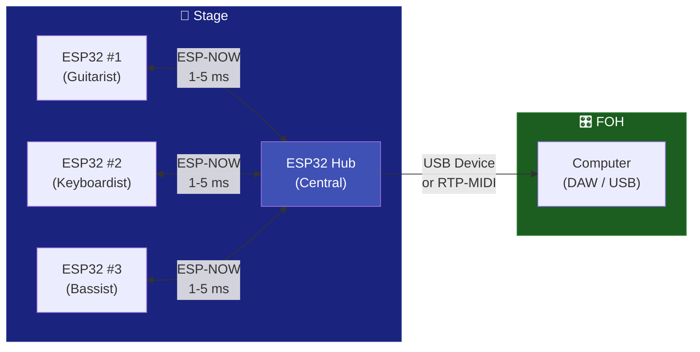
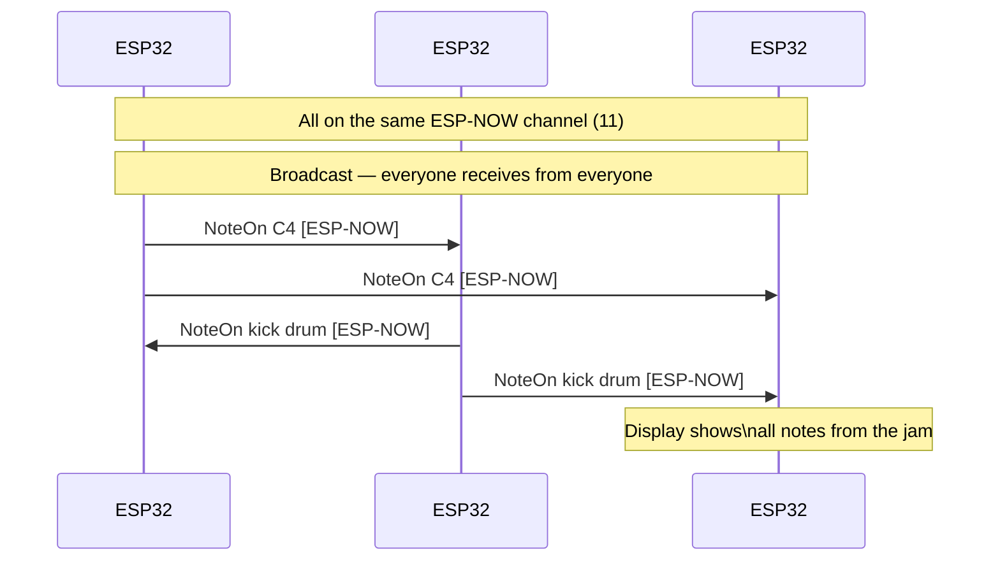

# 📡 ESP-NOW

Ultra-low latency wireless MIDI between ESP32 units via Espressif's proprietary protocol. No router, no handshake, no pairing -- works on any ESP32.

---

## Features

| Aspect | Detail |
|--------|--------|
| Protocol | ESP-NOW (Espressif) |
| Physical | 2.4 GHz WiFi radio (P2P, no router) |
| Latency | 1-5 ms |
| Range | ~200 m (line of sight) |
| Mode | Broadcast or Unicast |
| Chips | Any ESP32, S2, S3, C3, C6 |
| Chips without ESP-NOW | ESP32-P4 (no WiFi radio) |

---

## How It Works



ESP-NOW uses the WiFi radio in peer-to-peer mode, without needing an access point. Multiple ESP32 units can communicate in broadcast (everyone receives from everyone) or unicast (point to point).

---

## Code -- Broadcast Mode

```cpp
#include <ESP32_Host_MIDI.h>
#include "src/ESPNowConnection.h"

ESPNowConnection espNow;

void setup() {
    Serial.begin(115200);

    // WiFi channel must be the same on all ESP32 units in the group
    espNow.begin(/*channel=*/11);

    midiHandler.addTransport(&espNow);
    midiHandler.begin();

    Serial.println("ESP-NOW MIDI ready (broadcast)");
}

void loop() {
    midiHandler.task();

    for (const auto& ev : midiHandler.getQueue()) {
        char noteBuf[8];
        Serial.printf("[ESP-NOW] %s %s vel=%d\n",
            MIDIHandler::statusName(ev.statusCode),
            MIDIHandler::noteWithOctave(ev.noteNumber, noteBuf, sizeof(noteBuf)),
            ev.velocity7);
    }

    // Send a note every 2 seconds (example)
    static unsigned long last = 0;
    if (millis() - last > 2000) {
        midiHandler.sendNoteOn(1, 60, 100);
        delay(200);
        midiHandler.sendNoteOff(1, 60, 0);
        last = millis();
    }
}
```

---

## Code -- Unicast Mode (specific peer)

```cpp
#include "src/ESPNowConnection.h"

ESPNowConnection espNow;

// MAC address of the target ESP32 (see Serial.println(WiFi.macAddress()))
uint8_t peerMAC[] = {0xAA, 0xBB, 0xCC, 0xDD, 0xEE, 0xFF};

void setup() {
    espNow.begin(11);

    // Add a specific peer (unicast)
    espNow.addPeer(peerMAC);

    midiHandler.addTransport(&espNow);
    midiHandler.begin();
}
```

---

## Finding an ESP32's MAC Address

```cpp
void setup() {
    Serial.begin(115200);
    WiFi.mode(WIFI_STA);
    Serial.printf("MAC: %s\n", WiFi.macAddress().c_str());
    // Example: "AA:BB:CC:DD:EE:FF"
}
```

---

## Collaborative Jam -- 3 ESP32 Units



---

## ESP-NOW + USB Host + BLE

```cpp
#include <ESP32_Host_MIDI.h>
#include "src/ESPNowConnection.h"

ESPNowConnection espNow;

void setup() {
    // ESP-NOW
    espNow.begin(11);
    midiHandler.addTransport(&espNow);

    // USB Host + BLE started automatically
    MIDIHandlerConfig cfg;
    cfg.bleName = "Jam Node";
    midiHandler.begin(cfg);

    // Now USB keyboard + BLE + ESP-NOW are all active!
}

void loop() {
    midiHandler.task();

    // Events from any transport
    for (const auto& ev : midiHandler.getQueue()) {
        // Automatically forwarded to all others!
    }
}
```

---

## WiFi Channel Considerations

!!! warning "WiFi Channel"
    ESP-NOW and WiFi (station) must use the **same channel**. If the ESP32 is connected to a WiFi router, ESP-NOW will automatically use the router's channel. If there is no WiFi, you specify the channel in `espNow.begin(channel)`.

```cpp
// If using ESP-NOW together with WiFi (for RTP-MIDI):
WiFi.begin("ssid", "password");
while (WiFi.status() != WL_CONNECTED) delay(500);
// The channel is determined by the router -- DO NOT pass a channel to begin()
espNow.begin();  // uses the current WiFi channel

// If using only ESP-NOW (no WiFi):
espNow.begin(11);  // fixed channel 11 (1-13)
```

---

## Examples

| Example | Description |
|---------|-------------|
| `T-Display-S3-ESP-NOW-Jam` | Collaborative jam with display |
| `ESP-NOW-MIDI` | Basic ESP-NOW MIDI |

---

## Next Steps

- [BLE MIDI →](ble-midi.md) -- ~30 m range but compatible with iOS
- [RTP-MIDI →](rtp-midi.md) -- use WiFi with a router for greater range
- [ESP-NOW Examples →](../exemplos/esp-now-jam.md) -- full jam sketch
