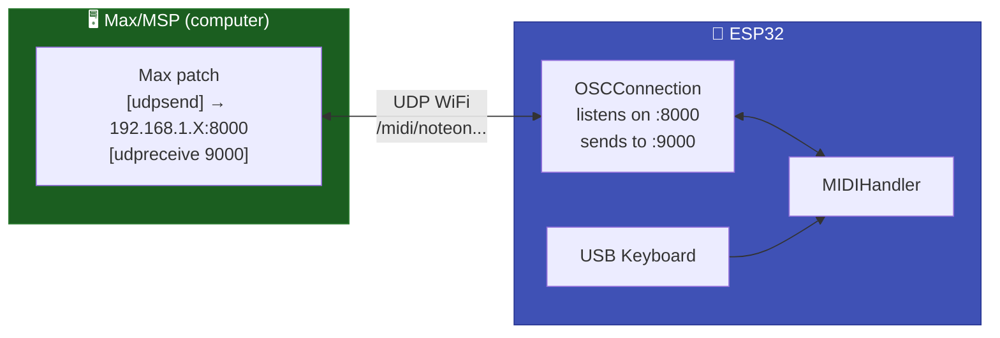

# 🎨 OSC (Open Sound Control)

Bidirectional **OSC to MIDI** bridge over WiFi UDP. Receives OSC messages from Max/MSP, Pure Data, SuperCollider, and TouchOSC and converts them into MIDI events -- and vice-versa.

---

## Features

| Aspect | Detail |
|--------|--------|
| Protocol | OSC 1.0 over UDP |
| Latency | 5-15 ms |
| Bidirectional | ✅ (receive and send) |
| Platforms | Max/MSP, Pure Data, SuperCollider, TouchOSC, Pd, Processing |
| Requires | WiFi + `CNMAT/OSC library` |

---

## Installing the OSC Library

```
Arduino IDE → Sketch → Include Library → Manage Libraries
→ Search: "OSC"
→ Install: OSC by Adrian Freed, Yotam Mann (CNMAT)
```

---

## OSC Address Map

The library automatically maps between OSC and MIDI:

| OSC Address | Arguments | MIDI Message |
|-------------|-----------|--------------|
| `/midi/noteon` | channel note velocity | NoteOn |
| `/midi/noteoff` | channel note velocity | NoteOff |
| `/midi/cc` | channel controller value | Control Change |
| `/midi/pc` | channel program | Program Change |
| `/midi/pitchbend` | channel bend | Pitch Bend (-8192 to +8191) |
| `/midi/aftertouch` | channel pressure | Channel Pressure |

---

## Code

```cpp
#include <WiFi.h>
#include <ESP32_Host_MIDI.h>
#include "src/OSCConnection.h"  // Requires CNMAT/OSC

OSCConnection oscMIDI;

void setup() {
    Serial.begin(115200);

    WiFi.begin("YourSSID", "YourPassword");
    while (WiFi.status() != WL_CONNECTED) {
        delay(500);
        Serial.print(".");
    }
    Serial.printf("\nIP: %s\n", WiFi.localIP().toString().c_str());

    // Local port: 8000  |  Remote IP: 192.168.1.100  |  Remote port: 9000
    oscMIDI.begin(8000, IPAddress(192, 168, 1, 100), 9000);

    midiHandler.addTransport(&oscMIDI);
    midiHandler.begin();

    Serial.println("OSC MIDI ready");
    Serial.printf("Listening for OSC on: %s:8000\n", WiFi.localIP().toString().c_str());
    Serial.println("Sending OSC to: 192.168.1.100:9000");
}

void loop() {
    midiHandler.task();

    for (const auto& ev : midiHandler.getQueue()) {
        char noteBuf[8];
        Serial.printf("[OSC→MIDI] %s %s vel=%d\n",
            MIDIHandler::statusName(ev.statusCode),
            MIDIHandler::noteWithOctave(ev.noteNumber, noteBuf, sizeof(noteBuf)),
            ev.velocity7);
    }
}
```

---

## Integration with Max/MSP



### Basic Max/MSP Patch

```
[udpreceive 9000]
        |
    [OSC-route /midi/noteon]
        |
    [unpack i i i]   ← channel note velocity
        |           |           |
    [route]        [route]     [route]
```

To send from Max to the ESP32:
```
[pack i i i]  ← channel note velocity
     |
[OSC-format /midi/noteon]
     |
[udpsend 192.168.1.X 8000]  ← ESP32's IP
```

---

## Integration with Pure Data (Pd)

### Receiving MIDI in Pd (from the ESP32)

```
[udpreceive 9000]
       |
 [oscparse]
       |
[route /midi/noteon /midi/noteoff /midi/cc]
```

### Sending MIDI from Pd to the ESP32

```
[pack f f f]    ← channel note velocity
      |
[oscformat /midi/noteon]
      |
[udpsend]
[connect 192.168.1.X 8000]
```

---

## TouchOSC

Configure TouchOSC to send to the ESP32's IP on port 8000, and receive on port 9000.

Each button/slider in TouchOSC can send:
```
/midi/noteon   1 60 127   (plays C4 on channel 1 with vel 127)
/midi/cc       1 74 64    (Cutoff CC#74 = 50% on channel 1)
```

---

## OSC → USB Bridge (physical keyboard → Max/MSP)

The most practical use case: USB keyboard connected to the ESP32, Max/MSP receives via OSC.

```cpp
#include <WiFi.h>
#include <ESP32_Host_MIDI.h>
#include "src/OSCConnection.h"
// Tools > USB Mode → "USB Host"

OSCConnection oscMIDI;

void setup() {
    WiFi.begin("ssid", "password");
    while (WiFi.status() != WL_CONNECTED) delay(500);

    // ESP32 receives MIDI from the USB keyboard
    // Max/MSP is at 192.168.1.50 listening on port 9000
    oscMIDI.begin(8000, IPAddress(192, 168, 1, 50), 9000);

    midiHandler.addTransport(&oscMIDI);
    midiHandler.begin();
    // Every note from the USB keyboard is sent as OSC to Max!
}

void loop() { midiHandler.task(); }
```

---

## Examples

| Example | Description |
|---------|-------------|
| `T-Display-S3-OSC` | OSC bridge with WiFi status display |

---

## Next Steps

- [RTP-MIDI →](rtp-midi.md) -- alternative for DAWs with AppleMIDI support
- [OSC Examples →](../exemplos/osc-bridge.md) -- full sketch with display
