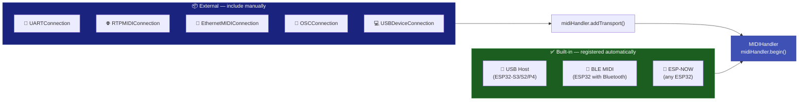
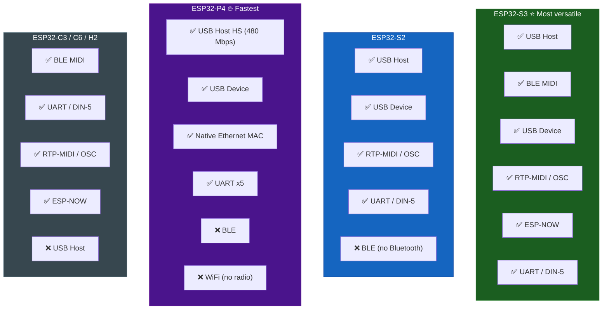

# 📡 Transports -- Overview

The library supports **9 simultaneous MIDI transports**. Each one implements the same abstract `MIDITransport` interface, ensuring that the `MIDIHandler` treats them uniformly.

---

## Transport Comparison

| Transport | Protocol | Physical | Latency | Chips | Extra library |
|-----------|----------|----------|---------|-------|---------------|
| [🔌 USB Host](usb-host.md) | USB MIDI 1.0 | USB-OTG cable | **< 1 ms** | S3 / S2 / P4 | None |
| [🎵 USB Host MIDI 2.0](usb-host.md#midi-20) | USB MIDI 2.0 / UMP | USB-OTG cable | **< 1 ms** | S3 / S2 / P4 | None |
| [📱 BLE MIDI](ble-midi.md) | BLE MIDI 1.0 | Bluetooth LE 5.0 | 3-15 ms | S3 / Classic / C3 / C6 | None |
| [💻 USB Device](usb-device.md) | USB MIDI 1.0 | USB-OTG cable | **< 1 ms** | S3 / S2 / P4 | None (TinyUSB) |
| [📡 ESP-NOW](esp-now.md) | ESP-NOW | 2.4 GHz radio | 1-5 ms | Any ESP32 | None |
| [🌐 RTP-MIDI](rtp-midi.md) | AppleMIDI / RFC 6295 | WiFi UDP | 5-20 ms | Any with WiFi | AppleMIDI-Library |
| [🔗 Ethernet](ethernet-midi.md) | AppleMIDI / RFC 6295 | Wired Ethernet | 2-10 ms | W5500 SPI or P4 | AppleMIDI-Library + Ethernet |
| [🎨 OSC](osc.md) | Open Sound Control | WiFi UDP | 5-15 ms | Any with WiFi | CNMAT/OSC |
| [🎹 UART / DIN-5](uart-din5.md) | Serial MIDI 1.0 (31250 baud) | DIN-5 connector | **< 1 ms** | Any ESP32 | None |

---

## Built-in vs. External Transports



### Built-in Transports

Registered automatically when the chip supports them:

```cpp
#include <ESP32_Host_MIDI.h>

void setup() {
    midiHandler.begin();  // USB + BLE + ESP-NOW started automatically
}
```

### External Transports

Must be included and registered manually:

```cpp
#include <ESP32_Host_MIDI.h>
#include "src/UARTConnection.h"     // DIN-5 serial MIDI
#include "src/RTPMIDIConnection.h"  // Apple MIDI via WiFi
#include "src/OSCConnection.h"      // OSC via WiFi

UARTConnection uartMIDI;
RTPMIDIConnection rtpMIDI;
OSCConnection oscMIDI;

void setup() {
    // 1. Initialize external transports
    uartMIDI.begin(Serial1, 16, 17);
    rtpMIDI.begin("My ESP32");
    oscMIDI.begin(8000, IPAddress(192,168,1,100), 9000);

    // 2. Register with the handler
    midiHandler.addTransport(&uartMIDI);
    midiHandler.addTransport(&rtpMIDI);
    midiHandler.addTransport(&oscMIDI);

    // 3. Start the handler
    midiHandler.begin();
}
```

!!! warning "Transport limit"
    The `MIDIHandler` supports up to **4 external transports** via `addTransport()`. Built-in transports (USB, BLE, ESP-NOW) do not count towards this limit.

---

## Compatibility by Chip



---

## MIDITransport Interface

All transports implement this interface:

```cpp
class MIDITransport {
public:
    virtual void task() = 0;                              // Called every loop()
    virtual bool isConnected() const = 0;                 // Connection status

    // Optional — MIDI send (fallback: return false)
    virtual bool sendMidiMessage(const uint8_t* data, size_t length);

    // Callback registration (used internally by MIDIHandler)
    void setMidiCallback(MidiDataCallback cb, void* ctx);
    void setConnectionCallbacks(ConnectionCallback onConn,
                                ConnectionCallback onDisconn, void* ctx);

protected:
    // Called by implementations to inject data
    void dispatchMidiData(const uint8_t* data, size_t len);
    void dispatchConnected();
    void dispatchDisconnected();
};
```

### Creating a Custom Transport

```cpp
class MyTransport : public MIDITransport {
public:
    void begin() {
        // Initialize hardware/connection
    }

    void task() override {
        // Check if data is available
        if (hasData()) {
            uint8_t buf[3];
            readMidi(buf);
            dispatchMidiData(buf, 3);  // Injects into MIDIHandler
        }
    }

    bool isConnected() const override {
        return connected;
    }

    bool sendMidiMessage(const uint8_t* data, size_t len) override {
        // Send via your protocol
        return writeMidi(data, len);
    }
};

MyTransport myTransport;

void setup() {
    myTransport.begin();
    midiHandler.addTransport(&myTransport);
    midiHandler.begin();
}
```

---

## Next Steps

Explore each transport in detail:

- [🔌 USB Host](usb-host.md) -- USB class-compliant keyboards and pads (MIDI 1.0 and 2.0)
- [📱 BLE MIDI](ble-midi.md) -- iOS, macOS, and Android
- [💻 USB Device](usb-device.md) -- ESP32 as a USB interface for your DAW
- [🎹 UART / DIN-5](uart-din5.md) -- vintage synthesizers
- [🌐 RTP-MIDI](rtp-midi.md) -- Apple MIDI via WiFi
- [🔗 Ethernet](ethernet-midi.md) -- wired Ethernet for studios
- [📡 ESP-NOW](esp-now.md) -- wireless mesh between ESP32 units
- [🎨 OSC](osc.md) -- Max/MSP, Pure Data, SuperCollider
