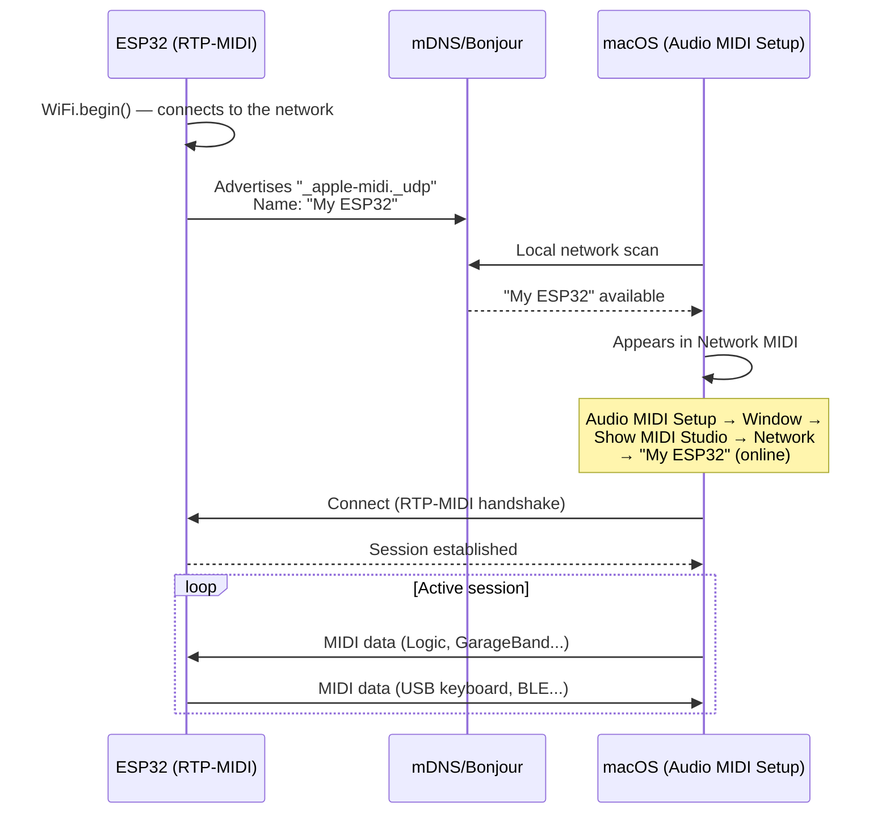

# 🌐 RTP-MIDI (WiFi)

Implements **Apple MIDI** (RTP-MIDI, RFC 6295) over WiFi UDP. The ESP32 appears automatically in **Audio MIDI Setup → Network** on macOS and iOS via mDNS Bonjour -- no manual IP configuration needed.

---

## Features

| Aspect | Detail |
|--------|--------|
| Protocol | AppleMIDI / RTP-MIDI (RFC 6295) |
| Discovery | mDNS / Bonjour automatic |
| Latency | 5-20 ms |
| Platforms | macOS, iOS, Logic Pro, GarageBand, Ableton |
| Requires | WiFi connected + `lathoub/Arduino-AppleMIDI-Library v3.x` |

---

## Installing the Library

```
Arduino IDE → Sketch → Include Library → Manage Libraries
→ Search: "AppleMIDI"
→ Install: Arduino-AppleMIDI-Library by lathoub (v3.x)
```

---

## Code

```cpp
#include <WiFi.h>
#include <ESP32_Host_MIDI.h>
#include "src/RTPMIDIConnection.h"  // Requires AppleMIDI-Library

RTPMIDIConnection rtpMIDI;

void setup() {
    Serial.begin(115200);

    // Connect to WiFi
    WiFi.begin("YourSSID", "YourPassword");
    while (WiFi.status() != WL_CONNECTED) {
        delay(500);
        Serial.print(".");
    }
    Serial.printf("\nWiFi: %s\n", WiFi.localIP().toString().c_str());

    // Start RTP-MIDI (appears in macOS Audio MIDI Setup)
    rtpMIDI.begin("My ESP32");  // Session name

    midiHandler.addTransport(&rtpMIDI);
    midiHandler.begin();

    Serial.println("RTP-MIDI ready -- open 'Audio MIDI Setup' on your Mac");
}

void loop() {
    midiHandler.task();

    for (const auto& ev : midiHandler.getQueue()) {
        char noteBuf[8];
        Serial.printf("[RTP] %s %s vel=%d\n",
            MIDIHandler::statusName(ev.statusCode),
            MIDIHandler::noteWithOctave(ev.noteNumber, noteBuf, sizeof(noteBuf)),
            ev.velocity7);
    }
}
```

---

## Connecting on macOS



### Step by step on macOS

1. Open **Audio MIDI Setup** (`/Applications/Utilities/`)
2. Menu **Window → Show MIDI Studio**
3. Click **Network** (globe icon at the top)
4. In the left panel "Directory", the ESP32 appears with the configured name
5. Select it and click **Connect**
6. The MIDI port "My ESP32" becomes available in all DAWs automatically

---

## Connecting on iOS

1. Open **GarageBand** (or any CoreMIDI app)
2. Settings → **Advanced** → MIDI
3. The ESP32 appears in the network sessions list

---

## Sequencer with RTP-MIDI

```cpp
#include <WiFi.h>
#include <ESP32_Host_MIDI.h>
#include "src/RTPMIDIConnection.h"

RTPMIDIConnection rtpMIDI;

const uint8_t SEQ[] = {60, 64, 67, 72};  // C4, E4, G4, C5
int step = 0;
unsigned long nextNote = 0;
const int BPM = 120;
const int NOTE_MS = 60000 / BPM / 2;  // eighth note

void setup() {
    WiFi.begin("ssid", "password");
    while (WiFi.status() != WL_CONNECTED) delay(500);

    rtpMIDI.begin("ESP32 Sequencer");
    midiHandler.addTransport(&rtpMIDI);
    midiHandler.begin();
}

void loop() {
    midiHandler.task();

    unsigned long now = millis();
    if (now >= nextNote) {
        // Turn off previous note
        midiHandler.sendNoteOff(1, SEQ[(step - 1 + 4) % 4], 0);
        // Turn on next note
        midiHandler.sendNoteOn(1, SEQ[step], 100);
        step = (step + 1) % 4;
        nextNote = now + NOTE_MS;
    }
}
```

---

## Gallery

<div style="display:flex; gap:12px; flex-wrap:wrap; justify-content:center; margin:20px 0">
  <figure style="margin:0; text-align:center">
    
    <figcaption><em>RTP-MIDI in macOS Audio MIDI Setup</em></figcaption>
  </figure>
  <figure style="margin:0; text-align:center">
    
    <figcaption><em>Connected RTP-MIDI session</em></figcaption>
  </figure>
</div>

---

## Latency and Jitter

RTP-MIDI includes timestamps and synchronization mechanisms (clock sync) to compensate for WiFi jitter. In practice, with good WiFi:

- **Home / studio** (clean network): 5-15 ms, jitter < 3 ms
- **Congested network**: 15-30 ms, variable jitter
- **5 GHz vs 2.4 GHz**: 5 GHz is more stable for MIDI

!!! tip "Improving latency"
    - Use a dedicated WiFi network (no other streaming devices)
    - Prefer the 5 GHz band
    - Place the router close to the ESP32

---

## Examples

| Example | Description |
|---------|-------------|
| `RTP-MIDI-WiFi` | Sequencer with step display on T-Display-S3 |

---

## Next Steps

- [Ethernet MIDI →](ethernet-midi.md) -- same latency, more consistent with cable
- [OSC →](osc.md) -- alternative for Max/MSP and Pure Data
- [RTP-MIDI Examples →](../exemplos/rtp-midi-wifi.md) -- full sketch with display
