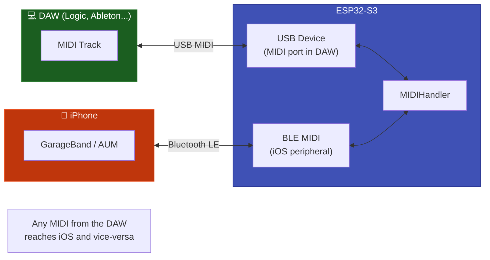

# 💻 USB Device

The ESP32 presents itself as a USB MIDI class-compliant interface to the host computer. macOS, Windows, and Linux recognize it instantly -- no driver, no configuration.

---

## Difference: USB Host vs. USB Device

| Aspect | USB Host | USB Device |
|--------|----------|------------|
| ESP32 role | **Master** -- controls the bus | **Slave** -- responds to the computer |
| What it connects to | Keyboard, pad, controller | Computer (DAW) |
| Where it appears | -- | MIDI port in the DAW |
| Arduino IDE | `USB Mode → "USB Host"` | `USB Mode → "USB-OTG (TinyUSB)"` |
| Coexistence | ❌ Not with USB Device | ❌ Not with USB Host |

!!! warning "Shared OTG pin"
    USB Host and USB Device use the same physical OTG pin. You must choose one **at compile time** -- it is not possible to use both in the same sketch.

---

## Required Hardware

| Requirement | Detail |
|-------------|--------|
| Chip | ESP32-S3, ESP32-S2, or ESP32-P4 |
| Connection | Regular USB cable from the computer to the ESP32 |
| Library | TinyUSB (already included in arduino-esp32 >= 3.0.0) |

---

## Arduino IDE Configuration

```
Tools → USB Mode → "USB-OTG (TinyUSB)"
```

---

## Code

```cpp
#include <ESP32_Host_MIDI.h>
#include "src/USBDeviceConnection.h"
// Tools > USB Mode → "USB-OTG (TinyUSB)"

USBDeviceConnection usbMIDI("ESP32 MIDI Hub");  // Port name in the DAW

void setup() {
    Serial.begin(115200);

    // 1. Register BEFORE begin()
    midiHandler.addTransport(&usbMIDI);
    usbMIDI.begin();

    // 2. Start the handler (BLE can be started alongside)
    midiHandler.begin();

    Serial.println("USB Device MIDI waiting for connection...");
}

void loop() {
    midiHandler.task();

    for (const auto& ev : midiHandler.getQueue()) {
        // MIDI received from the DAW via USB Device
        char noteBuf[8];
        Serial.printf("[USB-DEV] %s %s vel=%d\n",
            MIDIHandler::statusName(ev.statusCode),
            MIDIHandler::noteWithOctave(ev.noteNumber, noteBuf, sizeof(noteBuf)),
            ev.velocity7);

        // Re-sends to BLE (automatic bridge)
    }
}
```

---

## Bidirectional Bridge Usage

The most powerful use case: ESP32 connects to the DAW via USB, and simultaneously receives from iOS via BLE -- automatic bridge.



```cpp
#include <ESP32_Host_MIDI.h>
#include "src/USBDeviceConnection.h"
// Tools > USB Mode → "USB-OTG (TinyUSB)"

USBDeviceConnection usbMIDI("BLE-USB Bridge");

void setup() {
    midiHandler.addTransport(&usbMIDI);
    usbMIDI.begin();

    MIDIHandlerConfig cfg;
    cfg.bleName = "Bridge MIDI";
    midiHandler.begin(cfg);

    // Done! Any MIDI from BLE goes to USB and vice-versa
}

void loop() {
    midiHandler.task();

    for (const auto& ev : midiHandler.getQueue()) {
        // midiHandler.sendNoteOn() would send to BOTH
        // But automatic retransmission already covers this
    }
}
```

---

## Port Name in the DAW

The name passed to `USBDeviceConnection` appears in the DAW's MIDI port list:

```cpp
USBDeviceConnection usbMIDI("ESP32 MIDI Hub");  // macOS: "ESP32 MIDI Hub"
USBDeviceConnection usbMIDI("My Controller");   // Windows: "My Controller"
```

!!! tip "Renaming on macOS"
    In **Audio MIDI Setup → MIDI Studio**, you can permanently rename the port by double-clicking on the device name.

---

## DAW Compatibility

| DAW | Platform | Status |
|-----|----------|--------|
| Logic Pro | macOS | ✅ Plug & Play |
| GarageBand | macOS / iOS | ✅ Plug & Play |
| Ableton Live | macOS / Windows | ✅ Plug & Play |
| Bitwig Studio | macOS / Windows / Linux | ✅ Plug & Play |
| FL Studio | Windows / macOS | ✅ Plug & Play |
| Reaper | macOS / Windows / Linux | ✅ Plug & Play |
| Pro Tools | macOS / Windows | ✅ With CoreMIDI driver |
| Cubase | Windows / macOS | ✅ Plug & Play |

!!! warning "Windows + CDC enabled"
    With "USB CDC on Boot" enabled, the ESP32 creates a **composite USB device** (Serial + MIDI). Windows may not load the MIDI driver automatically in this configuration. If the DAW does not list the MIDI port, see [Troubleshooting → USB Device](../avancado/troubleshooting.md#usb-device).

---

## Examples

| Example | Description |
|---------|-------------|
| `T-Display-S3-USB-Device` | BLE + USB Device bridge with display |

---

## Next Steps

- [BLE MIDI →](ble-midi.md) -- use BLE simultaneously with USB Device
- [RTP-MIDI →](rtp-midi.md) -- WiFi alternative (does not use the OTG pin)
- [UART / DIN-5 →](uart-din5.md) -- connect vintage synthesizers
