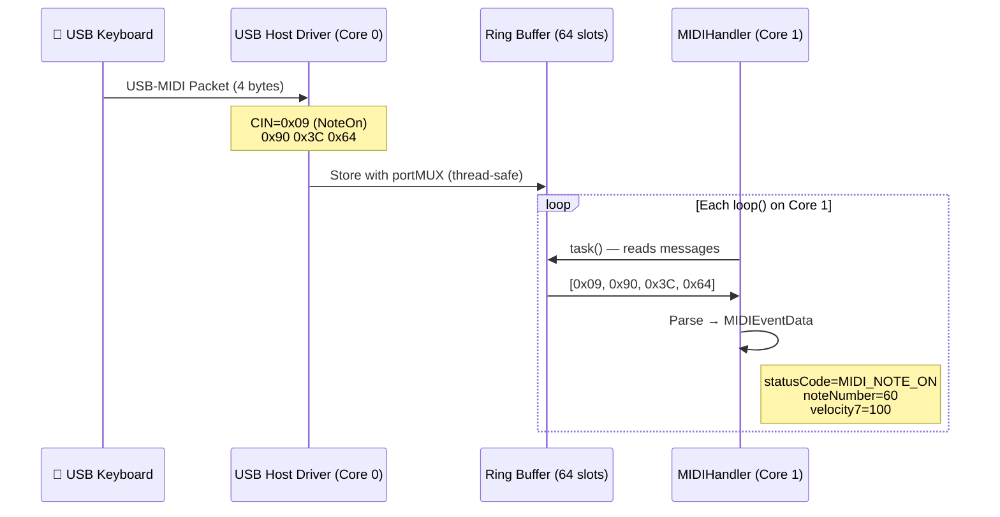

# 🔌 USB Host (OTG)

Connect any USB MIDI class-compliant device -- keyboards, pads, interfaces, controllers -- directly to the ESP32 via USB-OTG. No hub, no driver, no computer configuration needed.

---

## Required Hardware

| Requirement | Detail |
|-------------|--------|
| Chip | ESP32-S3, ESP32-S2, or ESP32-P4 |
| Pins | D+ / D- from the USB-OTG connector |
| Cable | USB-OTG (host) -- micro-OTG or USB-A female end |
| Recommended board | LilyGO T-Display-S3 (has native OTG connector) |

!!! warning "Classic ESP32 does NOT support USB Host"
    Only the S2, S3, and P4 have USB-OTG hardware. The classic (original) ESP32 does not support this transport.

---

## USB Speed

| Chip | Speed | Bandwidth |
|------|-------|-----------|
| ESP32-S2 | Full-Speed | 12 Mbps |
| ESP32-S3 | Full-Speed | 12 Mbps |
| ESP32-P4 | **High-Speed** | 480 Mbps (hub with multiple devices) |

For MIDI (31250 baud), Full-Speed is more than enough. The ESP32-P4 with High-Speed allows connecting **USB hubs** with multiple simultaneous devices.

---

## Arduino IDE Configuration

```
Tools → USB Mode → "USB Host"
```

!!! note
    This option only appears when you select an ESP32-S3, S2, or P4 board in the Board Manager.

---

## Code

```cpp
#include <ESP32_Host_MIDI.h>
// Tools > USB Mode → "USB Host"

void setup() {
    Serial.begin(115200);
    midiHandler.begin();  // USB Host started automatically
}

void loop() {
    midiHandler.task();

    for (const auto& ev : midiHandler.getQueue()) {
        char noteBuf[8];
        Serial.printf("[USB] %s %s ch=%d vel=%d\n",
            MIDIHandler::statusName(ev.statusCode),
            MIDIHandler::noteWithOctave(ev.noteNumber, noteBuf, sizeof(noteBuf)),
            ev.channel0 + 1,
            ev.velocity7);
    }
}
```

No additional configuration is needed -- the USB transport is built-in.

---

## Internal Data Flow



### USB-MIDI Packet Format

```
Byte 0: CIN (Cable Index Number)  — message type
Byte 1: MIDI Status               — 0x90 = NoteOn channel 1
Byte 2: Data 1                    — note (0-127)
Byte 3: Data 2                    — velocity (0-127)
```

---

## Supported Devices

Any **USB MIDI 1.0 Class Compliant** device works without a driver:

- MIDI keyboards (Arturia, Akai, Native Instruments, Roland, Yamaha...)
- Percussion pads (Akai MPC, Roland SPD...)
- Audio interfaces with MIDI port (Focusrite, PreSonus...)
- DJ controllers (Numark, Pioneer...)
- MIDI footswitches and pedalboards
- Digital wind instruments (Akai EWI)

!!! tip "How to check if it's class-compliant"
    If the device works on macOS or Linux **without installing a driver**, it is class-compliant and will work with ESP32_Host_MIDI.

---

## Multiple Devices via USB Hub

Connect up to **4 USB MIDI devices** simultaneously using `USBHubManager` with a powered USB hub.

| Chip | Speed | Recommendation |
|------|-------|----------------|
| ESP32-S3 | Full-Speed (12 Mbps) | 2-3 devices |
| ESP32-P4 | High-Speed (480 Mbps) | 4+ devices |

```cpp
#define ESP32_HOST_MIDI_NO_USB_HOST   // disable built-in single-device USB
#include <ESP32_Host_MIDI.h>
#include <USBHubManager.h>

USBHubManager usbHub;

void setup() {
    midiHandler.begin();
    usbHub.begin(midiHandler);
}

void loop() {
    usbHub.task();
    midiHandler.task();
}
```

Hot-plug is supported: devices are registered on connect and removed on disconnect. See the full example in `USB-Hub-Multi-Device`.

!!! note "sdkconfig for multi-TT hubs"
    ESP-IDF v5.x supports single-TT hubs natively. For multi-TT hubs, add `CONFIG_USB_HOST_HUB_MULTI_TT=y` to your sdkconfig.

---

## Limitations

- **USB MIDI 1.0 and 2.0 (via USBMIDI2Connection)** (does not support USB Audio or HID)
- **Cannot coexist with USB Device** -- both use the same OTG pin

---

## Examples with USB Host

| Example | What it shows |
|---------|---------------|
| `T-Display-S3` | Active notes + event log on display |
| `T-Display-S3-Queue` | Full event queue with debug |
| `T-Display-S3-Piano` | 25-key piano roll with scrolling |
| `T-Display-S3-Gingoduino` | Real-time chord detection |
| `USB-Hub-Multi-Device` | Multiple USB devices via hub |

> **MIDI 2.0:** For native USB MIDI 2.0 support with UMP negotiation, use `USBMIDI2Connection`. See the [API reference](../api/referencia.md#usbmidi2connection).

---

## Next Steps

- [BLE MIDI →](ble-midi.md) -- add Bluetooth without removing USB
- [USB Device →](usb-device.md) -- ESP32 as a USB interface for your DAW (mutually exclusive with USB Host)
- [Getting Started →](../guia/primeiros-passos.md) -- complete USB + BLE sketch
