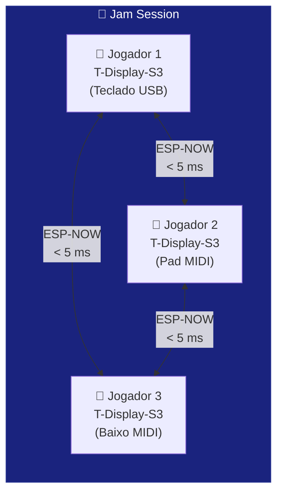

# 📡 ESP-NOW Jam

O exemplo `T-Display-S3-ESP-NOW-Jam` cria um **jam colaborativo sem fio** entre múltiplos ESP32. Cada músico tem seu próprio ESP32; todos os eventos MIDI são compartilhados instantaneamente via ESP-NOW — sem router, sem latência de WiFi.

---

## Conceito



Todos os ESP32 estão no mesmo canal WiFi. Quando qualquer um toca uma nota, ela é enviada em broadcast para todos os outros — e aparece no display de cada um.

---

## Hardware Necessário

| Por participante | Detalhe |
|-----------------|---------|
| Placa | LilyGO T-Display-S3 (ou qualquer ESP32) |
| Instrumento | Qualquer USB MIDI class-compliant |
| Cabo | USB-OTG |

---

## Código

```cpp
#include <ESP32_Host_MIDI.h>
#include "src/ESPNowConnection.h"
// Tools > USB Mode → "USB Host"

// Canal WiFi — DEVE ser o mesmo em TODOS os ESP32 do jam
const int WIFI_CHANNEL = 11;

ESPNowConnection espNow;

void setup() {
    Serial.begin(115200);

    // Iniciar ESP-NOW no canal especificado
    espNow.begin(WIFI_CHANNEL);

    // Registrar e iniciar
    midiHandler.addTransport(&espNow);

    MIDIHandlerConfig cfg;
    cfg.bleName = "Jam Node";
    midiHandler.begin(cfg);

    // Mostrar MAC próprio (para adicionar como peer em outros ESP32)
    Serial.printf("Meu MAC: %s\n", WiFi.macAddress().c_str());
    Serial.println("ESP-NOW Jam pronto! Canal: " + String(WIFI_CHANNEL));
}

void loop() {
    midiHandler.task();

    for (const auto& ev : midiHandler.getQueue()) {
        // Exibir evento (local ou recebido via ESP-NOW de outro participante)
        Serial.printf("[JAM] %s %s vel=%d\n",
            ev.status.c_str(),
            ev.noteOctave.c_str(),
            ev.velocity);

        // No display: mostrar nota + quem tocou
    }
}
```

---

## Descobrir IPs/MACs dos Participantes

Cada ESP32 deve imprimir seu MAC no Serial Monitor ao iniciar:

```
Meu MAC: AA:BB:CC:DD:EE:01   ← ESP32 do Jogador 1
Meu MAC: AA:BB:CC:DD:EE:02   ← ESP32 do Jogador 2
```

Em modo **broadcast**, todos recebem de todos automaticamente — sem precisar adicionar MACs.

Para modo **unicast** (enviar para um peer específico):

```cpp
uint8_t peerMAC[] = {0xAA, 0xBB, 0xCC, 0xDD, 0xEE, 0x02};
espNow.addPeer(peerMAC);
```

---

## Regras do Jam

1. **Mesmo canal WiFi** em todos os ESP32 (ex: canal 11)
2. **Sem router necessário** — os ESP32 se comunicam diretamente
3. **Alcance** ~200 m em linha de visão
4. **Latência** 1–5 ms — imperceptível musicalmente

---

## Jam + USB + BLE

Você pode combinar ESP-NOW com outros transportes no mesmo sketch:

```cpp
#include <ESP32_Host_MIDI.h>
#include "src/ESPNowConnection.h"

ESPNowConnection espNow;

void setup() {
    espNow.begin(11);
    midiHandler.addTransport(&espNow);

    MIDIHandlerConfig cfg;
    cfg.bleName = "Jam Node";
    midiHandler.begin(cfg);
    // Teclado USB + iPhone BLE + ESP-NOW — tudo ao mesmo tempo!
}
```

---

## Próximos Passos

- [ESP-NOW →](../transportes/esp-now.md) — detalhes do transporte
- [USB Host →](../transportes/usb-host.md) — conectar teclado ao jam
- [T-Display-S3 →](t-display-s3.md) — adicionar display ao jam
