# 🚀 MIDI 2.0 UDP

O exemplo `T-Display-S3-MIDI2-UDP` demonstra comunicação MIDI 2.0 end-to-end entre dois ESP32: um envia via teclado USB com resolução de 16-bit, o outro recebe e exibe a barra de velocidade em alta resolução.

---

## Conceito

```mermaid
flowchart LR
    subgraph A["ESP32-A (Sender)"]
        KB["🎹 Teclado USB"]
        H1["MIDIHandler"]
        SC["MIDI2Scaler\nscale7to16()"]
        SEND["MIDI2UDPConnection\nsend UMP"]
    end

    subgraph B["ESP32-B (Receiver)"]
        RECV["MIDI2UDPConnection\nrecv UMP"]
        H2["MIDIHandler\n(downscale automático)"]
        DISP["🖥️ Display\nbarra vel. 16-bit"]
    end

    KB --> H1 --> SC --> SEND
    SEND -->|"UDP WiFi\n12 bytes / evento"| RECV
    RECV --> H2 --> DISP
```



---

## Hardware

| Componente | Quantidade | Detalhe |
|-----------|-----------|---------|
| LilyGO T-Display-S3 | 2 | Mesma rede WiFi |
| Teclado USB MIDI | 1 | Para o ESP32-A |
| Cabo USB-OTG | 1 | Para o ESP32-A |

---

## Código — ESP32-A (Sender com teclado USB)

```cpp
#include <WiFi.h>
#include <ESP32_Host_MIDI.h>
#include "src/MIDI2Support.h"
#include "src/MIDI2UDPConnection.h"
// Tools > USB Mode → "USB Host"

const char* SSID     = "SeuSSID";
const char* PASSWORD = "SuaSenha";
IPAddress   PEER_IP  = IPAddress(192, 168, 1, 21);  // IP do ESP32-B
const int   PORT     = 5006;

MIDI2UDPConnection midi2udp;

void setup() {
    Serial.begin(115200);

    WiFi.begin(SSID, PASSWORD);
    while (WiFi.status() != WL_CONNECTED) delay(500);
    Serial.printf("Meu IP: %s\n", WiFi.localIP().toString().c_str());

    midi2udp.begin(PORT, PEER_IP, PORT);
    midiHandler.addTransport(&midi2udp);
    midiHandler.begin();
}

void loop() {
    midiHandler.task();

    // Eventos do teclado USB são automaticamente enviados via MIDI2UDP
    for (const auto& ev : midiHandler.getQueue()) {
        if (ev.status == "NoteOn" && ev.velocity > 0) {
            // Escalar velocidade para 16 bits e logar
            uint16_t vel16 = MIDI2Scaler::scale7to16(ev.velocity);
            Serial.printf("[USB→UDP] %s vel7=%d vel16=%u\n",
                ev.noteOctave.c_str(), ev.velocity, vel16);
        }
    }
}
```

---

## Código — ESP32-B (Receiver com display)

```cpp
#include <WiFi.h>
#include <ESP32_Host_MIDI.h>
#include "src/MIDI2Support.h"
#include "src/MIDI2UDPConnection.h"
// Tools > USB Mode → "USB Host" (ou outro)

const char* SSID     = "SeuSSID";
const char* PASSWORD = "SuaSenha";
IPAddress   PEER_IP  = IPAddress(192, 168, 1, 20);  // IP do ESP32-A
const int   PORT     = 5006;

MIDI2UDPConnection midi2udp;

void setup() {
    Serial.begin(115200);

    WiFi.begin(SSID, PASSWORD);
    while (WiFi.status() != WL_CONNECTED) delay(500);
    Serial.printf("Meu IP: %s\n", WiFi.localIP().toString().c_str());

    midi2udp.begin(PORT, PEER_IP, PORT);
    midiHandler.addTransport(&midi2udp);
    midiHandler.begin();
}

void loop() {
    midiHandler.task();

    for (const auto& ev : midiHandler.getQueue()) {
        // ev.velocity contém valores MIDI 1.0 (downscaled para 7-bit)
        Serial.printf("[UDP→MIDI] %s vel7=%d\n",
            ev.noteOctave.c_str(), ev.velocity);

        // Acessar valores MIDI 2.0 originais:
        const UMPResult& r = midi2udp.lastResult();
        if (r.valid) {
            float pct = r.velocity16 / 65535.0f * 100.0f;
            Serial.printf("           vel16=%u (%.1f%%)\n",
                r.velocity16, pct);

            // No display real: barra de progresso com pct
        }
    }
}
```

---

## Protocolo MIDI2UDP

Cada pacote UDP tem exatamente **12 bytes**:

```
[55 4D 50 32]  Magic "UMP2"
[XX XX XX XX]  UMP Word 0 (big-endian)
[XX XX XX XX]  UMP Word 1 (big-endian, = 00000000 para 32-bit)
```

Exemplo para NoteOn C4, vel=100:

```
Magic:  55 4D 50 32
Word0:  49 00 3C 00   ← MT=4 (MIDI2 voice), ch=0, opcode=9 (NoteOn), note=60
Word1:  C8 5C 00 00   ← vel16 = 0xC85C = 51292 (escala de vel7=100)
```

---

## Galeria

<div style="text-align:center; margin:20px 0">
  
  <figcaption><em>T-Display-S3-MIDI2-UDP — barra de velocidade de 16-bit mostrando resolução MIDI 2.0</em></figcaption>
</div>

---

## Próximos Passos

- [MIDI 2.0 / UMP →](../transportes/midi2-udp.md) — detalhes do transporte
- [MIDI 2.0 Deep Dive →](../avancado/midi2-ump.md) — especificação completa UMP
- [OSC Bridge →](osc-bridge.md) — alternativa para Max/MSP
