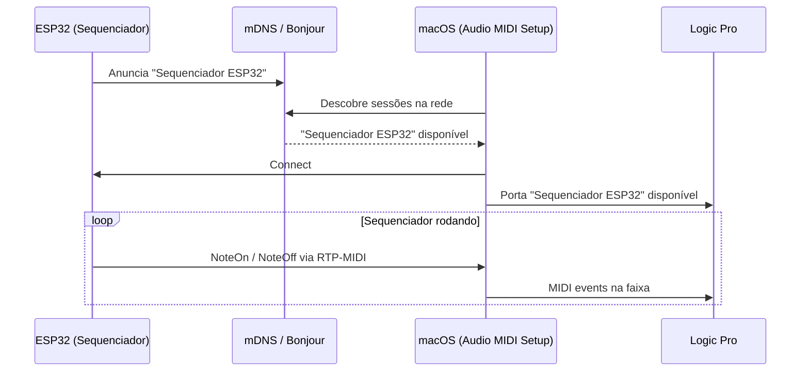

# 🌐 RTP-MIDI WiFi

O exemplo `RTP-MIDI-WiFi` implementa um sequenciador de etapas (*step sequencer*) que envia notas via Apple MIDI (RTP-MIDI) para macOS — aparecendo automaticamente em Audio MIDI Setup.

---

## Hardware Necessário

| Componente | Detalhe |
|-----------|---------|
| Placa | LilyGO T-Display-S3 (ou qualquer ESP32 com WiFi) |
| Display | ST7789 (embutido no T-Display-S3) |
| Rede | WiFi 2,4 GHz ou 5 GHz |

---

## Pré-requisito

Instalar a biblioteca AppleMIDI:

```
Manage Libraries → "AppleMIDI" → Arduino-AppleMIDI-Library by lathoub (v3.x)
```

---

## Código Completo

```cpp
#include <WiFi.h>
#include <ESP32_Host_MIDI.h>
#include "src/RTPMIDIConnection.h"

// ─── Configuração ────────────────────────────────────────────────────────────
const char* WIFI_SSID     = "SeuSSID";
const char* WIFI_PASSWORD = "SuaSenha";
const char* MIDI_NAME     = "Sequenciador ESP32";
const int   BPM           = 120;

// ─── Sequência ────────────────────────────────────────────────────────────────
const uint8_t NOTAS[]    = {60, 62, 64, 67, 69, 67, 64, 62};  // C D E G A G E D
const uint8_t VELS[]     = {100, 80, 90, 110, 95, 85, 75, 100};
const int     NUM_STEPS  = 8;

RTPMIDIConnection rtpMIDI;
int step = 0;
unsigned long nextTick = 0;
const unsigned long NOTE_MS = 60000UL / BPM / 2;  // colcheia

void setup() {
    Serial.begin(115200);

    // Conectar WiFi
    Serial.printf("Conectando a %s...", WIFI_SSID);
    WiFi.begin(WIFI_SSID, WIFI_PASSWORD);
    while (WiFi.status() != WL_CONNECTED) {
        delay(500);
        Serial.print(".");
    }
    Serial.printf("\nConectado! IP: %s\n", WiFi.localIP().toString().c_str());

    // Iniciar RTP-MIDI
    rtpMIDI.begin(MIDI_NAME);
    midiHandler.addTransport(&rtpMIDI);
    midiHandler.begin();

    Serial.printf("RTP-MIDI pronto — nome: '%s'\n", MIDI_NAME);
    Serial.println("Abra 'Audio MIDI Setup' no Mac e conecte à sessão.");
    nextTick = millis();
}

void loop() {
    midiHandler.task();

    // Receber MIDI do macOS (bidirecional)
    for (const auto& ev : midiHandler.getQueue()) {
        Serial.printf("[RTP IN] %s %s vel=%d\n",
            ev.status.c_str(),
            ev.noteOctave.c_str(),
            ev.velocity);
    }

    // Sequenciador — tocar próximo step
    unsigned long now = millis();
    if (now >= nextTick) {
        // Desligar nota anterior
        uint8_t prevNote = NOTAS[(step + NUM_STEPS - 1) % NUM_STEPS];
        midiHandler.sendNoteOff(1, prevNote, 0);

        // Ligar próxima nota
        midiHandler.sendNoteOn(1, NOTAS[step], VELS[step]);
        Serial.printf("[SEQ] Step %d: %d (vel=%d)\n",
            step, NOTAS[step], VELS[step]);

        step = (step + 1) % NUM_STEPS;
        nextTick = now + NOTE_MS;
    }
}
```

---

## Configuração no macOS



### Passo a passo

1. Abra **Audio MIDI Setup** → **Window → Show MIDI Studio**
2. Clique no ícone **Network** (globo)
3. No painel "Directory", clique em **+** e selecione "Sequenciador ESP32"
4. Clique em **Connect**
5. Abra **Logic Pro** / **GarageBand** → a porta aparece automaticamente

---

## Galeria

<div style="display:flex; gap:12px; flex-wrap:wrap; justify-content:center; margin:20px 0">
  <figure style="margin:0; text-align:center">
    
    <figcaption><em>Audio MIDI Setup — sessão ativa</em></figcaption>
  </figure>
  <figure style="margin:0; text-align:center">
    
    <figcaption><em>Sequenciador conectado ao macOS</em></figcaption>
  </figure>
</div>

---

## Próximos Passos

- [RTP-MIDI →](../transportes/rtp-midi.md) — detalhes do transporte
- [Ethernet MIDI →](ethernet-midi.md) — versão cabeada com menor latência
- [OSC Bridge →](osc-bridge.md) — alternativa para Max/MSP
