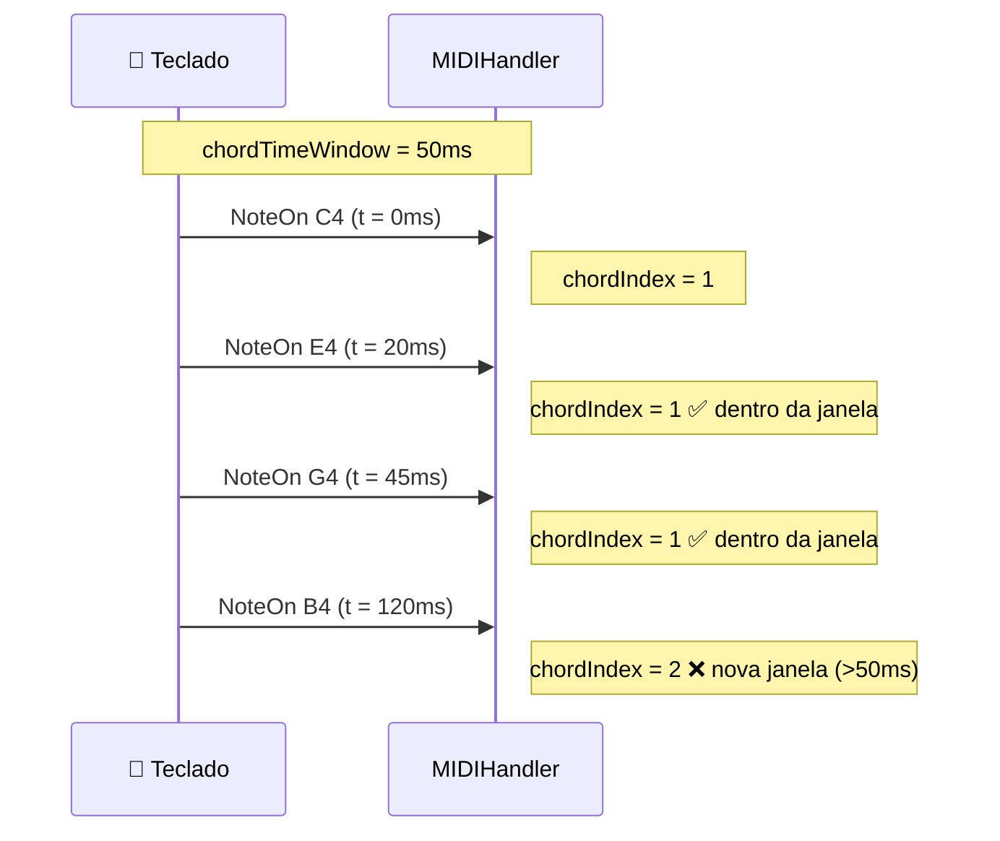

# 🎼 Detecção de Acordes

O `MIDIHandler` agrupa automaticamente notas simultâneas usando o campo `chordIndex`. Notas com o mesmo `chordIndex` foram pressionadas "ao mesmo tempo" (dentro da janela configurada).

---

## Como Funciona

Cada evento MIDI recebe um `chordIndex`. Notas que chegam próximas no tempo compartilham o mesmo índice:

```
Notas pressionadas:   C4  E4  G4  (acorde Dó maior)
chordIndex:            1   1   1   ← mesmo índice
                                   ← B4 pressionado depois
B4 pressionado:       B4
chordIndex:            2           ← novo índice
```

---

## Configuração

### chordTimeWindow

Controla a janela de tempo (ms) para agrupar notas:

```cpp
MIDIHandlerConfig cfg;
cfg.chordTimeWindow = 0;   // 0 ms (padrão): novo acorde só quando TODAS as notas são soltas
cfg.chordTimeWindow = 50;  // 50 ms: janela de tempo (ideal para teclados físicos)
midiHandler.begin(cfg);
```



---

## API de Acordes

### lastChord() — Índice do Último Acorde

Retorna o `chordIndex` mais recente na fila:

```cpp
const auto& queue = midiHandler.getQueue();
int idx = midiHandler.lastChord(queue);  // -1 se a fila estiver vazia
```

### getChord() — Notas do Acorde

Retorna os valores de um campo específico para todas as notas de um acorde:

```cpp
const auto& queue = midiHandler.getQueue();
int idx = midiHandler.lastChord(queue);

// Lista de nomes de notas com oitava
std::vector<std::string> notas = midiHandler.getChord(idx, queue, {"noteOctave"});
// Exemplo: ["C4", "E4", "G4"]

// Lista de velocidades
std::vector<std::string> vels = midiHandler.getChord(idx, queue, {"velocity"});
// Exemplo: ["100", "95", "110"]

// Múltiplos campos com labels
std::vector<std::string> info = midiHandler.getChord(
    idx, queue, {"noteOctave", "velocity"}, /*includeLabels=*/true);
// Exemplo: ["noteOctave:C4", "noteOctave:E4", "velocity:100", "velocity:95"]
```

### getAnswer() — Resposta Rápida do Último Acorde

Atalho para o acorde mais recente, sem precisar chamar `lastChord()`:

```cpp
// Nome das notas do último acorde
std::vector<std::string> resp = midiHandler.getAnswer("noteName");
// Exemplo: ["C", "E", "G"]

// Múltiplos campos
std::vector<std::string> multi = midiHandler.getAnswer({"noteName", "velocity"});
```

---

## Exemplo Completo

```cpp
#include <ESP32_Host_MIDI.h>
// Tools > USB Mode → "USB Host"

void setup() {
    Serial.begin(115200);

    MIDIHandlerConfig cfg;
    cfg.chordTimeWindow = 50;  // agrupa notas dentro de 50ms
    midiHandler.begin(cfg);
}

void loop() {
    midiHandler.task();

    const auto& queue = midiHandler.getQueue();
    if (queue.empty()) return;

    // Verificar se há novas notas
    int lastIdx = midiHandler.lastChord(queue);
    if (lastIdx < 0) return;

    // Pegar notas do acorde mais recente
    auto notas = midiHandler.getChord(lastIdx, queue, {"noteOctave"});

    if (!notas.empty()) {
        Serial.print("Acorde [" + String(lastIdx) + "]: ");
        for (const auto& n : notas) {
            Serial.print(n.c_str());
            Serial.print(" ");
        }
        Serial.println();
    }
}
```

Saída típica ao tocar Dó maior (C-E-G):

```
Acorde [1]: C4 E4 G4
Acorde [2]: C4 F4 A4    ← Fá maior
Acorde [3]: G3 B3 D4    ← Sol maior
```

---

## Detectar Mudança de Acorde

```cpp
void loop() {
    midiHandler.task();

    const auto& queue = midiHandler.getQueue();
    static int ultimoAcorde = -1;

    int idx = midiHandler.lastChord(queue);
    if (idx != ultimoAcorde && idx >= 0) {
        ultimoAcorde = idx;

        auto notas = midiHandler.getChord(idx, queue, {"noteOctave"});
        if (!notas.empty()) {
            Serial.print("Novo acorde: ");
            for (const auto& n : notas) Serial.print(String(n.c_str()) + " ");
            Serial.println();
        }
    }
}
```

---

## Integração com Gingoduino

Para identificar o **nome** do acorde ("Cmaj7", "Dm7♭5"), use o [GingoAdapter](gingo-adapter.md):

```cpp
#include "src/GingoAdapter.h"  // requer Gingoduino ≥ v0.2.2

char chordName[16];
if (GingoAdapter::identifyLastChord(midiHandler, chordName, sizeof(chordName))) {
    Serial.printf("Acorde: %s\n", chordName);
    // Exemplo: "Cmaj7", "Dm", "G7sus4"
}
```

---

## chordIndex no Loop de Eventos

O `chordIndex` é parte de cada `MIDIEventData`. Você pode usar diretamente na iteração:

```cpp
for (const auto& ev : midiHandler.getQueue()) {
    if (ev.status == "NoteOn") {
        Serial.printf("Nota %s  acorde #%d  vel=%d\n",
            ev.noteOctave.c_str(),
            ev.chordIndex,
            ev.velocity);
    }
}
```

---

## Bug Clássico: Analisar Apenas uma Nota

!!! warning "Atenção ao analisar acordes em tempo real"
    Analise o acorde **sempre que o noteCount mudar**, não apenas na chegada de um evento novo. Se você verificar apenas em `chordIndex != lastIdx`, a análise acontece na primeira nota e as seguintes são ignoradas.

    **Correto:**
    ```cpp
    size_t count = midiHandler.getActiveNotesCount();
    if (count != lastCount) {
        lastCount = count;
        // re-analisar acorde
    }
    ```

---

## Próximos Passos

- [Notas Ativas →](notas-ativas.md) — quais notas estão pressionadas agora
- [GingoAdapter →](gingo-adapter.md) — identificar nome do acorde
- [Configuração →](../guia/configuracao.md) — ajustar `chordTimeWindow`
