# 🎵 GingoAdapter

`GingoAdapter.h` é uma bridge entre o `MIDIHandler` e a biblioteca **[Gingoduino](https://github.com/sauloverissimo/gingoduino)** — a biblioteca de teoria musical para sistemas embarcados. Com ela, você identifica nomes de acordes ("Cmaj7", "Dm7♭5"), campos harmônicos e progressões — tudo on-device, sem rede.

---

## Pré-requisito

Instale o Gingoduino v0.2.2 ou superior:

```
Arduino IDE → Manage Libraries → "gingoduino" → Instalar
```

---

## O Que é o Gingoduino?

O Gingoduino analisa conjuntos de notas MIDI e retorna:

- **Nome do acorde**: "Cmaj7", "Dm", "G7sus4", "F#dim7"...
- **Nota raiz**: "C", "F#", "Bb"...
- **Campo harmônico**: em que tonalidade o acorde se encaixa
- **Progressão de acordes**: identifica padrões (II-V-I, etc.)

Tudo roda **no dispositivo**, em tempo real, sem nuvem ou rede.

---

## Fluxo de Integração

```mermaid
flowchart LR
    USB["🎹 Teclado USB\nou BLE MIDI"]
    HANDLER["MIDIHandler\nfila de eventos\nnotas ativas"]
    ADAPTER["GingoAdapter\nconverte MIDI → Gingo"]
    GINGO["Gingoduino\nidentifyChord()\ngetField()"]
    OUT["🎼 Nome do acorde\n'Cmaj7', 'Dm7♭5'"]

    USB --> HANDLER
    HANDLER --> ADAPTER
    ADAPTER --> GINGO
    GINGO --> OUT

    style HANDLER fill:#3F51B5,color:#fff
    style ADAPTER fill:#37474F,color:#fff
    style GINGO fill:#1B5E20,color:#fff
```



---

## Uso Básico

```cpp
#include <ESP32_Host_MIDI.h>
#include "src/GingoAdapter.h"  // requer Gingoduino ≥ v0.2.2
// Tools > USB Mode → "USB Host"

void setup() {
    Serial.begin(115200);
    midiHandler.begin();
}

void loop() {
    midiHandler.task();

    // Verificar quando as notas ativas mudarem
    static size_t lastCount = 0;
    size_t count = midiHandler.getActiveNotesCount();

    if (count != lastCount) {
        lastCount = count;

        if (count > 0) {
            char chordName[16] = "";

            // Identificar nome do acorde
            if (GingoAdapter::identifyLastChord(midiHandler, chordName, sizeof(chordName))) {
                Serial.printf("Acorde: %s  (%d notas)\n", chordName, (int)count);
            } else {
                Serial.printf("Notas: %s\n", midiHandler.getActiveNotes().c_str());
            }
        } else {
            Serial.println("[ sem notas ]");
        }
    }
}
```

---

## API GingoAdapter

### identifyLastChord() — Nome do acorde

```cpp
char nome[16];
bool encontrado = GingoAdapter::identifyLastChord(
    midiHandler,    // referência ao MIDIHandler
    nome,           // buffer de saída
    sizeof(nome)    // tamanho do buffer
);

if (encontrado) {
    // nome = "Cmaj7", "Dm", "G7sus4", "F#dim", etc.
    Serial.printf("Acorde: %s\n", nome);
} else {
    // Notas não formam um acorde reconhecido
}
```

### midiToGingoNotes() — Converter MIDI para GingoNote

```cpp
uint8_t midiNotes[] = {60, 64, 67};  // C, E, G
GingoNote gingoNotas[7];
uint8_t count = GingoAdapter::midiToGingoNotes(
    midiNotes, 3, gingoNotas
);
// gingoNotas[0] = Dó, gingoNotas[1] = Mi, gingoNotas[2] = Sol
```

### deduceFieldFromQueue() — Campo Harmônico (Tier 2)

```cpp
#if defined(GINGODUINO_HAS_FIELD)
FieldMatch campos[8];
uint8_t count = GingoAdapter::deduceFieldFromQueue(
    midiHandler, campos, 8
);

for (uint8_t i = 0; i < count; i++) {
    Serial.printf("Campo: %s (score: %d)\n",
        campos[i].name, campos[i].score);
}
#endif
```

### identifyProgression() — Progressão (Tier 3)

```cpp
#if defined(GINGODUINO_HAS_PROGRESSION)
const char* branches[] = {"IIm", "V7", "I"};
ProgressionMatch resultado;

if (GingoAdapter::identifyProgression("C", SCALE_MAJOR, branches, 3, &resultado)) {
    Serial.printf("Progressão encontrada: %s\n", resultado.name);
}
#endif
```

---

## Exemplo com Display (T-Display-S3)

```cpp
#include <ESP32_Host_MIDI.h>
#include "src/GingoAdapter.h"

void setup() {
    midiHandler.begin();
    // inicializar display aqui
}

void loop() {
    midiHandler.task();

    static size_t lastCount = 0;
    size_t count = midiHandler.getActiveNotesCount();

    if (count != lastCount) {
        lastCount = count;

        char chord[16] = "";
        if (count > 0) {
            GingoAdapter::identifyLastChord(midiHandler, chord, sizeof(chord));
        }

        // Mostrar no display
        // display.showChord(chord);
        // display.showNotes(midiHandler.getActiveNotes().c_str());
    }
}
```

<div style="text-align:center; margin:20px 0">
  
  <figcaption><em>T-Display-S3-Gingoduino: nome do acorde, nota raiz e teclas ativas em tempo real</em></figcaption>
</div>

---

## Tiers do Gingoduino

| Tier | Feature | Macro |
|------|---------|-------|
| 0 | Notas, intervalos | sempre disponível |
| 1 | Identificação de acordes | `GINGODUINO_HAS_CHORD` |
| 2 | Campo harmônico | `GINGODUINO_HAS_FIELD` |
| 3 | Progressões | `GINGODUINO_HAS_PROGRESSION` |

---

## Links do Ecossistema

- **[Gingoduino no GitHub](https://github.com/sauloverissimo/gingoduino)** — biblioteca de teoria musical para ESP32
- **[Gingo (Python)](https://sauloverissimo.github.io/gingo/)** — versão desktop do Gingoduino

---

## Próximos Passos

- [Detecção de Acordes →](deteccao-acordes.md) — usar chordIndex sem Gingoduino
- [Exemplos T-Display-S3 →](../exemplos/t-display-s3.md) — piano roll + acordes no display
