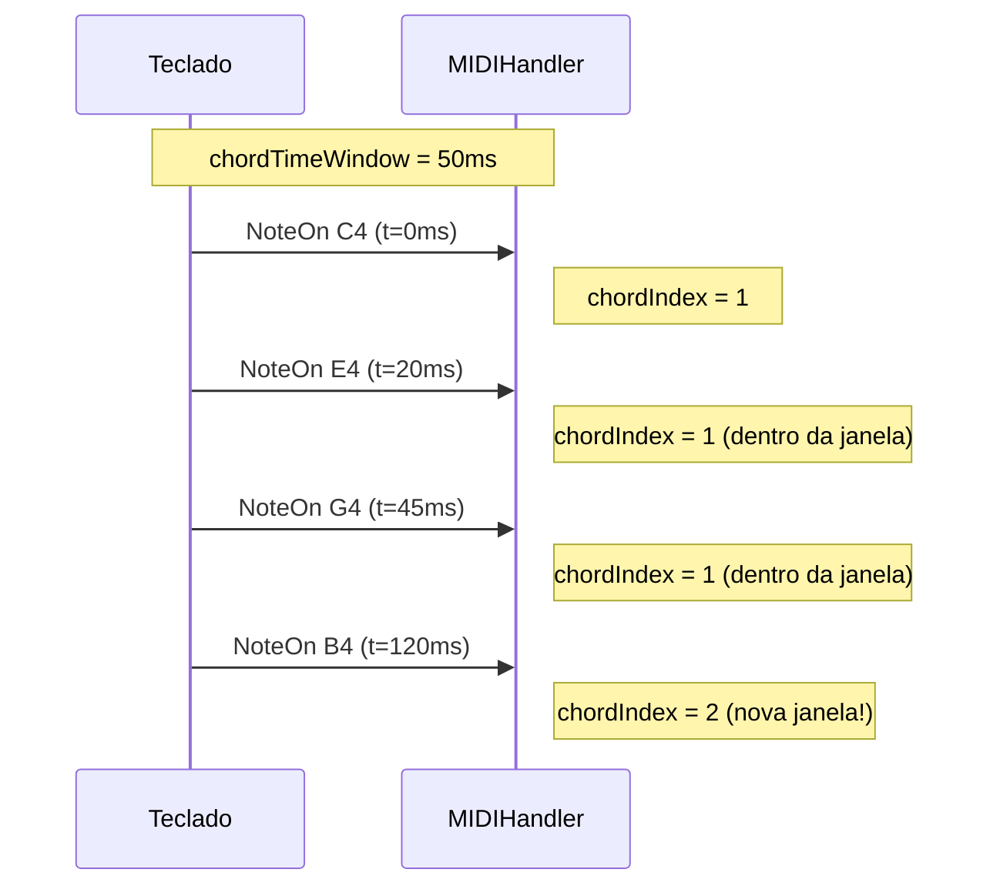

# ⚙️ Configuração

O `MIDIHandler` pode ser configurado via `MIDIHandlerConfig` antes de chamar `begin()`.

---

## MIDIHandlerConfig

```cpp
struct MIDIHandlerConfig {
    int maxEvents        = 20;    // Capacidade da fila de eventos
    unsigned long chordTimeWindow = 0;  // Janela para detecção de acordes (ms)
    int velocityThreshold = 0;   // Filtro mínimo de velocidade (0 = desabilitado)
    int historyCapacity  = 0;    // Buffer histórico PSRAM (0 = desabilitado)
    const char* bleName  = "ESP32 MIDI BLE";  // Nome do dispositivo BLE
};
```

### Uso básico

```cpp
MIDIHandlerConfig cfg;
cfg.maxEvents = 30;
cfg.bleName = "Meu Sintetizador";
midiHandler.begin(cfg);
```

---

## maxEvents — Capacidade da Fila

`maxEvents` define quantos eventos MIDI a fila mantém. Quando a fila atinge o limite, eventos mais antigos são descartados (FIFO).

```cpp
// Padrão: 20 eventos
cfg.maxEvents = 20;

// Para uso educacional (ver histórico longo):
cfg.maxEvents = 50;

// Para uso em loop() frequente (mais reativo):
cfg.maxEvents = 10;
```

!!! note "O que é a fila?"
    A fila (`getQueue()`) contém os eventos **desde a última chamada de `task()`**. Se o seu `loop()` for rápido, raramente terá mais de 5–10 eventos ao mesmo tempo.

Você também pode alterar após `begin()`:

```cpp
midiHandler.setQueueLimit(50);
```

---

## chordTimeWindow — Detecção de Acordes

Controla como notas simultâneas são agrupadas no mesmo `chordIndex`.

```cpp
// 0 ms (padrão): novo acorde apenas quando TODAS as notas são soltas
cfg.chordTimeWindow = 0;

// 30–80 ms: mais reativo para teclados físicos
// (pequenos atrasos entre os dedos ao tocar acordes)
cfg.chordTimeWindow = 50;
```



!!! tip "Quando usar chordTimeWindow?"
    - **0** (padrão): mais preciso, ideal quando você controla o timing (sequenciadores)
    - **30–80 ms**: ideal para teclados físicos onde os dedos chegam em tempos ligeiramente diferentes

Veja mais em [Detecção de Acordes →](../funcionalidades/deteccao-acordes.md)

---

## velocityThreshold — Filtro de Velocidade

Ignora eventos NoteOn com velocidade abaixo do limiar. Útil para filtrar "ghost notes" de sensores piezo.

```cpp
// Desabilitado (padrão) — processa todas as velocidades
cfg.velocityThreshold = 0;

// Filtrar notas muito suaves (veloc < 10)
cfg.velocityThreshold = 10;

// Apenas notas fortes (percussão):
cfg.velocityThreshold = 40;
```

---

## historyCapacity — Histórico em PSRAM

Habilita um buffer circular de eventos que persiste além do limite de `maxEvents`. Usa PSRAM quando disponível, com fallback para heap.

```cpp
// Desabilitado (padrão)
cfg.historyCapacity = 0;

// Guardar os últimos 500 eventos
cfg.historyCapacity = 500;
```

Também pode ser ativado após `begin()`:

```cpp
midiHandler.enableHistory(500);
```

!!! warning "PSRAM necessário para históricos grandes"
    Históricos grandes (> 200 eventos) devem usar ESP32-S3 com PSRAM (4 MB+). Sem PSRAM, o buffer é alocado no heap — espaço limitado.

Veja mais em [Histórico PSRAM →](../funcionalidades/historico-psram.md)

---

## bleName — Nome do Dispositivo BLE

Define o nome que aparece nos apps iOS/macOS ao escanear BLE MIDI.

```cpp
cfg.bleName = "ESP32 MIDI BLE";      // padrão
cfg.bleName = "Piano ESP32";          // qualquer string
cfg.bleName = "Studio Hub";           // aparece em GarageBand, AUM, etc.
```

---

## Macros de Feature Detection

A biblioteca detecta automaticamente os recursos disponíveis com base no chip alvo:

```cpp
// Compilado automaticamente — não defina manualmente

// USB Host disponível (ESP32-S2, S3, P4)
#if ESP32_HOST_MIDI_HAS_USB
    // Teclado USB conectado!
#endif

// BLE disponível (ESP32, S3, C3, C6 — CONFIG_BT_ENABLED)
#if ESP32_HOST_MIDI_HAS_BLE
    bool connected = midiHandler.isBleConnected();
#endif

// PSRAM disponível (CONFIG_SPIRAM ou CONFIG_SPIRAM_SUPPORT)
#if ESP32_HOST_MIDI_HAS_PSRAM
    midiHandler.enableHistory(1000);  // 1000 eventos em PSRAM
#endif

// Ethernet MAC nativo (apenas ESP32-P4)
#if ESP32_HOST_MIDI_HAS_ETH_MAC
    // Use EthernetMIDIConnection com PHY externo (LAN8720)
#endif
```

---

## Debug Callback — Raw MIDI

Para inspecionar os bytes MIDI brutos antes do parsing:

```cpp
void onRawMidi(const uint8_t* raw, size_t rawLen, const uint8_t* midi3) {
    // raw     = payload USB-MIDI completo (CIN + 3 bytes)
    // rawLen  = tamanho do raw
    // midi3   = os 3 bytes MIDI (status, data1, data2)
    Serial.printf("Raw: %02X %02X %02X\n",
        midi3[0], midi3[1], midi3[2]);
}

void setup() {
    midiHandler.setRawMidiCallback(onRawMidi);
    midiHandler.begin();
}
```

---

## Limpar a Fila e Notas Ativas

```cpp
// Esvazia a fila de eventos imediatamente
midiHandler.clearQueue();

// Zera o mapa de notas ativas (útil ao reconectar)
midiHandler.clearActiveNotesNow();
```

---

## Exemplo — Configuração Completa

```cpp
#include <ESP32_Host_MIDI.h>

void setup() {
    Serial.begin(115200);

    MIDIHandlerConfig cfg;
    cfg.maxEvents         = 30;          // fila maior
    cfg.chordTimeWindow   = 50;          // agrupar notas de acordes
    cfg.velocityThreshold = 5;           // ignorar ghost notes
    cfg.historyCapacity   = 500;         // guardar histórico em PSRAM
    cfg.bleName           = "Meu ESP32"; // nome no BLE

    midiHandler.begin(cfg);
}
```

---

## Próximos Passos

- [Transportes →](../transportes/visao-geral.md) — adicionar mais transportes
- [Detecção de Acordes →](../funcionalidades/deteccao-acordes.md) — usar `chordTimeWindow`
- [Histórico PSRAM →](../funcionalidades/historico-psram.md) — usar `historyCapacity`
