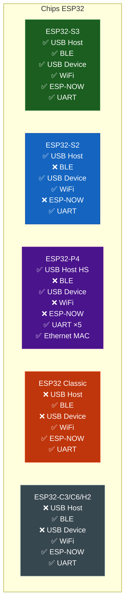

# 📦 Instalação

A biblioteca suporta três ambientes de desenvolvimento: Arduino IDE, PlatformIO e ESP-IDF (componente Arduino).

---

## Requisitos

!!! warning "Versão mínima do pacote ESP32"
    USB Host e USB Device requerem **arduino-esp32 ≥ 3.0.0** (TinyUSB MIDI integrado).
    Verifique em: `Tools > Boards Manager → "esp32" by Espressif`

---

## Arduino IDE

### Passo 1 — Instalar a biblioteca principal

```
Sketch → Include Library → Manage Libraries...
→ Pesquisar: "ESP32_Host_MIDI"
→ Instalar: ESP32_Host_MIDI by sauloverissimo
```

### Passo 2 — Instalar o pacote de placas ESP32

```
Tools → Boards Manager
→ Pesquisar: "esp32"
→ Instalar: esp32 by Espressif Systems (versão ≥ 3.0.0)
```

### Passo 3 — Instalar bibliotecas opcionais (por transporte)

Instale apenas as que você vai usar:

| Transporte | Biblioteca a instalar |
|-----------|----------------------|
| RTP-MIDI (WiFi) | `lathoub/Arduino-AppleMIDI-Library` (v3.x) |
| Ethernet MIDI | `lathoub/Arduino-AppleMIDI-Library` + `arduino-libraries/Ethernet` |
| OSC | `CNMAT/OSC` |
| Detecção de acordes | `sauloverissimo/gingoduino` |
| USB Host / BLE / ESP-NOW | Já incluído no arduino-esp32 |
| USB Device | Já incluído no arduino-esp32 (TinyUSB) |
| UART / DIN-5 | Sem dependências extras |
| MIDI 2.0 UDP | Sem dependências extras |

```
Sketch → Include Library → Manage Libraries...
→ Pesquisar e instalar cada uma acima
```

### Passo 4 — Configurar o modo USB (para USB Host)

```
Tools → USB Mode → "USB Host"
```

!!! note "USB Device"
    Para o transporte USB Device (ESP32 se apresenta como interface MIDI), use:
    `Tools → USB Mode → "USB-OTG (TinyUSB)"`

---

## PlatformIO

Adicione ao seu `platformio.ini`:

```ini
[env:esp32-s3-devkitc-1]
platform = espressif32
board    = esp32-s3-devkitc-1
framework = arduino

lib_deps =
    sauloverissimo/ESP32_Host_MIDI
    ; Descomente conforme os transportes que usar:
    ; lathoub/Arduino-AppleMIDI-Library  ; RTP-MIDI + Ethernet MIDI
    ; arduino-libraries/Ethernet          ; Ethernet MIDI
    ; CNMAT/OSC                           ; OSC
    ; sauloverissimo/gingoduino           ; Detecção de acordes

; Para USB Host:
build_flags =
    -D ARDUINO_USB_MODE=0
    -D ARDUINO_USB_CDC_ON_BOOT=0
```

Para USB Device:

```ini
build_flags =
    -D ARDUINO_USB_MODE=1
    -D ARDUINO_USB_CDC_ON_BOOT=1
```

---

## Instalação Manual (symlink)

Se você desenvolveu a biblioteca localmente e quer testar os exemplos no Arduino IDE:

```bash
# Criar symlink da sua pasta de desenvolvimento para o Arduino libraries
ln -s /home/saulo/Libraries/ESP32_Host_MIDI /home/saulo/Arduino/libraries/ESP32_Host_MIDI
```

Isso permite editar os fontes diretamente sem copiar arquivos.

---

## Verificação da Instalação

Após instalar, abra um dos exemplos:

```
File → Examples → ESP32_Host_MIDI → UART-MIDI-Basic
```

Compile (sem upload) para verificar que todas as dependências estão resolvidas. Se compilar sem erros, a instalação está correta.

!!! tip "Exemplo mínimo — sem hardware USB"
    `UART-MIDI-Basic` é o exemplo mais simples para verificar a instalação, pois não requer hardware USB-OTG específico.

---

## Tabela de Compatibilidade por Chip



!!! tip "Placa recomendada"
    **LilyGO T-Display-S3** = ESP32-S3 + display ST7789 1.9" + bateria LiPo. É a placa mais versátil para ESP32_Host_MIDI: USB Host, BLE, WiFi, ESP-NOW e display tudo em um.

---

## Próximos Passos

- [Primeiros Passos →](primeiros-passos.md) — primeiro sketch funcionando
- [Configuração →](configuracao.md) — opções do `MIDIHandlerConfig`
