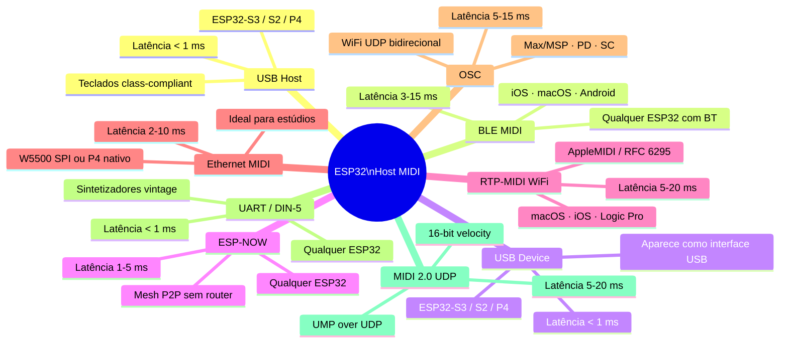
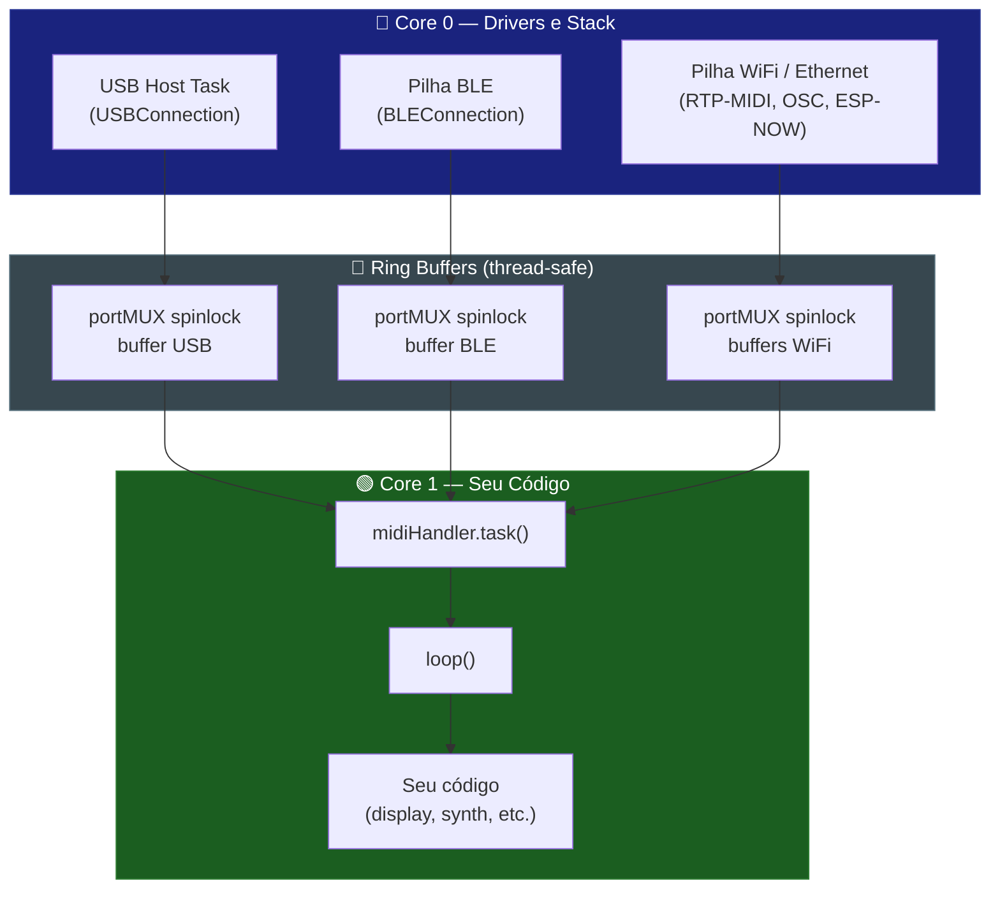
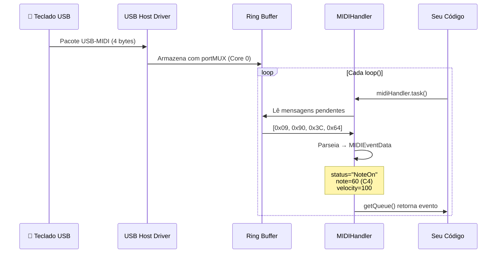

# 🎛️ Introdução

**ESP32_Host_MIDI** é uma biblioteca Arduino de código aberto que transforma o ESP32 em um hub MIDI universal com suporte a **9 transportes simultâneos**, todos operando pela mesma API limpa de eventos.

---

## O Que É a Biblioteca

A ideia central é simples: não importa de onde o MIDI vem — USB, Bluetooth, WiFi, cabo serial, rádio — ele chega sempre na mesma fila de eventos (`getQueue()`), com o mesmo formato (`MIDIEventData`), pronto para processar.

```cpp
for (const auto& ev : midiHandler.getQueue()) {
    ev.status;      // "NoteOn", "NoteOff", "ControlChange", "PitchBend"...
    ev.channel;     // 1–16
    ev.note;        // número MIDI (0–127)
    ev.noteOctave;  // "C4", "D#5", "G3"...
    ev.velocity;    // 0–127
    ev.timestamp;   // millis() na chegada
    ev.chordIndex;  // agrupa notas simultâneas
}
```

Ao mesmo tempo, `midiHandler.sendNoteOn()` e outros métodos de envio transmitem para **todos** os transportes ativos simultaneamente. Um evento que chega pelo USB pode sair imediatamente pelo BLE, pelo DIN-5 e pelo WiFi — sem nenhum código extra.

---

## Os 9 Transportes



---

## Arquitetura de Software

### Separação por Cores do FreeRTOS

O ESP32 tem dois núcleos. A biblioteca usa essa separação para garantir baixa latência:



### Fluxo de um Evento NoteOn



---

## Camadas da Biblioteca

| Camada | Arquivo | Responsabilidade |
|--------|---------|-----------------|
| Feature detection | `ESP32_Host_MIDI.h` | Detecta USB, BLE, PSRAM por chip |
| Transporte abstrato | `MIDITransport.h` | Interface comum para todos transportes |
| Processador central | `MIDIHandler.h/.cpp` | Fila, accordes, notas ativas, envio |
| Configuração | `MIDIHandlerConfig.h` | Struct de configuração do handler |
| Transportes built-in | `USBConnection`, `BLEConnection`, `ESPNowConnection` | Registrados automaticamente |
| Transportes externos | `UART`, `RTP-MIDI`, `Ethernet`, `OSC`, `MIDI2`, `USBDevice` | Incluídos manualmente no sketch |
| Integração teoria | `GingoAdapter.h` | Bridge com Gingoduino |
| MIDI 2.0 | `MIDI2Support.h` | Parser, builder e scaler UMP |

---

## Casos de Uso Típicos

### Hub MIDI de Palco

```
Teclado USB ──────────────────────────────────────────┐
iPhone BLE ───────────────────────────────────────────┤
ESP-NOW (pedais) ─────────────────────────────────────┤──► MIDIHandler ──► USB Device → Computador FOH
                                                       │              ──► DIN-5 → Rack de efeitos
                                                       │              ──► ESP-NOW → Outros performers
```

### Interface de Estúdio

```
macOS (RTP-MIDI via WiFi) ────────────────────────────┐
Sintetizador DIN-5 ───────────────────────────────────┤──► MIDIHandler ──► USB Device → DAW
iPad (BLE MIDI) ──────────────────────────────────────┘              ──► DIN-5 (THRU) → Outros synths
```

### Experimento MIDI 2.0

```
ESP32-A (teclado USB) ──────────► MIDIHandler ──► MIDI2UDPConnection ──► UDP →
── UDP → MIDI2UDPConnection ──► MIDIHandler ──► ESP32-B (display, síntese)
                                               (16-bit velocity, 32-bit CC)
```

---

## Próximos Passos

- [Instalação →](instalacao.md) — instalar via Arduino IDE ou PlatformIO
- [Primeiros Passos →](primeiros-passos.md) — primeiro sketch funcionando em 5 minutos
- [Configuração →](configuracao.md) — `MIDIHandlerConfig` e opções avançadas
