# 🚀 Primeiros Passos

Neste guia você terá o ESP32 recebendo e enviando MIDI em menos de 5 minutos.

---

## Pré-requisito

- Biblioteca instalada (veja [Instalação](instalacao.md))
- ESP32-S3 com cabo USB-OTG **ou** qualquer ESP32 com Bluetooth

---

## Passo 1 — O Sketch Mais Simples

Este sketch imprime todos os eventos MIDI recebidos via USB Host ou BLE no Serial Monitor:

```cpp
#include <ESP32_Host_MIDI.h>
// Arduino IDE: Tools > USB Mode → "USB Host"

void setup() {
    Serial.begin(115200);
    midiHandler.begin();  // (1)
}

void loop() {
    midiHandler.task();   // (2)

    for (const auto& ev : midiHandler.getQueue()) {  // (3)
        Serial.printf("%-12s %-5s ch=%d  vel=%d\n",
            ev.status.c_str(),    // "NoteOn" | "NoteOff" | "ControlChange"...
            ev.noteOctave.c_str(), // "C4", "D#5"...
            ev.channel,
            ev.velocity);
    }
}
```

**Anotações:**

1. `begin()` inicializa automaticamente USB Host (se o chip suportar) e BLE (se habilitado)
2. `task()` deve ser chamado em todo `loop()` — ele drena os ring buffers de todos os transportes
3. `getQueue()` retorna a fila de eventos desde a última chamada de `task()`

---

## Passo 2 — Acessar Campos do Evento

Cada evento tem os seguintes campos:

```cpp
for (const auto& ev : midiHandler.getQueue()) {
    // Identificação
    ev.index;        // Contador global de eventos (único, crescente)
    ev.timestamp;    // millis() no momento da chegada
    ev.delay;        // Δt em ms desde o evento anterior

    // Tipo de mensagem
    ev.status;       // "NoteOn" | "NoteOff" | "ControlChange" |
                     // "ProgramChange" | "PitchBend" | "ChannelPressure"
    ev.channel;      // Canal MIDI: 1–16

    // Nota (apenas NoteOn / NoteOff)
    ev.note;         // Número MIDI: 0–127 (60 = C4 = Dó central)
    ev.noteName;     // "C", "C#", "D"... (sem oitava)
    ev.noteOctave;   // "C4", "D#5", "G3"... (com oitava)
    ev.velocity;     // Velocidade: 0–127 (também: valor CC, program, pressure)

    // Agrupamento de acordes
    ev.chordIndex;   // Notas simultâneas compartilham o mesmo chordIndex

    // Pitch Bend (apenas PitchBend)
    ev.pitchBend;    // 0–16383 (centro = 8192)
}
```

### Exemplo — Apenas NoteOn

```cpp
for (const auto& ev : midiHandler.getQueue()) {
    if (ev.status == "NoteOn" && ev.velocity > 0) {
        Serial.printf("Nota: %s  Velocidade: %d  Canal: %d\n",
            ev.noteOctave.c_str(),
            ev.velocity,
            ev.channel);
    }
}
```

### Exemplo — Control Change

```cpp
for (const auto& ev : midiHandler.getQueue()) {
    if (ev.status == "ControlChange") {
        // ev.note = número do controlador (CC#)
        // ev.velocity = valor do controlador (0–127)
        Serial.printf("CC #%d = %d  (canal %d)\n",
            ev.note, ev.velocity, ev.channel);
    }
}
```

---

## Passo 3 — Enviar MIDI de Volta

Todos os métodos de envio transmitem **simultaneamente** para todos os transportes ativos:

```cpp
// NoteOn: canal 1, nota C4 (60), velocidade 100
midiHandler.sendNoteOn(1, 60, 100);

// NoteOff: canal 1, nota C4 (60), velocidade 0
midiHandler.sendNoteOff(1, 60, 0);

// Control Change: canal 1, CC #7 (volume) = 127
midiHandler.sendControlChange(1, 7, 127);

// Program Change: canal 1, programa 0
midiHandler.sendProgramChange(1, 0);

// Pitch Bend: canal 1, valor -8192 a +8191 (0 = centro)
midiHandler.sendPitchBend(1, 4096);  // +0.5 semitom
```

### Exemplo — Echo MIDI (loopback)

Recebe qualquer NoteOn e reenvia para todos os transportes:

```cpp
void loop() {
    midiHandler.task();

    for (const auto& ev : midiHandler.getQueue()) {
        if (ev.status == "NoteOn") {
            // Reenvia com velocidade dobrada (limitada a 127)
            uint8_t vel = min(ev.velocity * 2, 127);
            midiHandler.sendNoteOn(ev.channel, ev.note, vel);
        }
        if (ev.status == "NoteOff") {
            midiHandler.sendNoteOff(ev.channel, ev.note, 0);
        }
    }
}
```

---

## Passo 4 — Verificar Conexão BLE

```cpp
void loop() {
    midiHandler.task();

#if ESP32_HOST_MIDI_HAS_BLE
    if (midiHandler.isBleConnected()) {
        Serial.println("BLE MIDI conectado!");
    }
#endif
}
```

!!! tip "Conectar via iOS"
    1. Abra **GarageBand** no iPhone
    2. Toque em "+" → Música Mixada → Iniciar
    3. Menu de configurações → Conectar dispositivo MIDI via Bluetooth
    4. O ESP32 aparecerá como "ESP32 MIDI BLE" (ou o nome configurado)

---

## Passo 5 — Sketch Completo com USB + BLE

```cpp
#include <ESP32_Host_MIDI.h>
// Arduino IDE: Tools > USB Mode → "USB Host"

void setup() {
    Serial.begin(115200);
    delay(1000);
    Serial.println("ESP32 Host MIDI — Iniciando...");

    MIDIHandlerConfig cfg;
    cfg.maxEvents = 20;         // capacidade da fila
    cfg.chordTimeWindow = 50;   // ms para agrupar acordes
    midiHandler.begin(cfg);

    Serial.println("Pronto! Conecte um teclado USB ou use BLE.");
}

void loop() {
    midiHandler.task();

    for (const auto& ev : midiHandler.getQueue()) {
        if (ev.status == "NoteOn" && ev.velocity > 0) {
            Serial.printf("[NoteOn]  %s  vel=%3d  ch=%d  t=%lums\n",
                ev.noteOctave.c_str(),
                ev.velocity,
                ev.channel,
                ev.timestamp);
        } else if (ev.status == "NoteOff" || ev.velocity == 0) {
            Serial.printf("[NoteOff] %s             ch=%d\n",
                ev.noteOctave.c_str(),
                ev.channel);
        } else if (ev.status == "ControlChange") {
            Serial.printf("[CC]      #%3d = %3d    ch=%d\n",
                ev.note, ev.velocity, ev.channel);
        } else if (ev.status == "PitchBend") {
            Serial.printf("[Pitch]   %d (centro=8192)  ch=%d\n",
                ev.pitchBend, ev.channel);
        }
    }
}
```

---

## Fluxo de Inicialização

```mermaid
sequenceDiagram
    participant SKETCH as Seu Sketch
    participant HANDLER as MIDIHandler
    participant USB as USBConnection
    participant BLE as BLEConnection

    SKETCH->>HANDLER: midiHandler.begin()
    HANDLER->>HANDLER: Lê MIDIHandlerConfig
    HANDLER->>USB: usbTransport.begin()
    Note over USB: Inicia FreeRTOS task\nno Core 0
    HANDLER->>BLE: bleTransport.begin(bleName)
    Note over BLE: Inicia stack BLE\ne advertising
    HANDLER-->>SKETCH: Pronto

    loop Cada loop()
        SKETCH->>HANDLER: midiHandler.task()
        HANDLER->>USB: usb.task()
        HANDLER->>BLE: ble.task()
        USB-->>HANDLER: Eventos do ring buffer
        BLE-->>HANDLER: Eventos do ring buffer
        HANDLER-->>SKETCH: getQueue() com eventos
    end
```



---

## Próximos Passos

- [Configuração →](configuracao.md) — ajustar `MIDIHandlerConfig`, filtros e histórico
- [Transportes →](../transportes/visao-geral.md) — adicionar mais transportes (RTP-MIDI, UART, OSC...)
- [Funcionalidades →](../funcionalidades/deteccao-acordes.md) — detecção de acordes, notas ativas
