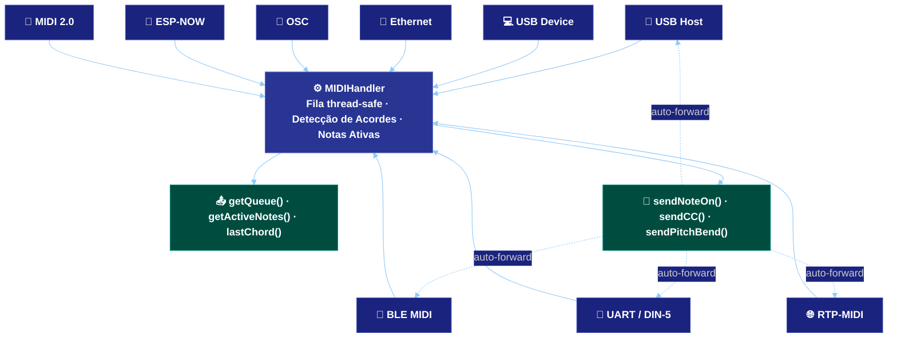

# 🎛️ ESP32 Host MIDI

**O hub MIDI universal para ESP32 — 9 transportes, uma API.**

ESP32_Host_MIDI transforma o seu ESP32 em um hub MIDI multi-protocolo completo. Conecte um teclado USB, receba notas de um iPhone via Bluetooth, conecte o seu DAW pelo WiFi com RTP-MIDI, controle o Max/MSP via OSC, alcance sintetizadores vintage por um cabo DIN-5 e troque pacotes MIDI 2.0 com resolução de 16 bits — **tudo ao mesmo tempo, tudo pela mesma API limpa de eventos.**

---

## Visão Geral da Arquitetura



---

## Início Rápido

```cpp
#include <ESP32_Host_MIDI.h>
// Arduino IDE: Tools > USB Mode → "USB Host"

void setup() {
    Serial.begin(115200);
    midiHandler.begin();  // inicializa USB Host + BLE automaticamente
}

void loop() {
    midiHandler.task();  // processa todos os transportes

    for (const auto& ev : midiHandler.getQueue()) {
        Serial.printf("%-12s %-4s  ch=%d  vel=%d\n",
            ev.status.c_str(),
            ev.noteOctave.c_str(),
            ev.channel,
            ev.velocity);
    }
}
```

---

## O Que Você Pode Construir

=== "🎸 Instrumentos"
    - **Pedalboard sem fio** — botões → ESP-NOW → hub → DIN-5 para rack de efeitos
    - **Pad de bateria MIDI** — sensores piezo + ADC → notas MIDI sensíveis a velocidade
    - **Controlador MIDI customizado** — encoders, faders → USB Device → qualquer DAW
    - **Theremin MIDI** — sensores ultrassônicos → pitch/volume → BLE para iPad
    - **Conversor MIDI para CV** — ESP32 + MCP4728 DAC → 0–5 V para Eurorack

=== "🌐 Pontes e Roteadores"
    - **Interface USB sem fio** — teclado USB → ESP32 → WiFi → macOS Logic Pro
    - **Adaptador DIN-5 para DAW** — sintetizador vintage → ESP32 → USB Device
    - **Mesh de palco** — ESP-NOW entre performers → saída USB única para FOH
    - **MIDI 2.0** — dois ESP32 trocam velocidade de 16 bits por UDP

=== "🎨 Software Criativo"
    - **OSC ↔ MIDI** — Max/MSP, Pure Data, SuperCollider via WiFi UDP
    - **TouchOSC → sintetizador DIN-5** — touchscreen para hardware vintage
    - **Composição algorítmica** — Max → OSC → ESP32 → BLE → app no iPad

=== "📊 Educação e Monitoramento"
    - **Piano roll ao vivo** — 25 teclas com rolagem em display 1.9"
    - **Detector de acordes** — toque um acorde, veja "Cmaj7" instantaneamente
    - **Logger de eventos** — timestamps, canal, velocidade, agrupamento de acordes

---

## Galeria

<div style="display:flex; gap:12px; flex-wrap:wrap; justify-content:center; margin:24px 0">
  <figure style="margin:0; text-align:center">
    
    <figcaption><em>Piano roll de 25 teclas</em></figcaption>
  </figure>
  <figure style="margin:0; text-align:center">
    
    <figcaption><em>Detecção de acordes (Gingoduino)</em></figcaption>
  </figure>
  <figure style="margin:0; text-align:center">
    
    <figcaption><em>MIDI 2.0 UDP — velocidade 16-bit</em></figcaption>
  </figure>
</div>

<div style="display:flex; gap:12px; flex-wrap:wrap; justify-content:center; margin:24px 0">
  <figure style="margin:0; text-align:center">
    
    <figcaption><em>RTP-MIDI no macOS Audio MIDI Setup</em></figcaption>
  </figure>
  <figure style="margin:0; text-align:center">
    
    <figcaption><em>BLE MIDI Receiver (iPhone → ESP32)</em></figcaption>
  </figure>
  <figure style="margin:0; text-align:center">
    
    <figcaption><em>Fila de eventos em tempo real</em></figcaption>
  </figure>
</div>

---

## Navegação

<div class="grid cards" markdown>

-   :material-book-open-page-variant:{ .lg .middle } **Guia**

    ---

    Do básico ao avançado: instalação, primeiros passos, configuração.

    [:octicons-arrow-right-24: Começar](guia/introducao.md)

-   :material-antenna:{ .lg .middle } **Transportes**

    ---

    9 protocolos documentados: USB, BLE, WiFi, Ethernet, DIN-5, ESP-NOW, OSC, MIDI 2.0.

    [:octicons-arrow-right-24: Ver Transportes](transportes/visao-geral.md)

-   :material-puzzle:{ .lg .middle } **Funcionalidades**

    ---

    Detecção de acordes, notas ativas, histórico PSRAM e integração com Gingoduino.

    [:octicons-arrow-right-24: Ver Funcionalidades](funcionalidades/deteccao-acordes.md)

-   :material-code-braces:{ .lg .middle } **API**

    ---

    Referência completa de classes, métodos e estruturas de dados.

    [:octicons-arrow-right-24: Ver API](api/referencia.md)

-   :material-lightbulb:{ .lg .middle } **Exemplos**

    ---

    Sketches prontos para usar: piano roll, OSC bridge, ESP-NOW Jam, MIDI 2.0 e mais.

    [:octicons-arrow-right-24: Ver Exemplos](exemplos/t-display-s3.md)

-   :material-wrench:{ .lg .middle } **Avançado**

    ---

    Compatibilidade de hardware, MIDI 2.0 / UMP e troubleshooting.

    [:octicons-arrow-right-24: Ver Avançado](avancado/hardware.md)

</div>

---

## Matriz de Transportes

| Transporte | Protocolo | Física | Latência | Chips |
|-----------|----------|--------|---------|-------|
| 🔌 USB Host | USB MIDI 1.0 | Cabo USB-OTG | **< 1 ms** | S3 / S2 / P4 |
| 📱 BLE MIDI | BLE MIDI 1.0 | Bluetooth LE | 3–15 ms | Qualquer ESP32 com BT |
| 💻 USB Device | USB MIDI 1.0 | Cabo USB-OTG | **< 1 ms** | S3 / S2 / P4 |
| 📡 ESP-NOW | ESP-NOW | Rádio 2,4 GHz | 1–5 ms | Qualquer ESP32 |
| 🌐 RTP-MIDI | AppleMIDI / RFC 6295 | WiFi UDP | 5–20 ms | Qualquer ESP32 com WiFi |
| 🔗 Ethernet | AppleMIDI / RFC 6295 | Cabeado | 2–10 ms | W5500 SPI ou ESP32-P4 |
| 🎨 OSC | Open Sound Control | WiFi UDP | 5–15 ms | Qualquer ESP32 com WiFi |
| 🎹 UART / DIN-5 | Serial MIDI 1.0 | DIN-5 | **< 1 ms** | Qualquer ESP32 |
| 🚀 MIDI 2.0 / UMP | UMP sobre UDP | WiFi UDP | 5–20 ms | Qualquer ESP32 com WiFi |

---

## Links do Ecossistema

- **[Gingoduino](https://github.com/sauloverissimo/gingoduino)** — biblioteca de teoria musical para ESP32 (detecta acordes, escalas e progressões)
- **[Gingo](https://sauloverissimo.github.io/gingo/)** — versão Python do Gingoduino para desktop e scripts
- **[LilyGO T-Display-S3](https://www.lilygo.cc/products/t-display-s3)** — placa recomendada (ESP32-S3 + display 1.9")
