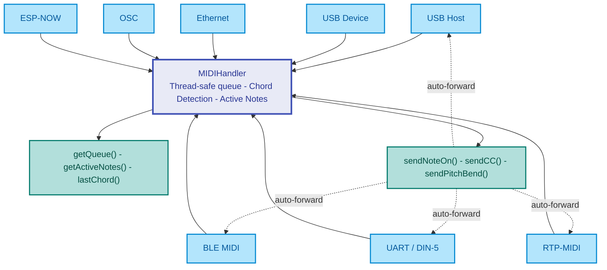

# ESP32 Host MIDI

**The universal MIDI hub for ESP32 -- 9 transports, one API.**

ESP32_Host_MIDI turns your ESP32 into a full-featured, multi-protocol MIDI hub. Connect a USB keyboard, receive notes from an iPhone via Bluetooth, bridge your DAW over WiFi with RTP-MIDI, control Max/MSP via OSC, reach vintage DIN-5 synths through a serial cable, link boards wirelessly with ESP-NOW -- **all simultaneously, all through the same clean event API.**

> **Language / Idioma:** [English](en/) | [Portugues (Brasil)](pt-BR/)

---

## Architecture Overview


```mermaid
flowchart TD
    classDef transport fill:#B3E5FC,color:#01579B,stroke:#0288D1,stroke-width:2px
    classDef handler   fill:#E8EAF6,color:#283593,stroke:#3F51B5,stroke-width:3px
    classDef output    fill:#B2DFDB,color:#004D40,stroke:#00796B,stroke-width:2px

    USB["USB Host"]:::transport
    BLE["BLE MIDI"]:::transport
    DEV["USB Device"]:::transport
    UART["UART / DIN-5"]:::transport
    RTP["RTP-MIDI"]:::transport
    ETH["Ethernet"]:::transport
    OSC["OSC"]:::transport
    NOW["ESP-NOW"]:::transport

    HANDLER["MIDIHandler\nThread-safe queue - Chord Detection - Active Notes"]:::handler

    GET["getQueue() - getActiveNotes() - lastChord()"]:::output
    SEND["sendNoteOn() - sendCC() - sendPitchBend()"]:::output

    USB  & BLE  & DEV  --> HANDLER
    UART & RTP  & ETH  --> HANDLER
    OSC  & NOW        --> HANDLER

    HANDLER --> GET
    HANDLER --> SEND
    SEND -.->|auto-forward| USB & BLE & UART & RTP
```

---

## Quick Start

```cpp
#include <ESP32_Host_MIDI.h>
// Arduino IDE: Tools > USB Mode > "USB Host"

void setup() {
    Serial.begin(115200);
    midiHandler.begin();  // initializes USB Host + BLE automatically
}

void loop() {
    midiHandler.task();  // processes all transports

    for (const auto& ev : midiHandler.getQueue()) {
        char noteBuf[8];
        Serial.printf("%-12s %-4s  ch=%d  vel=%d\n",
            MIDIHandler::statusName(ev.statusCode),
            MIDIHandler::noteWithOctave(ev.noteNumber, noteBuf, sizeof(noteBuf)),
            ev.channel0 + 1,
            ev.velocity7);
    }
}
```

---

## What You Can Build

=== "Instruments"
    - **Wireless pedalboard** -- buttons > ESP-NOW > hub > DIN-5 to effects rack
    - **MIDI drum pad** -- piezo sensors + ADC > velocity-sensitive MIDI notes
    - **Custom MIDI controller** -- encoders, faders > USB Device > any DAW
    - **MIDI theremin** -- ultrasonic sensors > pitch/volume > BLE to iPad
    - **MIDI to CV converter** -- ESP32 + MCP4728 DAC > 0-5 V for Eurorack

=== "Bridges and Routers"
    - **Wireless USB interface** -- USB keyboard > ESP32 > WiFi > macOS Logic Pro
    - **DIN-5 to DAW adapter** -- vintage synth > ESP32 > USB Device
    - **Stage mesh** -- ESP-NOW between performers > single USB output to FOH

=== "Creative Software"
    - **OSC to MIDI** -- Max/MSP, Pure Data, SuperCollider via WiFi UDP
    - **TouchOSC to DIN-5 synth** -- touchscreen to vintage hardware
    - **Algorithmic composition** -- Max > OSC > ESP32 > BLE > iPad app

=== "Education and Monitoring"
    - **Live piano roll** -- 25-key scrolling display on 1.9" screen
    - **Chord detector** -- play a chord, see "Cmaj7" instantly
    - **Event logger** -- timestamps, channel, velocity, chord grouping

---

## Gallery

<div style="display:flex; gap:12px; flex-wrap:wrap; justify-content:center; margin:24px 0">
  <figure style="margin:0; text-align:center">
    
    <figcaption><em>25-key piano roll</em></figcaption>
  </figure>
  <figure style="margin:0; text-align:center">
    
    <figcaption><em>Chord detection (Gingoduino)</em></figcaption>
  </figure>
</div>

<div style="display:flex; gap:12px; flex-wrap:wrap; justify-content:center; margin:24px 0">
  <figure style="margin:0; text-align:center">
    
    <figcaption><em>RTP-MIDI on macOS Audio MIDI Setup</em></figcaption>
  </figure>
  <figure style="margin:0; text-align:center">
    
    <figcaption><em>BLE MIDI Receiver (iPhone to ESP32)</em></figcaption>
  </figure>
  <figure style="margin:0; text-align:center">
    
    <figcaption><em>Real-time event queue</em></figcaption>
  </figure>
</div>

---

## Documentation

<div class="grid cards" markdown>

-   :material-book-open-page-variant:{ .lg .middle } **Guide**

    ---

    From basics to advanced: installation, getting started, configuration.

    [:octicons-arrow-right-24: English](en/guide/introduction.md) | [:octicons-arrow-right-24: Portugues](pt-BR/guia/introducao.md)

-   :material-antenna:{ .lg .middle } **Transports**

    ---

    9 protocols documented: USB Host, USB Device, BLE, WiFi, Ethernet, DIN-5, ESP-NOW, OSC, MIDI 2.0.

    [:octicons-arrow-right-24: English](en/transports/overview.md) | [:octicons-arrow-right-24: Portugues](pt-BR/transportes/visao-geral.md)

-   :material-puzzle:{ .lg .middle } **Features**

    ---

    Chord detection, active notes, PSRAM history, SysEx, and Gingoduino integration.

    [:octicons-arrow-right-24: English](en/features/chord-detection.md) | [:octicons-arrow-right-24: Portugues](pt-BR/funcionalidades/deteccao-acordes.md)

-   :material-code-braces:{ .lg .middle } **API**

    ---

    Complete reference for classes, methods, and data structures.

    [:octicons-arrow-right-24: English](en/api/reference.md) | [:octicons-arrow-right-24: Portugues](pt-BR/api/referencia.md)

-   :material-lightbulb:{ .lg .middle } **Examples**

    ---

    Ready-to-use sketches: piano roll, OSC bridge, ESP-NOW Jam, and more.

    [:octicons-arrow-right-24: English](en/examples/t-display-s3.md) | [:octicons-arrow-right-24: Portugues](pt-BR/exemplos/t-display-s3.md)

-   :material-wrench:{ .lg .middle } **Advanced**

    ---

    Hardware compatibility and troubleshooting.

    [:octicons-arrow-right-24: English](en/advanced/hardware.md) | [:octicons-arrow-right-24: Portugues](pt-BR/avancado/hardware.md)

</div>

---

## Transport Matrix

| Transport | Protocol | Physical | Latency | Chips |
|-----------|----------|----------|---------|-------|
| USB Host | USB MIDI 1.0 | USB-OTG cable | **< 1 ms** | S3 / S2 / P4 |
| BLE MIDI | BLE MIDI 1.0 | Bluetooth LE | 3-15 ms | Any ESP32 with BT |
| USB Device | USB MIDI 1.0 | USB-OTG cable | **< 1 ms** | S3 / S2 / P4 |
| ESP-NOW | ESP-NOW | 2.4 GHz radio | 1-5 ms | Any ESP32 |
| RTP-MIDI | AppleMIDI / RFC 6295 | WiFi UDP | 5-20 ms | Any ESP32 with WiFi |
| Ethernet | AppleMIDI / RFC 6295 | Wired | 2-10 ms | W5500 SPI or ESP32-P4 |
| OSC | Open Sound Control | WiFi UDP | 5-15 ms | Any ESP32 with WiFi |
| UART / DIN-5 | Serial MIDI 1.0 | DIN-5 | **< 1 ms** | Any ESP32 |
| MIDI 2.0 UMP | Universal MIDI Packet | WiFi UDP | 5-20 ms | Any ESP32 with WiFi |

---

## Ecosystem Links

- **[Gingoduino](https://github.com/sauloverissimo/gingoduino)** -- music theory library for ESP32 (detects chords, scales, and progressions)
- **[Gingo](https://sauloverissimo.github.io/gingo/)** -- Python version of Gingoduino for desktop and scripts
- **[LilyGO T-Display-S3](https://www.lilygo.cc/products/t-display-s3)** -- recommended board (ESP32-S3 + 1.9" display)
