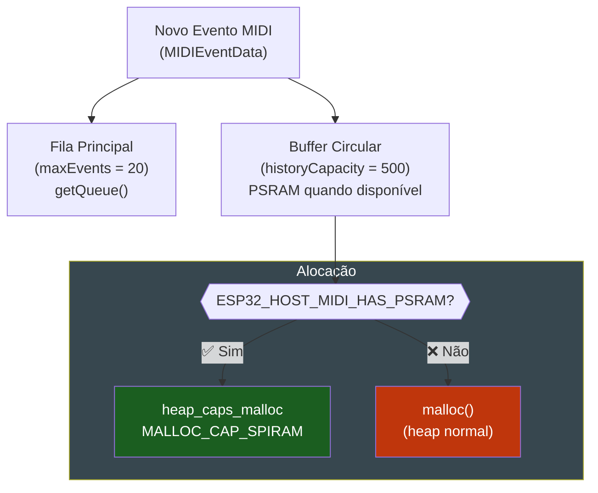

# 💾 Histórico em PSRAM

O `MIDIHandler` pode manter um buffer circular de eventos que persiste além do limite da fila principal (`maxEvents`). Quando PSRAM está disponível, o buffer é alocado lá — permitindo históricos de centenas ou milhares de eventos sem consumir heap.

---

## Quando Usar

- **Análise offline**: processar uma sessão de improvisação depois que terminou
- **Visualização de histórico**: scrollar por eventos passados no display
- **Debug**: inspecionar o que aconteceu nos últimos N eventos
- **Machine learning**: coletar dados de performance para análise

---

## Configuração

### Via MIDIHandlerConfig

```cpp
MIDIHandlerConfig cfg;
cfg.historyCapacity = 500;  // guardar os últimos 500 eventos
midiHandler.begin(cfg);
```

### Via enableHistory() — após begin()

```cpp
midiHandler.begin();
midiHandler.enableHistory(500);  // pode ser chamado a qualquer momento
```

---

## Como Funciona



---

## PSRAM no ESP32-S3

Para ativar PSRAM no Arduino IDE:

```
Tools → PSRAM → "OPI PSRAM" (para ESP32-S3 com PSRAM OPI)
        ou
Tools → PSRAM → "Quad PSRAM" (para ESP32-S3 com PSRAM SIP)
```

Verificar se está ativo:

```cpp
Serial.printf("PSRAM: %u bytes\n", ESP.getPsramSize());
Serial.printf("PSRAM livre: %u bytes\n", ESP.getFreePsram());
```

!!! tip "Verificar disponibilidade"
    A macro `ESP32_HOST_MIDI_HAS_PSRAM` é definida automaticamente em tempo de compilação se o sdkconfig tiver `CONFIG_SPIRAM` ou `CONFIG_SPIRAM_SUPPORT`.

---

## Tamanho do Histórico

Cada `MIDIEventData` ocupa aproximadamente **80–120 bytes** (depende do tamanho das strings STL).

| Capacidade | Memória aprox. | Adequado para |
|-----------|---------------|---------------|
| 100 | ~10 KB | Heap (sem PSRAM) |
| 500 | ~50 KB | Heap ou PSRAM |
| 1000 | ~100 KB | PSRAM recomendado |
| 5000 | ~500 KB | PSRAM obrigatório |

---

## Acessar o Histórico

```cpp
// Habilitar histórico de 500 eventos
midiHandler.enableHistory(500);

// A fila principal (getQueue()) continua limitada por maxEvents
// O histórico é acessado internamente — não há API direta de leitura

// Por ora, use a fila + seu próprio buffer para acesso ao histórico:
std::vector<MIDIEventData> meuHistorico;

void loop() {
    midiHandler.task();

    for (const auto& ev : midiHandler.getQueue()) {
        meuHistorico.push_back(ev);

        // Limitar ao tamanho desejado (buffer circular manual)
        if (meuHistorico.size() > 500) {
            meuHistorico.erase(meuHistorico.begin());
        }
    }
}
```

!!! note "API de leitura do histórico"
    A API de leitura direta do buffer histórico interno está em desenvolvimento. Por enquanto, o padrão recomendado é manter seu próprio `std::vector<MIDIEventData>` como mostrado acima, usando PSRAM via `ps_malloc()` se necessário.

---

## Alocar Vetor em PSRAM

Se você quiser armazenar seu próprio histórico em PSRAM:

```cpp
#include <esp_heap_caps.h>

const int MAX_HISTORY = 1000;
MIDIEventData* historyBuffer = nullptr;
int historySize = 0;

void setup() {
    midiHandler.begin();

#if ESP32_HOST_MIDI_HAS_PSRAM
    historyBuffer = (MIDIEventData*)heap_caps_malloc(
        MAX_HISTORY * sizeof(MIDIEventData),
        MALLOC_CAP_SPIRAM
    );
    if (historyBuffer) {
        Serial.println("Histórico alocado em PSRAM");
    } else {
        // Fallback para heap
        historyBuffer = (MIDIEventData*)malloc(MAX_HISTORY * sizeof(MIDIEventData));
    }
#else
    historyBuffer = (MIDIEventData*)malloc(MAX_HISTORY * sizeof(MIDIEventData));
#endif
}
```

---

## Exemplo — Analisador de Sessão

Coleta uma sessão de improvisação e mostra estatísticas ao final:

```cpp
#include <ESP32_Host_MIDI.h>

std::vector<MIDIEventData> sessao;
bool gravando = true;

void setup() {
    Serial.begin(115200);

    MIDIHandlerConfig cfg;
    cfg.maxEvents = 20;
    cfg.historyCapacity = 500;
    midiHandler.begin(cfg);

    Serial.println("Gravando sessão... (pressione botão para parar)");
}

void loop() {
    midiHandler.task();

    if (gravando) {
        for (const auto& ev : midiHandler.getQueue()) {
            if (ev.status == "NoteOn") {
                sessao.push_back(ev);
            }
        }
    }

    // Simular fim da sessão após 30 segundos
    if (millis() > 30000 && gravando) {
        gravando = false;
        analisarSessao();
    }
}

void analisarSessao() {
    Serial.printf("=== ANÁLISE DA SESSÃO ===\n");
    Serial.printf("Total de notas: %d\n", (int)sessao.size());

    // Nota mais tocada
    int contador[128] = {0};
    for (const auto& ev : sessao) contador[ev.note]++;

    int notaMaisTocada = 0;
    for (int i = 1; i < 128; i++) {
        if (contador[i] > contador[notaMaisTocada]) notaMaisTocada = i;
    }

    Serial.printf("Nota mais tocada: %d (vezes: %d)\n",
        notaMaisTocada, contador[notaMaisTocada]);

    // Velocidade média
    int somaVel = 0;
    for (const auto& ev : sessao) somaVel += ev.velocity;
    Serial.printf("Velocidade média: %d\n",
        sessao.empty() ? 0 : somaVel / (int)sessao.size());
}
```

---

## Próximos Passos

- [Detecção de Acordes →](deteccao-acordes.md) — analisar acordes do histórico
- [GingoAdapter →](gingo-adapter.md) — teoria musical sobre o histórico
- [Configuração →](../guia/configuracao.md) — `historyCapacity` e `maxEvents`
