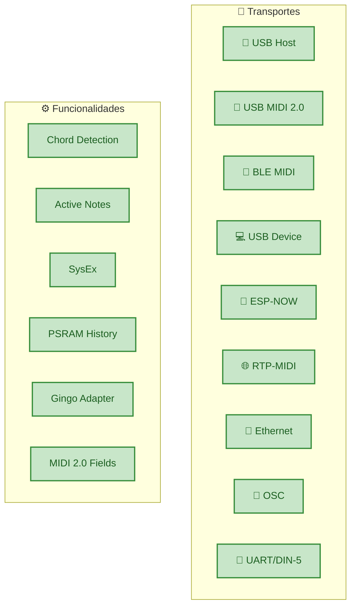

# 🗺️ Roadmap

Estado atual e direção futura da biblioteca ESP32_Host_MIDI.

---

## Estado Atual — v5.2.0

A versão 5.2.0 é uma biblioteca madura e estável. O núcleo — **9 transportes, uma API** — está completo e funcional, com campos MIDI 2.0 spec-compliant, USB Host MIDI 2.0 nativo, e SysEx em todos os transportes.



---

## Em Desenvolvimento

### 🔄 BLE MIDI Central (Scanner)

**O que é:** Modo central que permite ao ESP32 escanear e conectar a dispositivos BLE MIDI existentes (teclados, controladores).

**Por que importa:** Atualmente o ESP32 funciona apenas como periférico (aceita conexões). O modo central permite conectar a Controllers BLE existentes.

**Status:** Em implementação.

---

## Considerado para o Futuro

| Feature | Prioridade | Notas |
|---------|-----------|-------|
| Multi-device USB Hub | Média | ESP32-P4 HS já suporta — integração pendente |
| ~~SysEx handler~~ | ~~Média~~ | ✅ Implementado em v5.1.0 |
| ~~USB MIDI 2.0 Host~~ | ~~Alta~~ | ✅ Implementado em v5.2.0 |
| Running Status TX | Baixa | Otimização de largura de banda DIN-5 |
| BLE MIDI Central (Scanner) | Alta | Conectar ao invés de ser conectado |
| MIDI Clock generator | Média | BPM preciso via timer FreeRTOS |
| Virtual MIDI ports | Baixa | Múltiplas portas no USB Device |

---

## Contribuir

Contribuições são bem-vindas!

- **Issues:** [github.com/sauloverissimo/ESP32_Host_MIDI/issues](https://github.com/sauloverissimo/ESP32_Host_MIDI/issues)
- **Pull Requests:** fork + branch + PR
- **Discussões:** use as Issues para propor features

### Adicionar um Novo Transporte

A arquitetura é extensível — qualquer protocolo pode virar um transporte:

```cpp
class MeuTransporte : public MIDITransport {
public:
    void begin() { /* inicializar */ }

    void task() override {
        if (temDados()) {
            uint8_t dados[3];
            lerDados(dados);
            dispatchMidiData(dados, 3);  // injeta no MIDIHandler
        }
    }

    bool isConnected() const override { return true; }

    bool sendMidiMessage(const uint8_t* data, size_t len) override {
        return enviarDados(data, len);
    }
};
```

---

## Changelog

### v5.2.0
- MIDIStatus enum com status bytes MIDI reais (0x80–0xE0)
- Novos campos spec-compliant: statusCode, channel0 (0–15), noteNumber, velocity7, velocity16, pitchBend14, pitchBend32
- Campos deprecated mantidos para compatibilidade (channel, status, note, velocity, pitchBend, noteName, noteOctave)
- Helpers estáticos: noteName(), noteOctave(), noteWithOctave(), statusName() — zero allocation
- USBMIDI2Connection: USB Host com MIDI 2.0/UMP nativo (Protocol Negotiation, Function Blocks, Group Terminal Blocks)
- UMP callback path no MIDITransport (dispatchUMPData)
- 9 exemplos migrados para nova API
- 251 testes nativos (MIDIHandler + MIDI2Support + USB MIDI 2.0 scan)
- Guia de migração: docs/migration-v6.md

### v5.1.0
- SysEx send/receive em todos os transportes (USB Host, USB Device, UART)
- Remontagem de pacotes USB MIDI (CIN 0x04-0x07) e buffer UART (F0-F7)
- Fila separada `getSysExQueue()` + callback `setSysExCallback()`
- `sendSysEx()` para envio validado
- Buffer configurável: `maxSysExSize`, `maxSysExEvents`
- Exemplo: T-Display-S3-SysEx (monitor com Identity Request)
- Fix: `ESP32_HOST_MIDI_NO_USB_HOST` para USB Device mode
- Fix: EthernetMIDI session naming
- Fix: OSCConnection WiFiUdp.h case sensitivity
- Fix: UART SysEx (era descartado, agora é bufferizado)
- Docs: troubleshooting Windows CDC+MIDI

### v5.0.0
- 8 transportes simultâneos (USB, BLE, USB Device, ESP-NOW, RTP-MIDI, Ethernet, OSC, UART)
- Camada de abstração `MIDITransport` (interface unificada)
- `addTransport()` para transportes externos
- `USBDeviceConnection` — USB MIDI class-compliant (TinyUSB)
- `OSCConnection` — bridge bidirecional OSC ↔ MIDI
- `EthernetMIDIConnection` — AppleMIDI sobre W5500 SPI
- `RTPMIDIConnection` — AppleMIDI sobre WiFi com mDNS
- `UARTConnection` — DIN-5 MIDI serial (31250 baud)
- `ESPNowConnection` — mesh P2P sem router
- `GingoAdapter` — integração com Gingoduino
- PSRAM history buffer (circular, fallback para heap)
- Ring buffers thread-safe com `portMUX`
- Feature detection automático por chip (macros)

### v4.x
- USB Host + BLE MIDI básico
- Fila de eventos com chordIndex
- Detecção de acordes por janela de tempo
- Notas ativas (fillActiveNotes, getActiveNotesVector)

### v3.x e anteriores
- Implementação inicial USB Host
- BLE MIDI periférico

---

## Licença

MIT — use, modifique, distribua livremente, com ou sem fins comerciais.

Veja [LICENSE](https://github.com/sauloverissimo/ESP32_Host_MIDI/blob/main/LICENSE) para o texto completo.

---

<p style="text-align:center">
Construído com ❤️ para músicos, makers e pesquisadores.<br/>
<a href="https://github.com/sauloverissimo/ESP32_Host_MIDI">github.com/sauloverissimo/ESP32_Host_MIDI</a>
</p>
