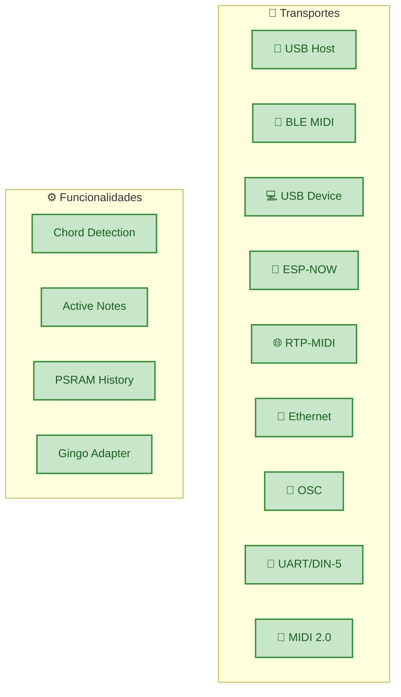

# 🗺️ Roadmap

Estado atual e direção futura da biblioteca ESP32_Host_MIDI.

---

## Estado Atual — v5.0.0

A versão 5.0.0 é uma biblioteca madura e estável. O núcleo — **9 transportes, uma API** — está completo e funcional.



---

## Em Desenvolvimento

### 🔄 MIDI-CI (Capability Inquiry)

**O que é:** Mecanismo de negociação do MIDI 2.0 — dispositivos se descobrem mutuamente e negociam o conjunto de funcionalidades suportadas.

**Por que importa:** Necessário para comunicação MIDI 2.0 "oficial" entre dispositivos certificados.

**Status:** Pesquisa e design.

---

### 🔄 Profile Negotiation

**O que é:** Perfis MIDI 2.0 definem comportamentos padronizados (ex: "Piano Profile", "Drawbar Organ Profile").

**Por que importa:** Permite que dispositivos MIDI 2.0 interoperem sem configuração manual.

**Status:** Aguarda MIDI-CI.

---

### 🔄 Property Exchange

**O que é:** Metadados em JSON trocados entre dispositivos MIDI 2.0 (nome, fabricante, versão, capabilities).

**Por que importa:** Permite que DAWs reconheçam e configurem dispositivos MIDI 2.0 automaticamente.

**Status:** Futuro.

---

## Considerado para o Futuro

| Feature | Prioridade | Notas |
|---------|-----------|-------|
| USB MIDI 2.0 Host | Alta | Quando TinyUSB suportar MIDI 2.0 |
| Multi-device USB Hub | Média | ESP32-P4 HS já suporta — integração pendente |
| SysEx handler | Média | Atualmente ignorado |
| Running Status TX | Baixa | Otimização de largura de banda DIN-5 |
| BLE MIDI Central (Scanner) | Alta | Conectar ao invés de ser conectado |
| MIDI Clock generator | Média | BPM preciso via timer FreeRTOS |
| Virtual MIDI ports | Baixa | Múltiplas portas no USB Device |

---

## Contribuir

Contribuições são bem-vindas!

- **Issues:** [github.com/sauloverissimo/ESP32_Host_MIDI/issues](https://github.com/sauloverissimo/ESP32_Host_MIDI/issues)
- **Pull Requests:** fork + branch + PR
- **Discussões:** use as Issues para propor features

### Adicionar um Novo Transporte

A arquitetura é extensível — qualquer protocolo pode virar um transporte:

```cpp
class MeuTransporte : public MIDITransport {
public:
    void begin() { /* inicializar */ }

    void task() override {
        if (temDados()) {
            uint8_t dados[3];
            lerDados(dados);
            dispatchMidiData(dados, 3);  // injeta no MIDIHandler
        }
    }

    bool isConnected() const override { return true; }

    bool sendMidiMessage(const uint8_t* data, size_t len) override {
        return enviarDados(data, len);
    }
};
```

---

## Changelog

### v5.0.0
- 9 transportes simultâneos (USB, BLE, USB Device, ESP-NOW, RTP-MIDI, Ethernet, OSC, UART, MIDI 2.0 UDP)
- Camada de abstração `MIDITransport` (interface unificada)
- `addTransport()` para transportes externos
- MIDI 2.0 / UMP: builder, parser, scaler (16/32-bit)
- `MIDI2UDPConnection` — protocolo customizado ESP32↔ESP32
- `USBDeviceConnection` — USB MIDI class-compliant (TinyUSB)
- `OSCConnection` — bridge bidirecional OSC ↔ MIDI
- `EthernetMIDIConnection` — AppleMIDI sobre W5500 SPI
- `RTPMIDIConnection` — AppleMIDI sobre WiFi com mDNS
- `UARTConnection` — DIN-5 MIDI serial (31250 baud)
- `ESPNowConnection` — mesh P2P sem router
- `GingoAdapter` — integração com Gingoduino
- PSRAM history buffer (circular, fallback para heap)
- Ring buffers thread-safe com `portMUX`
- Feature detection automático por chip (macros)

### v4.x
- USB Host + BLE MIDI básico
- Fila de eventos com chordIndex
- Detecção de acordes por janela de tempo
- Notas ativas (fillActiveNotes, getActiveNotesVector)

### v3.x e anteriores
- Implementação inicial USB Host
- BLE MIDI periférico

---

## Licença

MIT — use, modifique, distribua livremente, com ou sem fins comerciais.

Veja [LICENSE](https://github.com/sauloverissimo/ESP32_Host_MIDI/blob/main/LICENSE) para o texto completo.

---

<p style="text-align:center">
Construído com ❤️ para músicos, makers e pesquisadores.<br/>
<a href="https://github.com/sauloverissimo/ESP32_Host_MIDI">github.com/sauloverissimo/ESP32_Host_MIDI</a>
</p>
