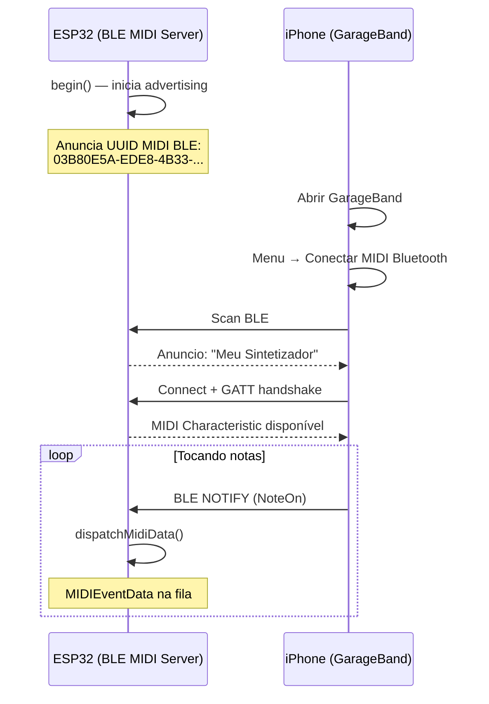

# 📱 BLE MIDI

O ESP32 se anuncia como um periférico BLE MIDI 1.0. Dispositivos iOS (GarageBand, AUM, Moog), macOS (Audio MIDI Setup) e Android conectam sem qualquer ritual de pareamento.

---

## Características

| Aspecto | Detalhe |
|---------|---------|
| Protocolo | BLE MIDI 1.0 (Spec Apple/MMA) |
| UUID do serviço | `03B80E5A-EDE8-4B33-A751-6CE34EC4C700` |
| Alcance | ~30 m (linha de visão) |
| Latência | 3–15 ms |
| Chips suportados | ESP32, ESP32-S3, ESP32-C3, ESP32-C6, ESP32-H2 |
| Chips **sem** BLE | ESP32-S2, ESP32-P4 |

---

## Código

```cpp
#include <ESP32_Host_MIDI.h>

void setup() {
    Serial.begin(115200);

    MIDIHandlerConfig cfg;
    cfg.bleName = "Meu Sintetizador";  // Nome que aparece no iOS/macOS
    midiHandler.begin(cfg);

    // O BLE começa a anunciar automaticamente
    Serial.println("BLE MIDI aguardando conexão...");
}

void loop() {
    midiHandler.task();

#if ESP32_HOST_MIDI_HAS_BLE
    static bool wasConnected = false;
    bool connected = midiHandler.isBleConnected();

    if (connected && !wasConnected) {
        Serial.println("✅ BLE MIDI conectado!");
    } else if (!connected && wasConnected) {
        Serial.println("❌ BLE MIDI desconectado.");
    }
    wasConnected = connected;
#endif

    for (const auto& ev : midiHandler.getQueue()) {
        Serial.printf("[BLE] %s %s vel=%d\n",
            ev.status.c_str(),
            ev.noteOctave.c_str(),
            ev.velocity);
    }
}
```

---

## Conectar no iOS



### Passo a passo no GarageBand (iOS)

1. Abra o GarageBand
2. Selecione qualquer instrumento
3. Toque no ícone **Settings** (engrenagem)
4. Toque em **Bluetooth MIDI Devices**
5. O ESP32 aparece com o nome configurado — toque para conectar

### Passo a passo no macOS

1. Abra **Audio MIDI Setup** (`/Applications/Utilities/`)
2. Clique em **Window → Show MIDI Studio**
3. Clique em **Bluetooth** (ícone Bluetooth)
4. O ESP32 aparece — clique em **Connect**

---

## Enviar MIDI via BLE

O BLE MIDI suporta envio completo. Quando você chama `sendNoteOn()`, o dado é enviado via BLE NOTIFY para o dispositivo conectado:

```cpp
// Envia para TODOS os transportes (incluindo BLE)
midiHandler.sendNoteOn(1, 60, 100);   // canal 1, C4, vel 100
midiHandler.sendNoteOff(1, 60, 0);    // libera C4
midiHandler.sendControlChange(1, 7, 127);  // volume máximo
midiHandler.sendPitchBend(1, 0);      // centro (8192 no raw)

// Envio raw BLE (legado — use sendRaw() preferencialmente)
uint8_t msg[] = {0x90, 0x3C, 0x64};  // NoteOn C4 vel=100
midiHandler.sendBleRaw(msg, 3);
```

---

## Configurações Avançadas

### Verificar conexão antes de enviar

```cpp
void loop() {
    midiHandler.task();

#if ESP32_HOST_MIDI_HAS_BLE
    if (midiHandler.isBleConnected()) {
        // Enviar apenas se BLE estiver conectado
        midiHandler.sendNoteOn(1, 60, 100);
        delay(500);
        midiHandler.sendNoteOff(1, 60, 0);
        delay(500);
    }
#endif
}
```

### Reconexão automática

O BLE reinicia o advertising automaticamente após desconexão. Não é necessário nenhum código extra — quando o iOS/macOS se desconectar, o ESP32 voltará a anunciar em segundos.

---

## Aplicativos Compatíveis

| Plataforma | Aplicativo | Uso |
|-----------|-----------|-----|
| iOS | GarageBand | Instrumento completo, gravação |
| iOS | AUM | Mixer e host de plugins AUv3 |
| iOS | Moog apps | Minimoog, Model D, Animoog |
| iOS | NLog Synth Pro | Sintetizador polifônico |
| iOS | Loopy Pro | Looper para ao vivo |
| macOS | GarageBand | Instrumento, gravação |
| macOS | Logic Pro | DAW profissional |
| macOS | Ableton Live | Com Bluetooth MIDI habilitado |
| Android | MIDI+BTLE | Bridge BLE MIDI para apps Android |
| Android | Caustic 3 | Sintetizador com BLE MIDI |

---

## Diagrama de Hardware

```
ESP32-S3 (ou qualquer ESP32 com BT)
    |
    |── Antena interna / externa BLE
    |
    ↕ Bluetooth LE 5.0
    |
    ↓
iPhone / iPad / macOS / Android
```

Não há hardware adicional necessário — o ESP32 já tem a antena BLE integrada.

---

## Exemplos com BLE MIDI

| Exemplo | Descrição |
|---------|-----------|
| `T-Display-S3-BLE-Sender` | Sequenciador BLE — ESP32 envia MIDI para iOS |
| `T-Display-S3-BLE-Receiver` | Receptor BLE — iOS envia para ESP32 |

<div style="display:flex; gap:12px; flex-wrap:wrap; justify-content:center; margin:20px 0">
  <figure style="margin:0; text-align:center">
    
    <figcaption><em>BLE MIDI Receiver — iPhone → ESP32</em></figcaption>
  </figure>
  <figure style="margin:0; text-align:center">
    
    <figcaption><em>BLE MIDI Sender — ESP32 → iOS</em></figcaption>
  </figure>
</div>

---

## Próximos Passos

- [USB Host →](usb-host.md) — use USB + BLE simultaneamente
- [ESP-NOW →](esp-now.md) — mesh sem fio entre ESP32 (sem iOS/macOS)
- [RTP-MIDI →](rtp-midi.md) — WiFi com auto-descoberta no macOS
