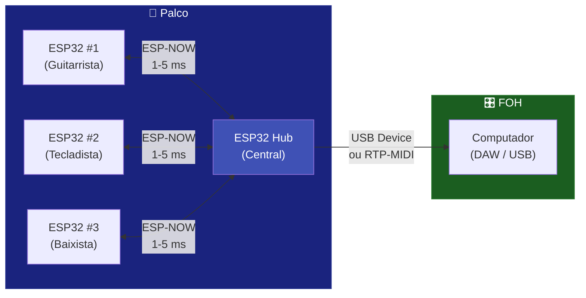
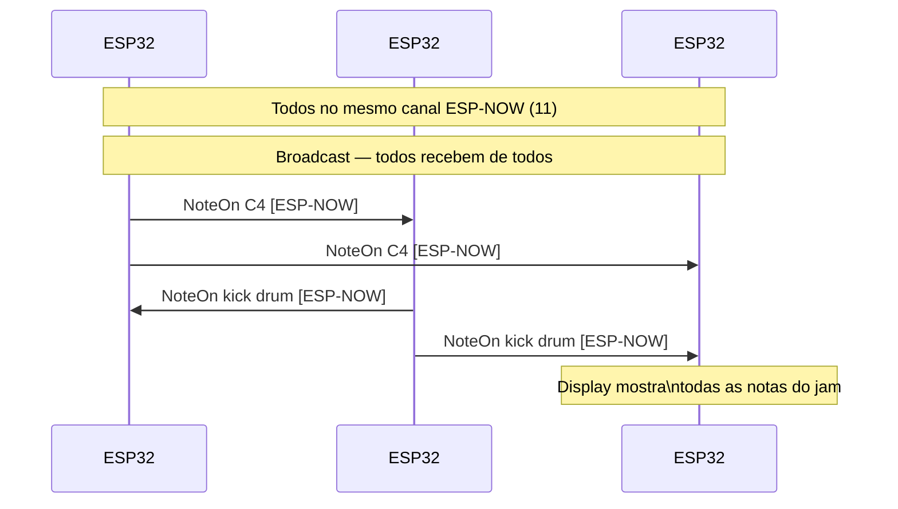

# 📡 ESP-NOW

Wireless MIDI de ultra-baixa latência entre ESP32 via protocolo proprietário Espressif. Sem router, sem handshake, sem pareamento — funciona em qualquer ESP32.

---

## Características

| Aspecto | Detalhe |
|---------|---------|
| Protocolo | ESP-NOW (Espressif) |
| Físico | Rádio WiFi 2,4 GHz (P2P, sem router) |
| Latência | 1–5 ms |
| Alcance | ~200 m (linha de visão) |
| Modo | Broadcast ou Unicast |
| Chips | Qualquer ESP32, S2, S3, C3, C6 |
| Chips sem ESP-NOW | ESP32-P4 (sem rádio WiFi) |

---

## Como Funciona



O ESP-NOW usa o rádio WiFi em modo peer-to-peer, sem necessidade de access point. Múltiplos ESP32 podem se comunicar em broadcast (todos recebem de todos) ou unicast (ponto a ponto).

---

## Código — Modo Broadcast

```cpp
#include <ESP32_Host_MIDI.h>
#include "src/ESPNowConnection.h"

ESPNowConnection espNow;

void setup() {
    Serial.begin(115200);

    // Canal WiFi deve ser o mesmo em todos os ESP32 do grupo
    espNow.begin(/*channel=*/11);

    midiHandler.addTransport(&espNow);
    midiHandler.begin();

    Serial.println("ESP-NOW MIDI pronto (broadcast)");
}

void loop() {
    midiHandler.task();

    for (const auto& ev : midiHandler.getQueue()) {
        Serial.printf("[ESP-NOW] %s %s vel=%d\n",
            ev.status.c_str(),
            ev.noteOctave.c_str(),
            ev.velocity);
    }

    // Enviar nota a cada 2 segundos (exemplo)
    static unsigned long last = 0;
    if (millis() - last > 2000) {
        midiHandler.sendNoteOn(1, 60, 100);
        delay(200);
        midiHandler.sendNoteOff(1, 60, 0);
        last = millis();
    }
}
```

---

## Código — Modo Unicast (par específico)

```cpp
#include "src/ESPNowConnection.h"

ESPNowConnection espNow;

// MAC do ESP32 de destino (ver Serial.println(WiFi.macAddress()))
uint8_t peerMAC[] = {0xAA, 0xBB, 0xCC, 0xDD, 0xEE, 0xFF};

void setup() {
    espNow.begin(11);

    // Adicionar peer específico (unicast)
    espNow.addPeer(peerMAC);

    midiHandler.addTransport(&espNow);
    midiHandler.begin();
}
```

---

## Descobrir o MAC de um ESP32

```cpp
void setup() {
    Serial.begin(115200);
    WiFi.mode(WIFI_STA);
    Serial.printf("MAC: %s\n", WiFi.macAddress().c_str());
    // Exemplo: "AA:BB:CC:DD:EE:FF"
}
```

---

## Jam Colaborativo — 3 ESP32



---

## ESP-NOW + USB Host + BLE

```cpp
#include <ESP32_Host_MIDI.h>
#include "src/ESPNowConnection.h"

ESPNowConnection espNow;

void setup() {
    // ESP-NOW
    espNow.begin(11);
    midiHandler.addTransport(&espNow);

    // USB Host + BLE iniciados automaticamente
    MIDIHandlerConfig cfg;
    cfg.bleName = "Jam Node";
    midiHandler.begin(cfg);

    // Agora teclado USB + BLE + ESP-NOW estão todos ativos!
}

void loop() {
    midiHandler.task();

    // Evento de qualquer transporte
    for (const auto& ev : midiHandler.getQueue()) {
        // Automaticamente repassado para todos os outros!
    }
}
```

---

## Considerações de Canal WiFi

!!! warning "Canal WiFi"
    O ESP-NOW e o WiFi (estação) precisam usar o **mesmo canal**. Se o ESP32 estiver conectado a um router WiFi, o ESP-NOW usará o canal do router automaticamente. Se não houver WiFi, você especifica o canal em `espNow.begin(channel)`.

```cpp
// Se usando ESP-NOW junto com WiFi (para RTP-MIDI):
WiFi.begin("ssid", "password");
while (WiFi.status() != WL_CONNECTED) delay(500);
// O canal é determinado pelo router — NÃO passe o canal para begin()
espNow.begin();  // usa canal atual do WiFi

// Se usando apenas ESP-NOW (sem WiFi):
espNow.begin(11);  // canal fixo 11 (1-13)
```

---

## Exemplos

| Exemplo | Descrição |
|---------|-----------|
| `T-Display-S3-ESP-NOW-Jam` | Jam colaborativo com display |
| `ESP-NOW-MIDI` | ESP-NOW MIDI básico |

---

## Próximos Passos

- [BLE MIDI →](ble-midi.md) — alcance ~30 m mas compatível com iOS
- [RTP-MIDI →](rtp-midi.md) — usar WiFi com router para maior alcance
- [Exemplos ESP-NOW →](../exemplos/esp-now-jam.md) — sketch completo do jam
