# 🚀 MIDI 2.0 / UMP sobre UDP

MIDI 2.0 implementado end-to-end com `MIDI2UDPConnection` — um protocolo UDP customizado de 12 bytes carregando **Universal MIDI Packets (UMP)** entre ESP32. Comunique-se com resolução completa MIDI 2.0: **velocidade de 16 bits**, CC de 32 bits, Pitch Bend de 32 bits.

---

## MIDI 1.0 vs. MIDI 2.0

| Aspecto | MIDI 1.0 | MIDI 2.0 |
|---------|---------|---------|
| Velocidade | 7 bits (0–127) | **16 bits (0–65535)** |
| Control Change | 7 bits (0–127) | **32 bits (0–4 bilhões)** |
| Pitch Bend | 14 bits (0–16383) | **32 bits** |
| Retrocompatível | — | ✅ (downscaling automático) |
| Protocolo | Bytes simples | UMP (Universal MIDI Packet) |

---

## Protocolo MIDI2UDP (12 bytes)

```
Byte  0–3:  Magic "UMP2" (0x55 0x4D 0x50 0x32)
Byte  4–7:  UMP Word 0 (big-endian uint32)
Byte  8–11: UMP Word 1 (big-endian uint32, = 0x00000000 para pacotes 32-bit)
```

O Word 0 contém o header UMP:
```
Bits 31-28: Message Type (0x4 = MIDI 2.0 Channel Voice)
Bits 27-24: Group
Bits 23-20: Status/Opcode
Bits 19-16: Channel (0-15)
Bits 15-8:  Note number (para NoteOn/NoteOff)
Bits 7-0:   Attribute Type
```

---

## Código

```cpp
#include <WiFi.h>
#include <ESP32_Host_MIDI.h>
#include "src/MIDI2UDPConnection.h"  // Inclui MIDI2Support automaticamente

MIDI2UDPConnection midi2udp;

void setup() {
    Serial.begin(115200);

    WiFi.begin("SeuSSID", "SuaSenha");
    while (WiFi.status() != WL_CONNECTED) {
        delay(500);
        Serial.print(".");
    }
    Serial.printf("\nIP: %s\n", WiFi.localIP().toString().c_str());

    // Escuta na porta 5006
    // Envia para 192.168.1.20 na porta 5006 (o outro ESP32)
    midi2udp.begin(5006, IPAddress(192, 168, 1, 20), 5006);

    midiHandler.addTransport(&midi2udp);
    midiHandler.begin();
}

void loop() {
    midiHandler.task();

    for (const auto& ev : midiHandler.getQueue()) {
        // ev contém os valores MIDI 1.0 (downscaled)
        Serial.printf("[MIDI2] %s %s  vel7=%d\n",
            ev.status.c_str(),
            ev.noteOctave.c_str(),
            ev.velocity);

        // Acessar valores MIDI 2.0 completos:
        const UMPResult& r = midi2udp.lastResult();
        if (r.valid) {
            Serial.printf("        vel16=%u  (%.1f%%)\n",
                r.velocity16,
                r.velocity16 / 65535.0f * 100.0f);
        }
    }
}
```

---

## Estrutura UMPResult

```cpp
struct UMPResult {
    bool valid;          // Pacote válido?
    bool isMIDI2;        // True = MIDI 2.0 (64-bit), False = MIDI 1.0 (32-bit)
    uint8_t msgType;     // Tipo de mensagem UMP
    uint8_t channel;     // Canal MIDI (0-15)
    uint8_t note;        // Nota MIDI (0-127)
    uint16_t velocity16; // Velocidade 16-bit (MIDI 2.0)
    uint32_t value;      // Valor 32-bit (CC, Pitch Bend)
    uint8_t midi1[3];    // Bytes MIDI 1.0 equivalentes (downscaled)
};
```

---

## Escalamento de Valores

```mermaid
flowchart LR
    subgraph MIDI1["MIDI 1.0"]
        VEL7["Velocidade\n7 bits\n0–127"]
        CC7["CC\n7 bits\n0–127"]
        PB14["Pitch Bend\n14 bits\n0–16383"]
    end

    subgraph MIDI2["MIDI 2.0"]
        VEL16["Velocidade\n16 bits\n0–65535"]
        CC32["CC\n32 bits\n0–4.29 bilhões"]
        PB32["Pitch Bend\n32 bits"]
    end

    VEL7 <-->|"MIDI2Scaler\nscale7to16 / scale16to7"| VEL16
    CC7 <-->|"MIDI2Scaler\nscale7to32 / scale32to7"| CC32
    PB14 <-->|"MIDI2Scaler\nscale14to32 / scale32to14"| PB32

    style MIDI1 fill:#37474F,color:#fff
    style MIDI2 fill:#3F51B5,color:#fff
```



### API de Escalamento (MIDI2Support.h)

```cpp
#include "src/MIDI2Support.h"

// MIDI 1.0 → MIDI 2.0
uint16_t vel16 = MIDI2Scaler::scale7to16(vel7);    // 7→16 bits
uint32_t cc32  = MIDI2Scaler::scale7to32(cc7);     // 7→32 bits
uint32_t pb32  = MIDI2Scaler::scale14to32(pb14);   // 14→32 bits

// MIDI 2.0 → MIDI 1.0
uint8_t  vel7  = MIDI2Scaler::scale16to7(vel16);   // 16→7 bits
uint8_t  cc7   = MIDI2Scaler::scale32to7(cc32);    // 32→7 bits
uint16_t pb14  = MIDI2Scaler::scale32to14(pb32);   // 32→14 bits
```

### Builder e Parser UMP

```cpp
#include "src/MIDI2Support.h"

// Construir pacote UMP
uint16_t vel16 = MIDI2Scaler::scale7to16(100);         // 7-bit → 16-bit
UMPWord64 pkt  = UMPBuilder::noteOn(0, 0, 60, vel16);  // group=0, ch=0, note=60

// Parsear pacote UMP
UMPResult r = UMPParser::parseMIDI2(pkt);
Serial.printf("Note=%d  Vel16=%u\n", r.note, r.velocity16);
```

---

## Tipos de Mensagem UMP

| Opcode | Mensagem |
|--------|---------|
| `0x9` | NoteOn |
| `0x8` | NoteOff |
| `0xB` | Control Change |
| `0xE` | Pitch Bend |
| `0xC` | Program Change |
| `0xD` | Channel Pressure |
| `0xA` | Poly Pressure |

---

## Experimento com Dois ESP32

Conecte dois ESP32-S3 na mesma rede WiFi. O ESP32-A toca notas no teclado USB, o ESP32-B recebe com resolução MIDI 2.0 completa:

```
ESP32-A (teclado USB) → MIDIHandler → MIDI2UDP → WiFi → ESP32-B (display)
                                                           ↓
                                               vel16, cc32, pb32
```

<div style="text-align:center; margin:20px 0">
  
  <figcaption><em>T-Display-S3-MIDI2-UDP — barra de velocidade 16-bit mostrando resolução MIDI 2.0</em></figcaption>
</div>

---

## Exemplos

| Exemplo | Descrição |
|---------|-----------|
| `T-Display-S3-MIDI2-UDP` | Dois ESP32 com display de vel. 16-bit |

---

## Próximos Passos

- [MIDI 2.0 / UMP Deep Dive →](../avancado/midi2-ump.md) — especificação completa UMP
- [OSC →](osc.md) — alternativa para Max/MSP e Pure Data
- [Exemplos MIDI 2.0 →](../exemplos/midi2-udp.md) — sketch completo com display
