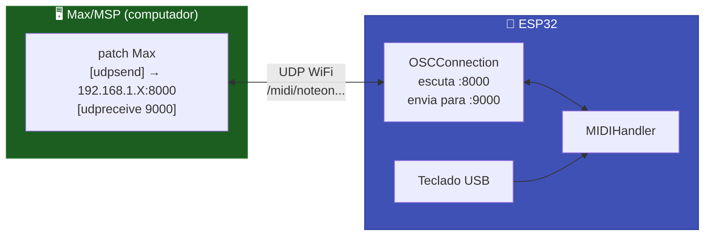

# 🎨 OSC (Open Sound Control)

Bridge bidirecional **OSC ↔ MIDI** sobre WiFi UDP. Recebe mensagens OSC do Max/MSP, Pure Data, SuperCollider e TouchOSC e converte em eventos MIDI — e vice-versa.

---

## Características

| Aspecto | Detalhe |
|---------|---------|
| Protocolo | OSC 1.0 sobre UDP |
| Latência | 5–15 ms |
| Bidirecional | ✅ (recebe e envia) |
| Plataformas | Max/MSP, Pure Data, SuperCollider, TouchOSC, Pd, Processing |
| Requer | WiFi + `CNMAT/OSC library` |

---

## Instalar a Biblioteca OSC

```
Arduino IDE → Sketch → Include Library → Manage Libraries
→ Pesquisar: "OSC"
→ Instalar: OSC by Adrian Freed, Yotam Mann (CNMAT)
```

---

## Mapa de Endereços OSC

A biblioteca mapeia automaticamente entre OSC e MIDI:

| Endereço OSC | Argumentos | Mensagem MIDI |
|-------------|-----------|---------------|
| `/midi/noteon` | channel note velocity | NoteOn |
| `/midi/noteoff` | channel note velocity | NoteOff |
| `/midi/cc` | channel controller value | Control Change |
| `/midi/pc` | channel program | Program Change |
| `/midi/pitchbend` | channel bend | Pitch Bend (-8192 a +8191) |
| `/midi/aftertouch` | channel pressure | Channel Pressure |

---

## Código

```cpp
#include <WiFi.h>
#include <ESP32_Host_MIDI.h>
#include "src/OSCConnection.h"  // Requer CNMAT/OSC

OSCConnection oscMIDI;

void setup() {
    Serial.begin(115200);

    WiFi.begin("SeuSSID", "SuaSenha");
    while (WiFi.status() != WL_CONNECTED) {
        delay(500);
        Serial.print(".");
    }
    Serial.printf("\nIP: %s\n", WiFi.localIP().toString().c_str());

    // Porta local: 8000  |  IP remoto: 192.168.1.100  |  Porta remota: 9000
    oscMIDI.begin(8000, IPAddress(192, 168, 1, 100), 9000);

    midiHandler.addTransport(&oscMIDI);
    midiHandler.begin();

    Serial.println("OSC MIDI pronto");
    Serial.printf("Escutando OSC em: %s:8000\n", WiFi.localIP().toString().c_str());
    Serial.println("Enviando OSC para: 192.168.1.100:9000");
}

void loop() {
    midiHandler.task();

    for (const auto& ev : midiHandler.getQueue()) {
        Serial.printf("[OSC→MIDI] %s %s vel=%d\n",
            ev.status.c_str(),
            ev.noteOctave.c_str(),
            ev.velocity);
    }
}
```

---

## Integração com Max/MSP



### Patch Max/MSP básico

```
[udpreceive 9000]
        |
    [OSC-route /midi/noteon]
        |
    [unpack i i i]   ← channel note velocity
        |           |           |
    [route]        [route]     [route]
```

Para enviar do Max para o ESP32:
```
[pack i i i]  ← channel note velocity
     |
[OSC-format /midi/noteon]
     |
[udpsend 192.168.1.X 8000]  ← IP do ESP32
```

---

## Integração com Pure Data (Pd)

### Receber MIDI no Pd (vindo do ESP32)

```
[udpreceive 9000]
       |
 [oscparse]
       |
[route /midi/noteon /midi/noteoff /midi/cc]
```

### Enviar MIDI do Pd para o ESP32

```
[pack f f f]    ← channel note velocity
      |
[oscformat /midi/noteon]
      |
[udpsend]
[connect 192.168.1.X 8000]
```

---

## TouchOSC

Configure o TouchOSC para enviar para o IP do ESP32 na porta 8000, e receber na porta 9000.

Cada botão/slider no TouchOSC pode enviar:
```
/midi/noteon   1 60 127   (toca C4 no canal 1 com vel 127)
/midi/cc       1 74 64    (Cutoff CC#74 = 50% no canal 1)
```

---

## Bridge OSC → USB (teclado físico → Max/MSP)

O caso de uso mais prático: teclado USB conectado ao ESP32, Max/MSP recebe via OSC.

```cpp
#include <WiFi.h>
#include <ESP32_Host_MIDI.h>
#include "src/OSCConnection.h"
// Tools > USB Mode → "USB Host"

OSCConnection oscMIDI;

void setup() {
    WiFi.begin("ssid", "password");
    while (WiFi.status() != WL_CONNECTED) delay(500);

    // ESP32 recebe MIDI do teclado USB
    // Max/MSP está em 192.168.1.50 escutando na porta 9000
    oscMIDI.begin(8000, IPAddress(192, 168, 1, 50), 9000);

    midiHandler.addTransport(&oscMIDI);
    midiHandler.begin();
    // Cada nota do teclado USB é enviada como OSC para o Max!
}

void loop() { midiHandler.task(); }
```

---

## Exemplos

| Exemplo | Descrição |
|---------|-----------|
| `T-Display-S3-OSC` | Bridge OSC com display WiFi status |

---

## Próximos Passos

- [RTP-MIDI →](rtp-midi.md) — alternativa para DAWs com suporte AppleMIDI
- [MIDI 2.0 UDP →](midi2-udp.md) — protocolo UDP customizado com alta resolução
- [Exemplos OSC →](../exemplos/osc-bridge.md) — sketch completo com display
