# 🌐 RTP-MIDI (WiFi)

Implementa **Apple MIDI** (RTP-MIDI, RFC 6295) sobre WiFi UDP. O ESP32 aparece automaticamente em **Audio MIDI Setup → Network** no macOS e iOS via mDNS Bonjour — nenhuma configuração manual de IP.

---

## Características

| Aspecto | Detalhe |
|---------|---------|
| Protocolo | AppleMIDI / RTP-MIDI (RFC 6295) |
| Descoberta | mDNS / Bonjour automático |
| Latência | 5–20 ms |
| Plataformas | macOS, iOS, Logic Pro, GarageBand, Ableton |
| Requer | WiFi conectado + `lathoub/Arduino-AppleMIDI-Library v3.x` |

---

## Instalar a Biblioteca

```
Arduino IDE → Sketch → Include Library → Manage Libraries
→ Pesquisar: "AppleMIDI"
→ Instalar: Arduino-AppleMIDI-Library by lathoub (v3.x)
```

---

## Código

```cpp
#include <WiFi.h>
#include <ESP32_Host_MIDI.h>
#include "src/RTPMIDIConnection.h"  // Requer AppleMIDI-Library

RTPMIDIConnection rtpMIDI;

void setup() {
    Serial.begin(115200);

    // Conectar ao WiFi
    WiFi.begin("SeuSSID", "SuaSenha");
    while (WiFi.status() != WL_CONNECTED) {
        delay(500);
        Serial.print(".");
    }
    Serial.printf("\nWiFi: %s\n", WiFi.localIP().toString().c_str());

    // Iniciar RTP-MIDI (aparece em macOS Audio MIDI Setup)
    rtpMIDI.begin("Meu ESP32");  // Nome da sessão

    midiHandler.addTransport(&rtpMIDI);
    midiHandler.begin();

    Serial.println("RTP-MIDI pronto — abra 'Audio MIDI Setup' no Mac");
}

void loop() {
    midiHandler.task();

    for (const auto& ev : midiHandler.getQueue()) {
        Serial.printf("[RTP] %s %s vel=%d\n",
            ev.status.c_str(),
            ev.noteOctave.c_str(),
            ev.velocity);
    }
}
```

---

## Conectar no macOS

```mermaid
sequenceDiagram
    participant ESP32 as ESP32 (RTP-MIDI)
    participant MDNS as mDNS/Bonjour
    participant MAC as macOS (Audio MIDI Setup)

    ESP32->>ESP32: WiFi.begin() — conecta à rede
    ESP32->>MDNS: Anuncia "_apple-midi._udp"<br/>Nome: "Meu ESP32"
    MAC->>MDNS: Scan da rede local
    MDNS-->>MAC: "Meu ESP32" disponível
    MAC->>MAC: Aparece em Network MIDI

    Note over MAC: Audio MIDI Setup → Window →<br/>Show MIDI Studio → Network<br/>→ "Meu ESP32" (online)

    MAC->>ESP32: Connect (RTP-MIDI handshake)
    ESP32-->>MAC: Session established

    loop Sessão ativa
        MAC->>ESP32: MIDI data (Logic, GarageBand...)
        ESP32->>MAC: MIDI data (teclado USB, BLE...)
    end
```



### Passo a passo no macOS

1. Abra **Audio MIDI Setup** (`/Applications/Utilities/`)
2. Menu **Window → Show MIDI Studio**
3. Clique em **Network** (ícone globo no topo)
4. No painel esquerdo "Directory", o ESP32 aparece com o nome configurado
5. Selecione e clique em **Connect**
6. A porta MIDI "Meu ESP32" aparece em todos os DAWs automaticamente

---

## Conectar no iOS

1. Abra **GarageBand** (ou qualquer app CoreMIDI)
2. Settings → **Advanced** → MIDI
3. O ESP32 aparece na lista de sessões de rede

---

## Sequenciador com RTP-MIDI

```cpp
#include <WiFi.h>
#include <ESP32_Host_MIDI.h>
#include "src/RTPMIDIConnection.h"

RTPMIDIConnection rtpMIDI;

const uint8_t SEQ[] = {60, 64, 67, 72};  // C4, E4, G4, C5
int step = 0;
unsigned long nextNote = 0;
const int BPM = 120;
const int NOTE_MS = 60000 / BPM / 2;  // colcheia

void setup() {
    WiFi.begin("ssid", "password");
    while (WiFi.status() != WL_CONNECTED) delay(500);

    rtpMIDI.begin("Sequenciador ESP32");
    midiHandler.addTransport(&rtpMIDI);
    midiHandler.begin();
}

void loop() {
    midiHandler.task();

    unsigned long now = millis();
    if (now >= nextNote) {
        // Desliga nota anterior
        midiHandler.sendNoteOff(1, SEQ[(step - 1 + 4) % 4], 0);
        // Liga próxima nota
        midiHandler.sendNoteOn(1, SEQ[step], 100);
        step = (step + 1) % 4;
        nextNote = now + NOTE_MS;
    }
}
```

---

## Galeria

<div style="display:flex; gap:12px; flex-wrap:wrap; justify-content:center; margin:20px 0">
  <figure style="margin:0; text-align:center">
    
    <figcaption><em>RTP-MIDI no Audio MIDI Setup do macOS</em></figcaption>
  </figure>
  <figure style="margin:0; text-align:center">
    
    <figcaption><em>Sessão RTP-MIDI conectada</em></figcaption>
  </figure>
</div>

---

## Latência e Jitter

O RTP-MIDI inclui timestamps e mecanismos de sincronização (clock sync) para compensar o jitter do WiFi. Na prática, com boa rede WiFi:

- **Casa / estúdio** (rede limpa): 5–15 ms, jitter < 3 ms
- **Rede congestionada**: 15–30 ms, jitter variável
- **5 GHz vs 2,4 GHz**: 5 GHz é mais estável para MIDI

!!! tip "Melhorar latência"
    - Use rede WiFi dedicada (sem outros dispositivos de streaming)
    - Prefira banda 5 GHz
    - Posicione o roteador próximo ao ESP32

---

## Exemplos

| Exemplo | Descrição |
|---------|-----------|
| `RTP-MIDI-WiFi` | Sequenciador com step display no T-Display-S3 |

---

## Próximos Passos

- [Ethernet MIDI →](ethernet-midi.md) — mesma latência mais consistente com cabo
- [OSC →](osc.md) — alternativa para Max/MSP e Pure Data
- [Exemplos RTP-MIDI →](../exemplos/rtp-midi-wifi.md) — sketch completo com display
