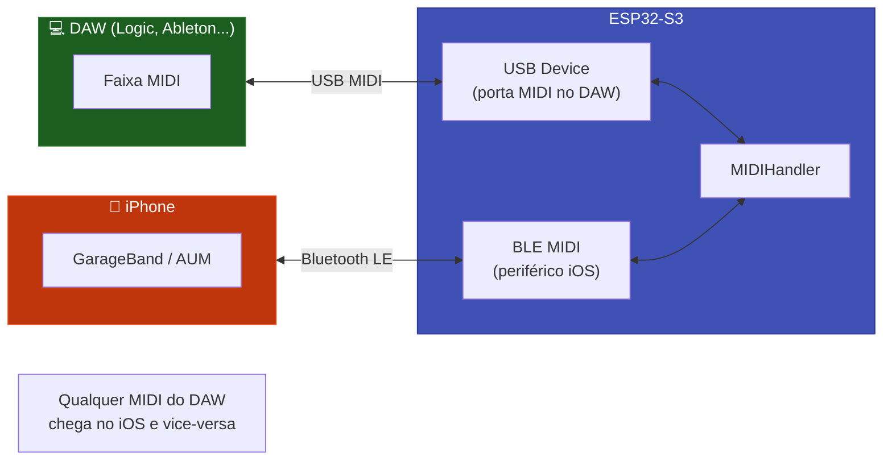

# 💻 USB Device

O ESP32 se apresenta como uma interface USB MIDI class-compliant ao computador host. macOS, Windows e Linux reconhecem instantaneamente — sem driver, sem configuração.

---

## Diferença: USB Host vs. USB Device

| Aspecto | USB Host | USB Device |
|---------|---------|-----------|
| Papel do ESP32 | **Mestre** — controla o barramento | **Escravo** — obedece ao computador |
| O que conecta | Teclado, pad, controlador | Computador (DAW) |
| Aparece onde | — | Porta MIDI no DAW |
| Arduino IDE | `USB Mode → "USB Host"` | `USB Mode → "USB-OTG (TinyUSB)"` |
| Coexistência | ❌ Não pode com USB Device | ❌ Não pode com USB Host |

!!! warning "Pino OTG compartilhado"
    USB Host e USB Device usam o mesmo pino físico OTG. Você deve escolher um **em tempo de compilação** — não é possível usar os dois no mesmo sketch.

---

## Hardware Necessário

| Requisito | Detalhe |
|-----------|---------|
| Chip | ESP32-S3, ESP32-S2, ou ESP32-P4 |
| Conexão | Cabo USB normal do computador para o ESP32 |
| Biblioteca | TinyUSB (já incluída no arduino-esp32 ≥ 3.0.0) |

---

## Configuração no Arduino IDE

```
Tools → USB Mode → "USB-OTG (TinyUSB)"
```

---

## Código

```cpp
#include <ESP32_Host_MIDI.h>
#include "src/USBDeviceConnection.h"
// Tools > USB Mode → "USB-OTG (TinyUSB)"

USBDeviceConnection usbMIDI("ESP32 MIDI Hub");  // Nome da porta no DAW

void setup() {
    Serial.begin(115200);

    // 1. Registrar ANTES de begin()
    midiHandler.addTransport(&usbMIDI);
    usbMIDI.begin();

    // 2. Iniciar o handler (BLE pode ser iniciado junto)
    midiHandler.begin();

    Serial.println("USB Device MIDI aguardando conexão...");
}

void loop() {
    midiHandler.task();

    for (const auto& ev : midiHandler.getQueue()) {
        // MIDI recebido do DAW via USB Device
        Serial.printf("[USB-DEV] %s %s vel=%d\n",
            ev.status.c_str(),
            ev.noteOctave.c_str(),
            ev.velocity);

        // Re-envia para BLE (bridge automático)
    }
}
```

---

## Uso como Bridge Bidirecional

O caso de uso mais poderoso: ESP32 conecta ao DAW via USB, e ao mesmo tempo recebe de iOS via BLE — bridge automático.



```cpp
#include <ESP32_Host_MIDI.h>
#include "src/USBDeviceConnection.h"
// Tools > USB Mode → "USB-OTG (TinyUSB)"

USBDeviceConnection usbMIDI("BLE-USB Bridge");

void setup() {
    midiHandler.addTransport(&usbMIDI);
    usbMIDI.begin();

    MIDIHandlerConfig cfg;
    cfg.bleName = "Bridge MIDI";
    midiHandler.begin(cfg);

    // Pronto! Qualquer MIDI de BLE vai para USB e vice-versa
}

void loop() {
    midiHandler.task();

    for (const auto& ev : midiHandler.getQueue()) {
        // midiHandler.sendNoteOn() enviaria para AMBOS
        // Mas a re-transmissão automática já cobre isso
    }
}
```

---

## Nome da Porta no DAW

O nome passado para `USBDeviceConnection` aparece na lista de portas MIDI do DAW:

```cpp
USBDeviceConnection usbMIDI("ESP32 MIDI Hub");  // macOS: "ESP32 MIDI Hub"
USBDeviceConnection usbMIDI("Meu Controlador"); // Windows: "Meu Controlador"
```

!!! tip "Renomeando no macOS"
    Em **Audio MIDI Setup → MIDI Studio**, você pode renomear a porta de forma permanente clicando duas vezes no nome do dispositivo.

---

## Compatibilidade com DAWs

| DAW | Sistema | Status |
|-----|---------|--------|
| Logic Pro | macOS | ✅ Plug & Play |
| GarageBand | macOS / iOS | ✅ Plug & Play |
| Ableton Live | macOS / Windows | ✅ Plug & Play |
| Bitwig Studio | macOS / Windows / Linux | ✅ Plug & Play |
| FL Studio | Windows / macOS | ✅ Plug & Play |
| Reaper | macOS / Windows / Linux | ✅ Plug & Play |
| Pro Tools | macOS / Windows | ✅ Com driver CoreMIDI |
| Cubase | Windows / macOS | ✅ Plug & Play |

!!! warning "Windows + CDC habilitado"
    Com "USB CDC on Boot" ativado, o ESP32 cria um **composite USB device** (Serial + MIDI). O Windows pode não carregar o driver MIDI automaticamente nessa configuração. Se o DAW não listar a porta MIDI, veja [Troubleshooting → USB Device](../avancado/troubleshooting.md#usb-device).

---

## Exemplos

| Exemplo | Descrição |
|---------|-----------|
| `T-Display-S3-USB-Device` | Bridge BLE + USB Device com display |

---

## Próximos Passos

- [BLE MIDI →](ble-midi.md) — usar BLE simultaneamente com USB Device
- [RTP-MIDI →](rtp-midi.md) — alternativa WiFi (não usa pino OTG)
- [UART / DIN-5 →](uart-din5.md) — conectar sintetizadores vintage
