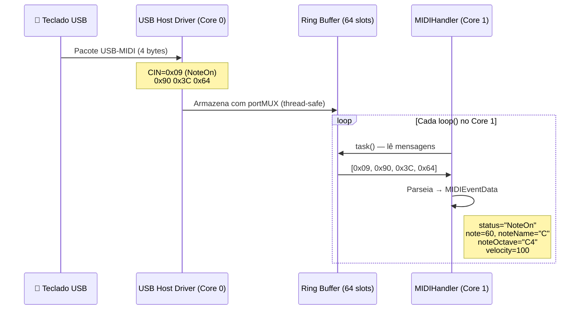

# 🔌 USB Host (OTG)

Conecta qualquer dispositivo USB MIDI class-compliant — teclados, pads, interfaces, controladores — diretamente ao ESP32 via USB-OTG. Sem hub, sem driver, sem configuração no computador.

---

## Hardware Necessário

| Requisito | Detalhe |
|-----------|---------|
| Chip | ESP32-S3, ESP32-S2, ou ESP32-P4 |
| Pinos | D+ / D- do conector USB-OTG |
| Cabo | USB-OTG (host) — ponta micro-OTG ou USB-A fêmea |
| Placa recomendada | LilyGO T-Display-S3 (tem conector OTG nativo) |

!!! warning "ESP32 Classic NÃO suporta USB Host"
    Apenas S2, S3 e P4 têm hardware USB-OTG. O ESP32 clássico (original) não suporta este transporte.

---

## Velocidade USB

| Chip | Velocidade | Largura de Banda |
|------|-----------|-----------------|
| ESP32-S2 | Full-Speed | 12 Mbps |
| ESP32-S3 | Full-Speed | 12 Mbps |
| ESP32-P4 | **High-Speed** | 480 Mbps (hub múltiplos dispositivos) |

Para MIDI (31250 baud), Full-Speed é mais que suficiente. O ESP32-P4 com High-Speed permite conectar **hubs USB** com múltiplos dispositivos simultâneos.

---

## Configuração no Arduino IDE

```
Tools → USB Mode → "USB Host"
```

!!! note
    Esta opção só aparece quando você seleciona uma placa ESP32-S3, S2 ou P4 no Board Manager.

---

## Código

```cpp
#include <ESP32_Host_MIDI.h>
// Tools > USB Mode → "USB Host"

void setup() {
    Serial.begin(115200);
    midiHandler.begin();  // USB Host iniciado automaticamente
}

void loop() {
    midiHandler.task();

    for (const auto& ev : midiHandler.getQueue()) {
        Serial.printf("[USB] %s %s ch=%d vel=%d\n",
            ev.status.c_str(),
            ev.noteOctave.c_str(),
            ev.channel,
            ev.velocity);
    }
}
```

Nenhuma configuração adicional é necessária — o transporte USB é built-in.

---

## Fluxo Interno de Dados



### Formato do Pacote USB-MIDI

```
Byte 0: CIN (Cable Index Number)  — tipo da mensagem
Byte 1: Status MIDI               — 0x90 = NoteOn canal 1
Byte 2: Data 1                    — nota (0-127)
Byte 3: Data 2                    — velocidade (0-127)
```

---

## Dispositivos Suportados

Qualquer dispositivo **USB MIDI 1.0 Class Compliant** funciona sem driver:

- Teclados MIDI (Arturia, Akai, Native Instruments, Roland, Yamaha...)
- Pads de percussão (Akai MPC, Roland SPD...)
- Interfaces de áudio com porta MIDI (Focusrite, PreSonus...)
- Controladores DJ (Numark, Pioneer...)
- Footswitches e pedaleiras MIDI
- Instrumentos de sopro digitais (Akai EWI)

!!! tip "Como verificar se é class-compliant"
    Se o dispositivo funciona em macOS ou Linux **sem instalar driver**, é class-compliant e vai funcionar com ESP32_Host_MIDI.

---

## Limitações

- **Um dispositivo por vez** (sem hub, exceto no P4)
- Apenas **USB MIDI 1.0** (não suporta USB Audio ou HID)
- **Não pode coexistir com USB Device** — ambos usam o mesmo pino OTG

---

## Exemplos com USB Host

| Exemplo | O que mostra |
|---------|-------------|
| `T-Display-S3` | Notas ativas + log de eventos no display |
| `T-Display-S3-Queue` | Fila de eventos completa com debug |
| `T-Display-S3-Piano` | Piano roll de 25 teclas com rolagem |
| `T-Display-S3-Gingoduino` | Detecção de acordes em tempo real |

---

## Próximos Passos

- [BLE MIDI →](ble-midi.md) — adicionar Bluetooth sem remover o USB
- [USB Device →](usb-device.md) — ESP32 como interface USB para DAW (mutualmente exclusivo com USB Host)
- [Primeiros Passos →](../guia/primeiros-passos.md) — sketch completo USB + BLE
