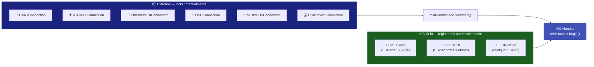
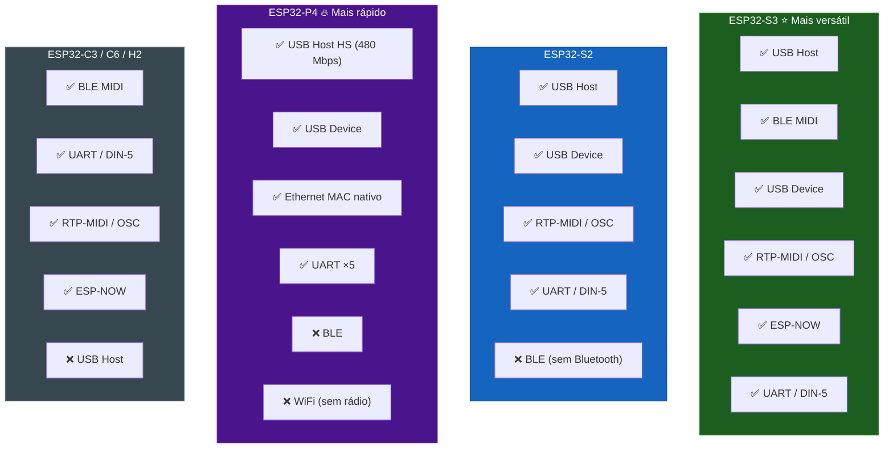

# 📡 Transportes — Visão Geral

A biblioteca suporta **9 transportes MIDI simultâneos**. Cada um implementa a mesma interface abstrata `MIDITransport`, garantindo que o `MIDIHandler` os trate de forma uniforme.

---

## Comparação de Transportes

| Transporte | Protocolo | Física | Latência | Chips | Biblioteca extra |
|-----------|----------|--------|---------|-------|-----------------|
| [🔌 USB Host](usb-host.md) | USB MIDI 1.0 | Cabo USB-OTG | **< 1 ms** | S3 / S2 / P4 | Nenhuma |
| [📱 BLE MIDI](ble-midi.md) | BLE MIDI 1.0 | Bluetooth LE 5.0 | 3–15 ms | S3 / Classic / C3 / C6 | Nenhuma |
| [💻 USB Device](usb-device.md) | USB MIDI 1.0 | Cabo USB-OTG | **< 1 ms** | S3 / S2 / P4 | Nenhuma (TinyUSB) |
| [📡 ESP-NOW](esp-now.md) | ESP-NOW | Rádio 2,4 GHz | 1–5 ms | Qualquer ESP32 | Nenhuma |
| [🌐 RTP-MIDI](rtp-midi.md) | AppleMIDI / RFC 6295 | WiFi UDP | 5–20 ms | Qualquer com WiFi | AppleMIDI-Library |
| [🔗 Ethernet](ethernet-midi.md) | AppleMIDI / RFC 6295 | Cabeado Ethernet | 2–10 ms | W5500 SPI ou P4 | AppleMIDI-Library + Ethernet |
| [🎨 OSC](osc.md) | Open Sound Control | WiFi UDP | 5–15 ms | Qualquer com WiFi | CNMAT/OSC |
| [🎹 UART / DIN-5](uart-din5.md) | Serial MIDI 1.0 (31250 baud) | Conector DIN-5 | **< 1 ms** | Qualquer ESP32 | Nenhuma |
| [🚀 MIDI 2.0](midi2-udp.md) | UMP over UDP | WiFi UDP | 5–20 ms | Qualquer com WiFi | Nenhuma |

---

## Transportes Built-in vs. Externos



### Transportes Built-in

Registrados automaticamente quando o chip suporta:

```cpp
#include <ESP32_Host_MIDI.h>

void setup() {
    midiHandler.begin();  // USB + BLE + ESP-NOW iniciados automaticamente
}
```

### Transportes Externos

Devem ser incluídos e registrados manualmente:

```cpp
#include <ESP32_Host_MIDI.h>
#include "src/UARTConnection.h"     // DIN-5 MIDI serial
#include "src/RTPMIDIConnection.h"  // Apple MIDI via WiFi
#include "src/OSCConnection.h"      // OSC via WiFi

UARTConnection uartMIDI;
RTPMIDIConnection rtpMIDI;
OSCConnection oscMIDI;

void setup() {
    // 1. Inicializar transportes externos
    uartMIDI.begin(Serial1, 16, 17);
    rtpMIDI.begin("Meu ESP32");
    oscMIDI.begin(8000, IPAddress(192,168,1,100), 9000);

    // 2. Registrar no handler
    midiHandler.addTransport(&uartMIDI);
    midiHandler.addTransport(&rtpMIDI);
    midiHandler.addTransport(&oscMIDI);

    // 3. Iniciar o handler
    midiHandler.begin();
}
```

!!! warning "Limite de transportes"
    O `MIDIHandler` suporta até **4 transportes externos** via `addTransport()`. Os transportes built-in (USB, BLE, ESP-NOW) não contam neste limite.

---

## Compatibilidade por Chip



---

## Interface MIDITransport

Todos os transportes implementam esta interface:

```cpp
class MIDITransport {
public:
    virtual void task() = 0;                              // Chamado a cada loop()
    virtual bool isConnected() const = 0;                 // Status da conexão

    // Opcional — envio de MIDI (fallback: return false)
    virtual bool sendMidiMessage(const uint8_t* data, size_t length);

    // Registro de callbacks (usado internamente pelo MIDIHandler)
    void setMidiCallback(MidiDataCallback cb, void* ctx);
    void setConnectionCallbacks(ConnectionCallback onConn,
                                ConnectionCallback onDisconn, void* ctx);

protected:
    // Chamados pelas implementações para injetar dados
    void dispatchMidiData(const uint8_t* data, size_t len);
    void dispatchConnected();
    void dispatchDisconnected();
};
```

### Criar um Transporte Customizado

```cpp
class MyTransport : public MIDITransport {
public:
    void begin() {
        // Inicializar hardware/conexão
    }

    void task() override {
        // Verificar se há dados disponíveis
        if (hasData()) {
            uint8_t buf[3];
            readMidi(buf);
            dispatchMidiData(buf, 3);  // Injeta no MIDIHandler
        }
    }

    bool isConnected() const override {
        return connected;
    }

    bool sendMidiMessage(const uint8_t* data, size_t len) override {
        // Enviar via seu protocolo
        return writeMidi(data, len);
    }
};

MyTransport myTransport;

void setup() {
    myTransport.begin();
    midiHandler.addTransport(&myTransport);
    midiHandler.begin();
}
```

---

## Próximos Passos

Explore cada transporte em detalhe:

- [🔌 USB Host](usb-host.md) — teclados e pads USB class-compliant
- [📱 BLE MIDI](ble-midi.md) — iOS, macOS e Android
- [💻 USB Device](usb-device.md) — ESP32 como interface USB para DAW
- [🎹 UART / DIN-5](uart-din5.md) — sintetizadores vintage
- [🌐 RTP-MIDI](rtp-midi.md) — Apple MIDI via WiFi
- [🔗 Ethernet](ethernet-midi.md) — Ethernet cabeada para estúdio
- [📡 ESP-NOW](esp-now.md) — mesh sem fio entre ESP32
- [🎨 OSC](osc.md) — Max/MSP, Pure Data, SuperCollider
- [🚀 MIDI 2.0](midi2-udp.md) — alta resolução com UMP
